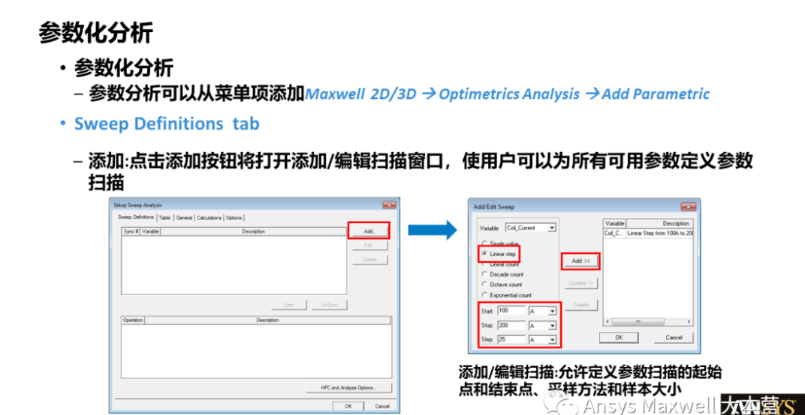
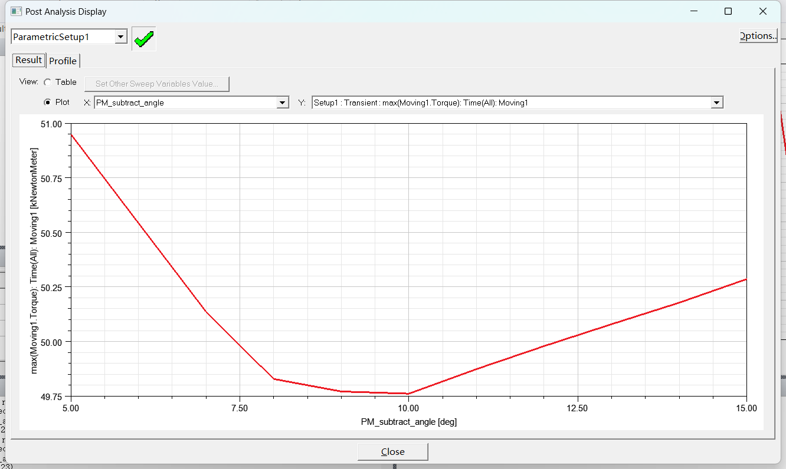
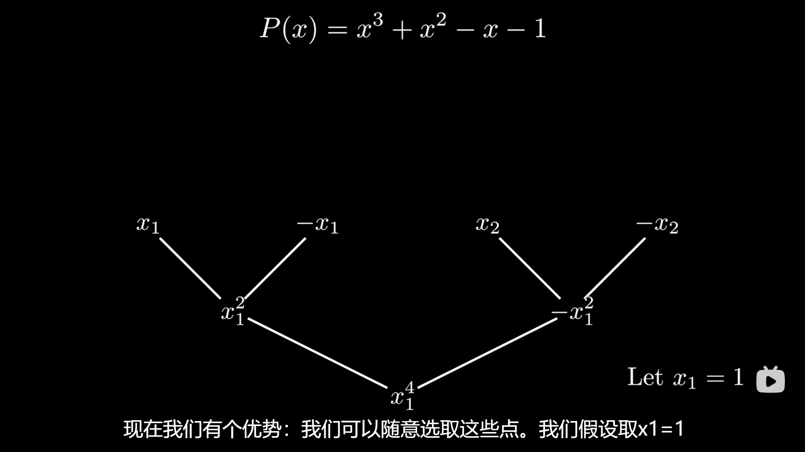
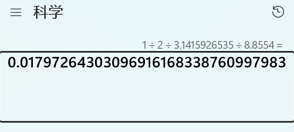
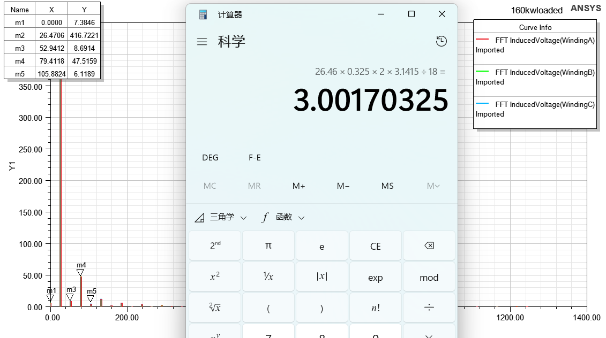
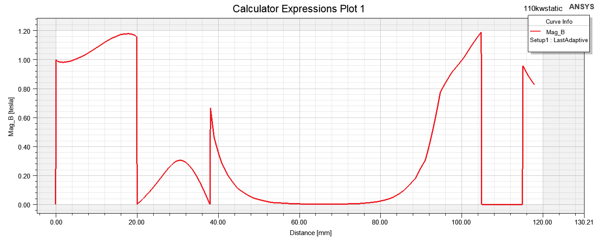

Monday, May 8, 2023 @ 08:51:42 AM
新的一周！
当前目标，完成loaded
首先把师兄的6phase模型删掉一半

这个咋来的，频率大约100?
##因为电路设置的90hz，我的转速是27hz，电机旋转的必要条件是同步，电频率和电频率同步，设置27hz
torque积分为0说明没有转起来
动笔才会有思维。。

目前电频率确实是54/2=27hz，但是转矩还是乱的
Monday, May 8, 2023 @ 02:57:31 PM

9550公式复习一下T=9550P/n,这次有限元算出的转矩48KN*m左右，脉动pk/avg在0.06，但是9550公式出来136左右，应该是轴向长度和张老师预设轴向长度有所出入，要问下预设轴向长度和相电阻、端部漏感,之后开始进行优化仿真
参数化分析

同步的意思是两个参数一起变化

参数扫描的
目前设置的是max（Torque），下一次对min（pkavg（torque））进行参数分析

切角为10deg的时候转矩最小，接下来看看对于pkavg的影响吧

不能对其进行参数化分析，但是可以算完之后来这边用marker里面的功能看然后自己用excel看一下

Monday, May 8, 2023 @ 04:42:23 PM
学会HPC option了，主要还是跑参数化的时候能用，只跑一个没必要而且容易报错
优化分析和参数分析有什么区别？

Tuesday, May 9, 2023 @ 10:13:35 AM
首先是傅里叶分解

在这里他证明了任何d阶多项式可以用d+1个点来表示

通过取值法来计算多项式的乘积，可以减少复杂度

如果直接取值的话复杂度不变，要利用奇偶性，多项式也同样可以拆开成奇偶多项式

使用复数的表示可以有效避免每次都要取负数利用奇偶的尴尬

复数在平面上的分布，这样也就能看懂傅里叶变换的那一堆e^pi之类的

每次都会变成n/2个点可以方便实现递归

实在看不懂了，记一下吧，就是实际谐波极对数除以画的polyline的弧长

Tuesday, May 9, 2023 @ 10:56:41 AM

还是很奇怪啊

计算结果怎么都对不上。R为17.9？问题先留这里吧，真的做上了分数槽再去担心这个

Tuesday, May 9, 2023 @ 11:32:45 AM
正在计算，想想之前什么操作导致的crush比较多，应该是生成场却没有选择full model还有带着fields就进行计算了，还要保留关掉小窗的好习惯

师兄重新教了一下fft横坐标，之前那个教程有点问题，没说考虑极对数，或者他说的是电跨距

先看一下9550公式的推导和量纲就是一个2pi/60的倒数，要换算成线速度罢了
有两种推导办法，一种是宏观上直接用量纲来表示（辜）还有一种就是用微观上的线负荷和气隙磁密积分出来（汤）

改成shift之后粘贴图片要先切换英文了

Tuesday, May 9, 2023 @ 03:33:01 PM

来看一下端部漏抗的计算吧

最后还是经验占比比较大，和绕组形式之类的都强相关
但是有一个归一化的项，就是4piμ0N^2/pq，之后的才是经验项

主要是三次谐波？为何，q=1啊

重新问了一下师兄，domain这里选择spectral，这里面有branchcurrent和nodevoltage，其实和打开winding调出来的没有什么区别，选中一个之后在最右边的function里面选择ang_deg，其实做的就是傅里叶分析，能直接告诉你频率，之后改table显示（或者一开始就创建一个table效果是一样的）这里注意找一下电频率，90/60*18，就是rpm/60*p，他的单位默认是khz，不要去找幅值，这里右边的量是角度！，真的是有点蠢，唉。

一般电机设计中所提到的Btheta都是值得我算出来的Br的基波幅值，不是整个波形的最大值，不然由于磁钢形状不同，这个是无法比较的，不能把所有工作都交给计算极弧系数

Thursday, May 11, 2023 @ 03:58:14 PM
现在学一下使用motorcad来设置一下绕组，方便和老师讨论，快速浏览这大本营10个教程

老师让从转子一路拉到定子外圈的一条线，在定子颚部mag_B只有0.5左右的幅值，需要缩减一部分的体积？为什么？浪费材料了吗

Friday, May 12, 2023 @ 04:21:14 PM
终于画完了，新的110kw的方案
A的形状不太对，应该是充磁设置有问题，唉，赶紧自学一下，都教了一遍没做笔记。。
右键形状在property-orenta里面
错误的结果没必要截图了，明显的就是永磁体内都不是直线的fluxline

