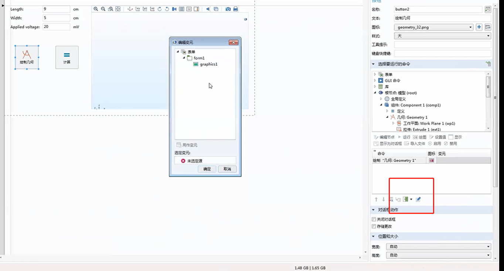
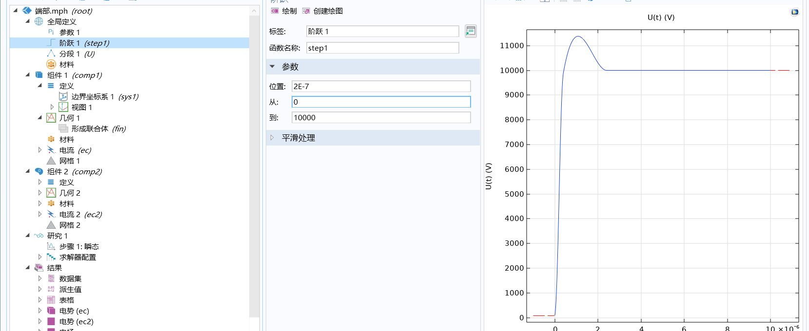
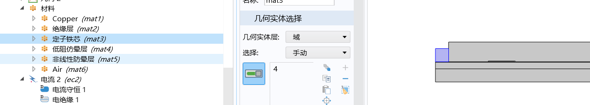
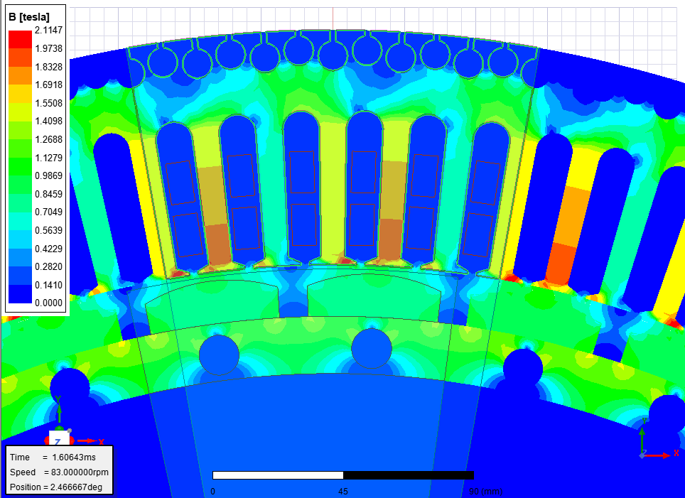
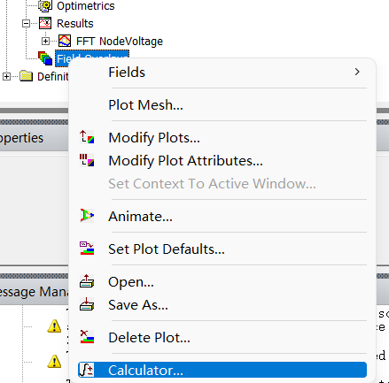

Tuesday, July 11, 2023 @ 10:39:19 PM
开始检查开题缺了些什么，对，连有限元都没有说。。
孟大伟文章能否找到？
坚果云zotero还没恢复，比较麻烦

Wednesday, July 12, 2023 @ 01:17:13 AM
西南和西安都没抄完，主要需要恢复一下自己的模型，明天抓紧

Wednesday, July 12, 2023 @ 03:49:31 AM
搞一下zotero插件，更改了一下首选项-高级-文件夹里面的路径，暂时还没有配置pdf，能用就行

Wednesday, July 12, 2023 @ 03:54:03 AM
想想办法恢复一下电场的图片，首先装一下comsol，忘记下载了，先下载一下，ansys和ug反而不急装，暂时用不到，仅仅毕设来说

Wednesday, July 12, 2023 @ 02:35:46 PM
comsol下载完毕，开始安装

Wednesday, July 12, 2023 @ 03:33:28 PM
安装完成，但是破解的bat文件没运行成功，虽然能用但还是有隐患

Wednesday, July 12, 2023 @ 04:17:51 PM
修改2.1公式的标号，采用的是整行复制的办法，他之前应该是用表格做的，但是行末还是有一些突出，希望不要多出那个框架。暂时通过修改标尺把它控制在行内了，希望不要出问题

Saturday, July 15, 2023 @ 01:40:21 PM
把209账号静置了，等回归

Wednesday, July 19, 2023 @ 09:51:36 AM
删除了传统高频部分重复的内容，字数回落到了7100

Wednesday, July 19, 2023 @ 11:47:48 PM
把论文放进框框里面了，但是没法自动生成目录，手动打一个吧

Wednesday, July 19, 2023 @ 11:48:26 PM
现在开始整理一下公式编号和章节编号，在-副本里修改？还是直接到-带格式里面修改？

Thursday, July 20, 2023 @ 01:48:44 AM
表格搞了一下公式，图号也一起动一下吧

Thursday, July 20, 2023 @ 07:12:04 PM
图号公式号

Thursday, July 20, 2023 @ 07:14:15 PM
接下来首要应该是需要照着刘仕裕的把结构补充完整，之后补参考文献，在这之前可以把研究报告1206的2.2节抄进来，分布参数计算的这一部分

Sunday, July 23, 2023 @ 01:31:49 AM
补充完了研究报告1206里面的参数计算部分，需要重新调整一下公式编号和图号切同时更改一下符号使得二者

Sunday, July 23, 2023 @ 01:40:10 AM
以上部分补充完毕

Monday, July 24, 2023 @ 03:41:01 PM
论文打印提交了

Monday, July 24, 2023 @ 03:43:56 PM
准备安装一下ansys，要看视频，会寝室看吧

Monday, July 31, 2023 @ 02:47:27 PM
躺平太久了。。。出了比较大问题
开始软件安装

Monday, July 31, 2023 @ 03:23:56 PM
ansysem结束安装，整理桌面，准备开始安装UG

Monday, July 31, 2023 @ 03:48:35 PM
ug安装结束，不要吝啬重启，会少很多问题

Monday, July 31, 2023 @ 03:49:04 PM
抓紧补充一下电场方面的文献，重读一下哈理工胡博士论文，然后学习一个comsol案例

Monday, July 31, 2023 @ 03:56:32 PM
电压计算那边的论文结论总结暂时搁置一下，如果不以这个作为研究重点的话？

在zotero中使用纯文本的笔记就行，之后粘贴到markdown中

Monday, July 31, 2023 @ 04:25:09 PM
autoCAD没装，暂时打不开dwg文件，PSCAd也需要安装的，今晚抓紧一下

Monday, July 31, 2023 @ 04:54:16 PM
首先看看算端部需要添加什么场，之前在maxwell里面建的二位模型好像并没有丢进comsol，一直想着用他的app，这样可不行。改了他的参数可以用了，6slot-副本，但是好像有部分几何是重合度，有机会最好自己画一下

Monday, July 31, 2023 @ 04:59:14 PM
他使用的场就是静电es和磁场mf，不算很精细
具体参数回去之后看表，先画个大概。。

Monday, July 31, 2023 @ 05:37:24 PM
可以先把试验的数据用excel复原一下放到论文里面

Tuesday, August 1, 2023 @ 08:21:33 AM
继续复原试验数据表格，完善一些能放到论文里的东西
这个表格可以塞进附表中，如果结果不是很好的话

Tuesday, August 1, 2023 @ 09:21:17 AM
表格复原完毕，开始准备重新学习一下comsol基本操作，为去哈理工学习做准备

Tuesday, August 1, 2023 @ 11:45:28 AM
几乎没有什么推进，文献看不进，这个仿真也没有进展，就是画完了这个槽点模型、、

报错相对残差大于相对容差，是因为静电场不能求解瞬态还是因为材料的相对介电常数等乱设置了？

Tuesday, August 1, 2023 @ 02:16:01 PM
更改相对介电常数等之后看看是否报错？

边界条件选择终端会比电势能做的东西更多，特别后处理可以输出终端，尽量使用终端作为静电的条件

在定义中可以通过选择显式-输出实体-相邻边界来一次选中所有相邻的边界，之后再在边界中分配，可以在选择下拉菜单中找到

边界元（bpm）用于求解不太适合划分网格的情况

不设置接地的话电势的答案可能是有问题的，因为是对电场求解，电势不是唯一的

Tuesday, August 1, 2023 @ 03:57:51 PM
还在看comsol视频，电流用频域，频域可以连续设置，要用外电路要添加物理场（电路cir），一般子母简单的比较泛用这样看起来。

使用编辑变元把按钮和操作进行绑定，在下方按钮可以找到各表单的编码

Wednesday, August 9, 2023 @ 02:21:37 PM
感觉都是目前用不到的知识，有点无所适从

为何要用这样的方法搞出波形。。是否导入进来的结果不够好？

电场最大值集中在低阻带和高阻带的交界处，是因为边界过于尖锐了？是否需要优化一下。

这样一个平的模型如何仿真端部的结构？

Wednesday, August 9, 2023 @ 04:47:33 PM
在绝缘-绕组-comsol里面有一个胡海涛的模型，但是需要装ptc cero，使用稍微麻烦，能否使用全集成的？会不会反而显得工作量小？还是先看看胡海涛模型吧

Thursday, August 10, 2023 @ 03:21:23 PM
装完creo了，但是还是用不了，需要他的一个特定模型才行。
先试试槽的？他只给了dwg文件，应该只能看槽的电场
早点把comsol的基本和app帮助文档看了再说

Thursday, August 10, 2023 @ 04:39:26 PM
今天目标是把comsol app的文档看完

Friday, August 11, 2023 @ 09:40:19 AM
AutoCAD安装完毕，看看他的dwg模型，之后想办法装一下creo的cad模块
是否版本不够？

Friday, August 11, 2023 @ 02:59:32 PM
还在跟comsol文档，这个fin到底有什么用？

Sunday, August 13, 2023 @ 02:32:51 PM
继续comsol文档的busbar例子

Monday, August 14, 2023 @ 08:28:58 AM
昨天没什么进展，继续这个busbar例子，争取迅速解决

https://cn.comsol.com/support/knowledgebase/1216
形成联合体相当于对几何序列中的所有实体进行布尔并集操作，但保持内部的几何边界
与形成装配的区别在于画出的网格是否共形（边界是否相连）

Monday, August 14, 2023 @ 10:41:02 AM
看完了comsol两个例子，等会开始看app，先直接看看胡的结构

Monday, August 14, 2023 @ 03:48:53 PM
胡的结构比较乱，PTC creo link还是用不了，还都是拼音的变量名，太逆天
边看app文档边想想波绕组在电场分布上有什么优势，安装motorCAD看看结构吧，自己想坡头
太逆天了我靠，写死还都是中文路径，拿出来骗横向

Monday, August 14, 2023 @ 04:30:53 PM
motorCAD装不上，晚点回家装一下v13，v15的ssq有点问题

波相当于打开的叠绕组，一个大电感打成一圈串联，一般匝数为1的时候使用波绕组

Tuesday, August 15, 2023 @ 10:27:48 AM
复原一下110kw的磁场图

Tuesday, August 15, 2023 @ 10:48:30 AM

回顾一下充磁方向的设置，是在这个orientation里面

回顾一下外电路设置的位置

Tuesday, August 15, 2023 @ 05:46:40 PM
还是不知道110kw出了什么问题，为了wedge处的磁场到了2.1t，从磁路法来看是不是between——PM还是太小了
减少PM——height之后最大Br显著减少了，高度减少到10的时候最大B只有1.8T了，这是自然气隙宽了之后磁场都散掉了

Tuesday, August 15, 2023 @ 10:55:23 PM

场计算器从这里打开

Wednesday, August 16, 2023 @ 09:49:17 AM
学习一下师兄排查错误-仿真错误的方法：从静态static重新建模到transient再到loaded，或者把loaded重新剥离到static
可以的话，尽量参数化，任何一个没参数化成功的参数都有可能因为某处漏掉没有修改而成为错误的罪魁
一定要提前拿到尽可能多的参数，尤其是最重要的电压电流还有功率因数，其他都是表象，这个才是结果
尽量清楚掉冗余的模型，在进行时间版本更替的时候，粘贴更名完之后就立刻删除冗余模型并重命名
现在是老版本了，要注意对上傅里叶频率，在选择spectral之后FFT options里面要选择采样点数，特别是选择多算两个点的这种，时间ms往前选两个
选在老版本直接对图像进行FFT分析会出现很多错误，典型就是横坐标都还是时间。。
现在还是想想为何转矩对不上，看看几个经典的涉及转矩的方程能否找找原因。
离独立完成工作还任重道远，唉。
同时还要想想这个cos（phi）如何用ang_deg搞出来
ang_deg出来的纵坐标就是角度，把branchcurrent的angdeg和nodevoltage进行相减即可得到phi
如果感觉结果不对可以看看三相电，或者线电压

Wednesday, August 16, 2023 @ 10:35:15 AM
仿真软件里面跑出来的转矩和功率都是电磁功率，也就是电机学里面提到的Pem，而一般电动机标定的额定功率都是输出功率！需要再考虑杂散和机械，而低速的情况下杂散并不大，所以可以参照陈世坤《电机设计》来看看一些经验公式

考虑电机最大的工作效率的内功率因数角（即电机向量图中E和I的夹角psai（三叉戟）），一般标贴式的电机使用Id=0控制，I在E方向上的投影就是直轴电流，所以psai应该为90，但是实际上无法做到，师兄建议想想如何对psai进行扫描，找到最大的功率点

平行齿的结构首先关注一下齿宽，如果齿宽一致性对上了，说明槽的尺寸大致不差

斜槽系数直接在轴线长度里面乘算掉了，叠压系数和端部损耗暂时不考虑，μ和Hc的值需要用来反推一下温度