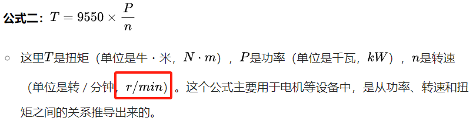

Tuesday, October 29, 2024 @ 04:59:43 PM
修改全部焊接件为wave
部分焊接面需要留余量，未考虑到焊接的变形
开始学习AutoCAD，需要先把电机的二维全部画出来？如何修改？

Wednesday, October 30, 2024 @ 02:55:51 PM
TR修剪命令代表的是trim

Friday, November 1, 2024 @ 03:17:17 PM
内六角圆柱头螺钉
Hexagon socket head cap screws
常用的螺钉headcap screw
Bearing：轴承；
Bolt：螺栓；
Nut：螺母；
Pin：销，钉；
Profile：轮廓，外形；
Screw：螺丝；（用的多）
Washer：垫圈。

screw中的分类
Capstan：绞盘头（螺丝）
Cheese Head：圆头（螺丝）
Countersunk：沉头（螺丝）
Hex Head：六角头（螺丝）
Knurled Head：滚花头（螺丝）
Pan Head：盘头（螺丝）
Round Head：圆头（螺丝，与 Cheese Head 类似，但在细节上可能有不同的形状特点）
Set Screw：紧定螺钉
Socket Head：内六角头（螺丝）

灵活使用GB里面的成员选择和搜索

Saturday, November 8, 2024 @ 23:06:08 AM zzz 178 login

Tuesday, November 12, 2024 @ 05:16:00 PM
♬看一下通孔需要打多大，比螺纹大0.5

使用ctrl+W可以快速隐藏片体和基准

load option 一般要高版本的才有

旋转变压器是一种输出电压随转子转角变化的信号元件。是采用电磁感应原理工作，随着旋转变压器的转子和定子角位置不同，输出信号可以实现对输入正弦载波信号的相位变换和幅值调制，最终由专用的信号处理电路或者某些具备一定功能接口的DSP和单片机，根据输出信号的幅值和相位与正弦载波信号的关系，解析出转子和定子间的角位置关系。

典型的旋转编码器采用光栅原理，用光电方法进行角位置检测，又可分为增量式和绝对式等类型。

Friday, November 22, 2024 @ 11:49:03 AM
😃紧固件加垫片，使用中级（a级）并调整尺寸done

Sunday, November 24, 2024 @ 08:47:21 PM
CKPw6RRJkV6z2qAMtEdhms8MgQ7jf
anna密码

***下列部分AI***

扭矩会导致物体产生角加速度，它们之间的关系是T=I×α，其中是I转动惯量（描述物体抵抗转动的惯性大小），α是角加速度。
