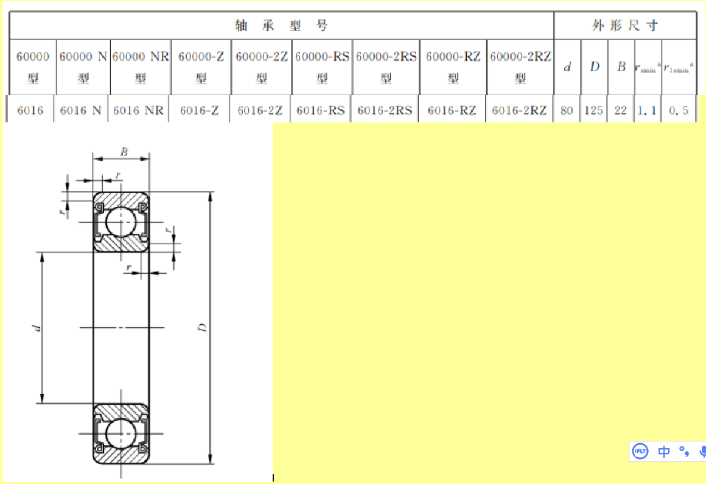
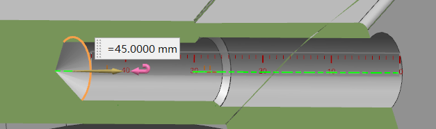
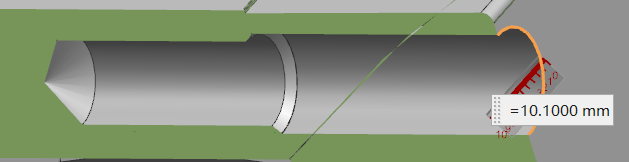

Tuesday, October 29, 2024 @ 04:59:43 PM
修改全部焊接件为wave
部分焊接面需要留余量，未考虑到焊接的变形
开始学习AutoCAD，需要先把电机的二维全部画出来？如何修改？

Wednesday, October 30, 2024 @ 02:55:51 PM
TR修剪命令代表的是trim

Friday, November 1, 2024 @ 03:17:17 PM
内六角圆柱头螺钉
Hexagon socket head cap screws
常用的螺钉headcap screw
Bearing：轴承；
Bolt：螺栓；
Nut：螺母；
Pin：销，钉；
Profile：轮廓，外形；
Screw：螺丝；（用的多）
Washer：垫圈。

screw中的分类
Capstan：绞盘头（螺丝）
Cheese Head：圆头（螺丝）
Countersunk：沉头（螺丝）
Hex Head：六角头（螺丝）
Knurled Head：滚花头（螺丝）
Pan Head：盘头（螺丝）
Round Head：圆头（螺丝，与 Cheese Head 类似，但在细节上可能有不同的形状特点）
Set Screw：紧定螺钉
Socket Head：内六角头（螺丝）

灵活使用GB里面的成员选择和搜索

Saturday, November 8, 2024 @ 23:06:08 AM zzz 178 login