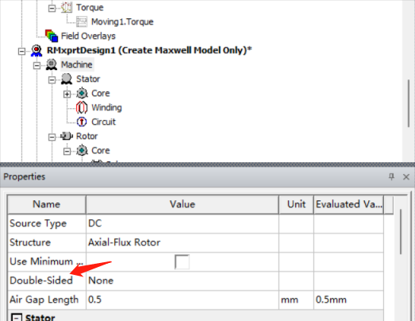

**Monday, April 10, 2023 @ 05:04:36 PM**

band和inner outer可以设置transpant方便查看之后的结果

band的设置，右键assign即可，注意选择旋转还是translation，就是暂态

###vector potential就是向量势，或者矢量势，A（x,y,t）就是边界条件使用电流密度不好表示的时候使用这个来表示∇ × A = B

如果在仿真中未使用向量势边界条件，则可能需要更频繁地进行电机中的电磁场采样

矢量磁势边界条件，定义边界上的矢量磁位A的常数值。边界处的磁场与边界正切，不会漏到边界外面去。

modelica实例实战http://modelicabyexample.globalcrown.com.cn/Release: v0.3.6-307-g33331e7-Early Access作者： Michael M. Tiller, Ph.D.

使用了timestamp，使用ctrl+shift+T可以创建时间戳

**Monday, April 10, 2023 @ 05:09:48 PM**

查看maxwell场图不显示的一个可能原因，没有隐藏掉band之类没有用的区域，把field遮住了

添加了markdown快捷键（使用markdown all in one），使用ctrlB和ctrlI可以实现快速斜体粗体

**Monday, April 10, 2023 @ 05:20:07**

使用快捷键：按下Ctrl + L，即可选中光标所在行。

*？加上的负载都是电流（和永磁体），那么为何load不需要与轴相关呢？是只有失去同步之后才会影响？*

玩poly brige有感，使用三角形的稳定性真的能做很多事情

mb3_excitation_assign eddy effect_可以分配涡流损耗，
*一般给永磁体？*

2d仿真别忘了设置轴向长度，mb3>model>assign depth即可

**Monday, April 10, 2023 @ 06:03:17 PM**
##轴向设计方法

插入一个rmxprt design

machine这一栏1.电流类型选择DC2.选择气隙长度，其他不用设置

stator这一栏全部要设置

core这一栏要注意外径给外壳留余量（也全部要设置，材料用steel就行）

slot这一栏根据槽型来看，最好都写，Rs可以不写不报错

winding这一栏注意conductor per slot是匝数乘以绕组层数（双层绕组是2）coil pitch指的是节距，设置1就行，漆包线厚度比较麻烦，需要查表，都是一一对应的，wire wrap指的是绝缘厚度，导线材料选铜

circuit也都填一下

stator依然注意是选择级数（x2）

core按照定子抄过来就行

pole分配的材料可以选NdFe35铝铁鹏，mag len不要选太大容易重合

之后再anali里面add solu，选一下电压转速，保存

右键setup，最下面的create 模型，这个circuit可以去掉如果不需要外电路

**Monday, April 10, 2023 @ 06:08:07 PM**

##双层轴向

click machine and then set fraction to one to get the whole machine.

删除掉多余的模型，选择select all。

右键材料查看property可以得到充磁方向。

这里一个比较方便的设置就是把上下都设为沿着z轴，所以经常会把电机这样摆放。

band设置要比运动部分稍大inner和outer正好包住就行摁住alt和方向可以快速转向Tuesday, April 11, 2023 @ 05:52:22 PM修改：他的意思仅仅是alt和mb1可以替代使用mb2进行旋转的作用，非常无语，定位到平面还是需要用电机coordinate

电流面coilterm可以用来加载电流方向和匝数等dependentsheet用来赋予边界条件

用draw里面这个按钮可以隐藏掉暂时不需要的区域（快捷键是f8还是f9，忘记了）

从右下角往左上角选择可以选择所有触碰到的obj，从左上角往右下角选择只能选择完全框住的

使用镜像命令镜像所有上半部分得到一个双定子结构之后使用参数化建模来约束下半个定子使得可以同步修改

在coil当中的createu user define part需要修改参数化外径内径等，之后就不用管了，都是根据coil_0复制过来的

之后在ndfe35（磁钢）里面改一下，diaouter设置为statorouter-2mm即可，单位不可缺失，不然默认是m

铁心也是一样操作，这个值要继承之前的修改

这几个域需要重新定义，需要完全重新设置band和outerregion才能

进行运动仿真

创建一个cylinder，改名为band，之后使用右键-measure-position可以

测量一下数值方便之后设置参数（三维之后感觉比较有用）

复制这个band，改变参数包住所有模型，height使用之前定义的参数加起来

选中这个域，进行split，先使用xz切一边再用yz切一边，可以保留四分之一模型

之后还要修改电流面coilterm和边界条件denpedent都需要在这里选择使用xz平面进行画图可以修改作图面

我怎么感觉这种简单的可以每次都重新画一下更快转到这个平面之后就很简
单了，仅仅画图的话使用around axis命令可以创建出从边界

右键band，assign band进行motion setupinitial角度选择7.5？关注吮指原味的后续视频
再选一个转速

边界选择assign bounders，因为模型不是对称的，（是否只有180deg才能叫做对称？）所以需要选择Hdep=-Hind

##参数化

之后开始设置激励，相对于前两个相对复杂

首先在exitation里面右键已经存在的phase选择add terminal，把属于a的两个激励选择加
进去以此类推
进
rmxprt里面，wind里面右键connect all coil可以得到线圈的连接情况方便理解电流的方
向，结合右手定则可以确定磁钢的NS极

设置一下winding，点击phaseA，改变激励type从external到 Current.

再点击单个线圈的，激励可以看到设置导体数目，其实设置的就是匝数。

点击set up。选择step time。计算一下电周期使用60秒除以转速，再除以极对数。记得是
除，因为之前算电角度的时候，是用机械角度乘以极对数。

**Monday, April 10, 2023 @ 06:13:08 PM**

##参数扫描

optimetric可以add一个参数，设置步长之后就可以进行扫描

HPC和analis这里可以设置多核计算

在中间的add中添加一个新的规则

add machine to list，设置core为4

之后右键parasetup进行仿真

*？？需要总结一下设计流程*

Ctrl/Cmd + Shift + V 快捷键在编辑器中打开 Clipboad Preview，然后直接粘贴图像即可，

Clipboad Preview 会自动将其转换为 Markdown 代码。

**Monday, April 10, 2023 @ 06:30:47 PM**
##峰值转速仿真
一般先仿真峰值转速之后仿真峰值转矩，再仿真一个额定工作点就行了。

电机能达到某个转速的条件电机的线反电动势峰值小于母线电压并且要给电阻和电感留出余量

线反电动势峰值和转速正比，和直径成正比，和线圈匝数成正比

无刷直流电机的线反电动势峰值小于母线电压(24V)，并且要给电阻和电感留出余量

永磁同步!电机的线反电动势峰值大于母线电压加ld，削弱磁密，实现弱磁升速。

如此看来必须要联合变频器进行仿真才能得到高频下的这个，本来maxwell就可以加外电路，但是感觉还是不如抽出参数

**omega(rad/s)=2xpixf(Hz)
电频率(Hz)=机械频率(HZ)x极对数
机械速度(rpm)=机械频率(HZ)/60**

A:lqrms*sqrt(2)*sin(2*pi*rotor_speed con/60*10*time)I
B相:lqrms*sqrt(2)*sin(2*pi*rotor_speed_con/60*10*time-2*pi/3)
C相: lqrms*sqrt(2)*sin(2*pi*rotor_speed_con/60*10*time+2*pi/3)

**Monday, April 10, 2023 @ 07:05:26 PM**

了解一下磁场调制理论，下载知乎文章

**Monday, April 10, 2023 @ 09:18:29 PM**

使用report>winding>任意一相电压，即可查看反电动势

如果需要查看电感矩阵，需要在model>model depth>matrix compu里面勾选并运算之后到报告中查看，不然默认是空白

**Monday, April 10, 2023 @ 09:52:15 PM**

试试吧SD卡作为miui的主要存储空间，这个红米10也能玩转了

**Tuesday, April 11, 2023 @ 12:09:16 AM**

继续尝试hory的acmop
一直在报错conda install pygmo，怀疑还是chen老师自己设置有问题
最后使用pip直接装了，conda还是玩不明白
给我报错的大意是pygmo无法通过pip直接安装，好烦，是不是还是要conda，用conda也可以防止一部分污染
chen老师这里关键是需要太多支持了，能不能把pyfemm里面的东西单独搞出来自己写一个，还有作图的那些

**Tuesday, April 11, 2023 @ 02:29:51 AM**

acmop学习阻力太大了，现阶段是不是先放一下？
感觉尽快搞完轴向+maxwell小技巧和comsol电磁比较重要
except:sys.path.insert(0, 'D:/DrH/Codes/acmop/codes3/')
用的是绝对路径，搞毛啊
pygmo安装失败大概率和mworks里面用到的一些东西有关

**Tuesday, April 11, 2023 @ 02:59:13 AM**

真的好烦啊这个东西，多目标优化，最好是能攥在自己手里就好
chen老师的东西很难模块化来用，暂时先放一放
抓紧先把maxwell所有的能回的会了然后学会分数槽

**Tuesday, April 11, 2023 @ 11:38:30 AM**

轴向的绕组理论？先放一下
之前听到idiq辨识还是有问题，要上功率容易掉电压，感觉轴向的控制确实比较麻烦，使用常规的FOC可能会出比较大的问题，参数辨识真的很重要

**Tuesday, April 11, 2023 @ 02:23:04 PM**

办完港澳通行证回来，记得20号去取一下
开始准备做振动测试这个事情
快速过一遍DTC之后就先把袁雷放一边，不能匀出更多时间给控制了
感觉把轴向那个分析外特性的过程学会比较重要

**Tuesday, April 11, 2023 @ 03:12:59 PM**

D’Amato2022综述阅读，感觉和王鹏的写的差不多，现在才看一半，希望能多讲建模的事情

**Tuesday, April 11, 2023 @ 03:55:35 PM**

找了一圈，资产，实验室，采购，没有找到底座的主人，等张松老师进一步安排

1.在VS Code中打开命令面板，可以使用快捷键Ctrl+Shift+P或者F1键来打开。
2.在命令面板中输入Preferences: Open Keyboard Shortcuts，然后选择这个选项来打开Keyboard Shortcuts配置页面。
3.在搜索栏中输入Timestamp，然后定位到Timestamp插件的命令。
修改为了alt+t

**Tuesday, April 11, 2023 @ 04:37:18 PM**

继续看了点rundong的overview of axial flux，师兄做的应该是double side

**Tuesday, April 11, 2023 @ 05:04:04 PM**

轴向仿真的问题，三维N极定义的是R，phi，Z，那所谓的halbach充磁会不会比较麻烦

**Tuesday, April 11, 2023 @ 05:26:29 PM**

在machine里面可以直接选择double sided，是否能达到一样的效果？试试
报错RatedOutputPower must be greater than 0. ，应该是因为删除了电路cirt导致的

明明选了double stator，为何生成了double rotor，好奇怪

siglesided会浪费很多磁通，如果使用double可以都兜住
使用bldc控制的话，一般就是每3coil对应4poles，这是那个拖动方式决定的

还是继续搞一下conda吧，顺便开个新坑，看一下pyaedt的东西
记一下要用jpg存本地图床才能显示markdown

**Wednesday, April 12, 2023 @ 08:58:21 AM**

别用win+shift+s截图了，出来的是png

Relative Permeability（相对磁导率）：相对磁导率是材料在存在磁场时的磁导率与真空中磁场的比值，是描述材料磁性的重要参数。N36Z_23的相对磁导率可能比较高，表示它在磁场中容易被磁化。
Bulk Conductivity（体导率）：体导率是指材料对电流的导电性能。N36Z_23的体导率可能较低，因为铁氧体材料通常为绝缘材料，不会很好地传导电流。
Magnetic Coercivity（磁饱和磁场强度）：磁饱和磁场强度是材料在磁化过程中需要的最大磁场强度，通常用于描述材料的磁性，但与相对磁导率不同，它与材料的饱和磁化强度有关。N36Z_23的磁饱和磁场强度可能比较高，表示它可以容纳更多的磁通量，但这并不一定意味着它具有较强的磁性能力。

**Wednesday, April 12, 2023 @ 09:28:08 AM**

Navigator Error
An unexpected error occurred on Navigator start-up
原来是整个anaconda出问题了
