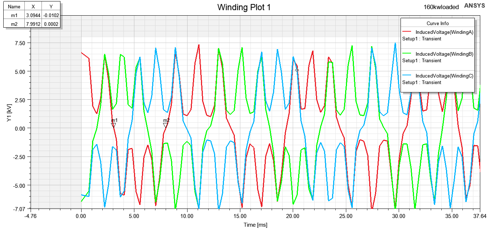
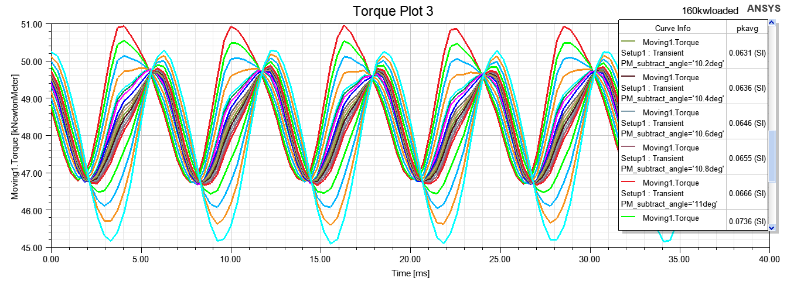

Monday, May 8, 2023 @ 08:51:42 AM
新的一周！
当前目标，完成loaded
首先把师兄的6phase模型删掉一半

这个咋来的，频率大约100?
##因为电路设置的90hz，我的转速是27hz，电机旋转的必要条件是同步，电频率和电频率同步，设置27hz
torque积分为0说明没有转起来
动笔才会有思维。。

目前电频率确实是54/2=27hz，但是转矩还是乱的
Monday, May 8, 2023 @ 02:57:31 PM

9550公式复习一下T=9550P/n,这次有限元算出的转矩48KN*m左右，脉动pk/avg在0.06，但是9550公式出来136左右，应该是轴向长度和张老师预设轴向长度有所出入，要问下预设轴向长度和相电阻、端部漏感,之后开始进行优化仿真
参数化分析

同步的意思是两个参数一起变化

参数扫描的
目前设置的是max（Torque），下一次对min（pkavg（torque））进行参数分析

切角为10deg的时候转矩最小，接下来看看对于pkavg的影响吧

不能对其进行参数化分析，但是可以算完之后来这边用marker里面的功能看然后自己用excel看一下

Monday, May 8, 2023 @ 04:42:23 PM
学会HPC option了，主要还是跑参数化的时候能用，只跑一个没必要而且容易报错
优化分析和参数分析有什么区别？
