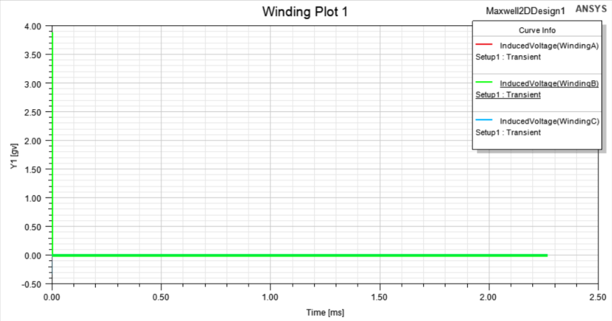
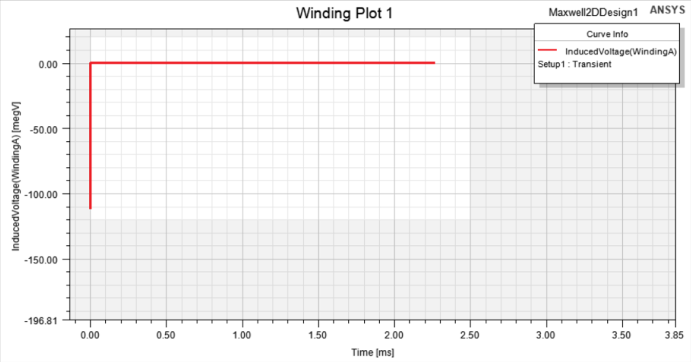
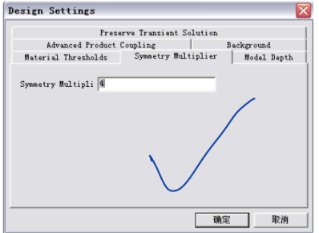

Thursday, May 4, 2023 @ 11:15:35 AM

算一个静态场，ansoft12保佑

看不到mesh看这里哦meshplot visibility

磁力线flux line在这里哦

赶紧学会处理简单报告

Thursday, May 4, 2023 @ 03:16:52 PM

学一下场计算器

使用wavecoil可以创建线圈模型

控制网格细度的办法：inner和outer都选在气隙的正中心，通过on selection对于气隙进行特别细分

在建模窗口的左下角可以选择瞬态仿真的当前时间用于查看sliding mesh和当前场

搞好这个瞬态仿真，setup的时候就要首先选好stop time，周期比较直观，再确定每一步的时间长度

师兄要求A相调整到起始角，不然会影响backemf的相对相位，这样功率∠计算就会出问题

Friday, May 5, 2023 @ 01:14:51 AM

把原来的项目abort了，目前在用副本算，尽量不要用任务管理器结束程序，会有很多错误数据，尽快学会清除冗余数据应该也可以

Friday, May 5, 2023 @ 05:38:56 PM

检查空载反电势一般从e=blv这个最基本的公式开始考虑，如果induce voltage没有，先看看B，l不设置也会有默认值，v只要设置了motion一般都能旋转

有可能是单位的问题，这个空载反电势的单位给的是gv，可能太大了，重新生成一下报告

目前还是没法解决这个，去mxwldby看看？这个先缓缓，为了避免被师兄讨厌，首先要解决A起始点的问题

打开ansoft12书

Saturday, May 6, 2023 @ 08:21:13 AM

看不到反电势的原因，这个参数没有选择moving1？
并不是，选择了也没有显示

也许不是没显示？而是分相分错了

A相，也有可能是前两个点的错误没有排除

他的电机的A相换向点是15deg，看看他的电机本身的参数，4极24槽，用rmxprt看看

我的电机，检查发现没有设置重复周期，会不会是这个原因？

一定找时间学一下清除场数据，目前的小技巧是把报告全部删掉然后重启软件，一般都能转起来
应该主要还是网格那个图一定删掉

和师兄交流结束，现在开始负载仿真

Saturday, May 6, 2023 @ 10:41:42 AM

《ansoft12》用的是外电路的方法加负载，显然不是132kw使用的方法，尽快跳过往后面看，找到sin有关的

但是132kw的winding这里写的是external，又没有circuit，难道是我拿过来之后删掉了？

目前需要从老师那里取得的参数：电机的轴向长度或depth，目前depth用的默认的1meter，还有端部漏感和相电阻，只有一个L是从有限元这里给的

还有预估的相电压（不能功率除额定电流，还有功率因数和效率之类的需要考虑）

当前版本160kwloaded-副本

Saturday, May 6, 2023 @ 04:28:05 PM

取更多点，优化齿槽转矩的平滑度，齿槽转矩可以在noload的torque，moving1.torque里面得到，就是由于开槽导致的转矩，可以试试通过斜一个槽来进行改善

