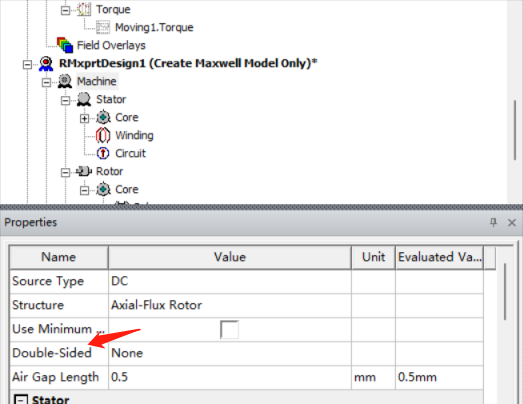
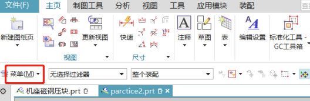
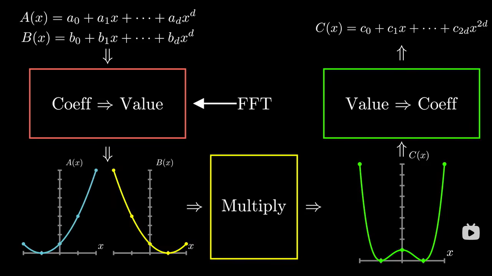
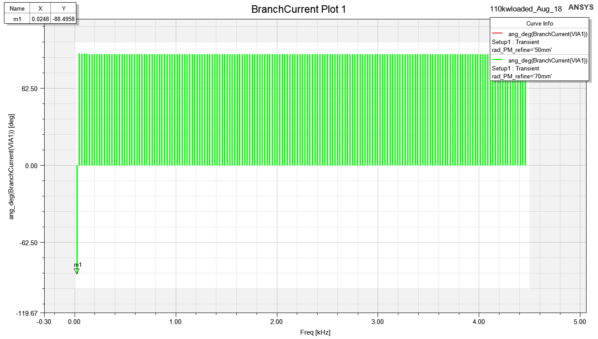
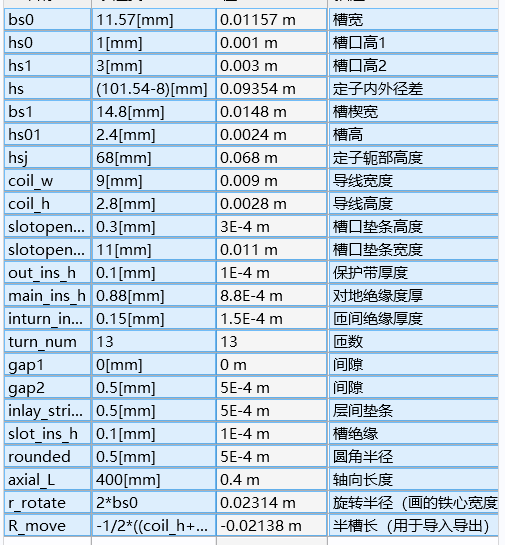
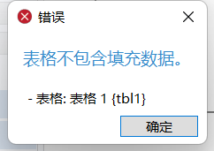
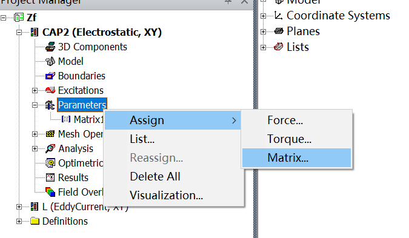
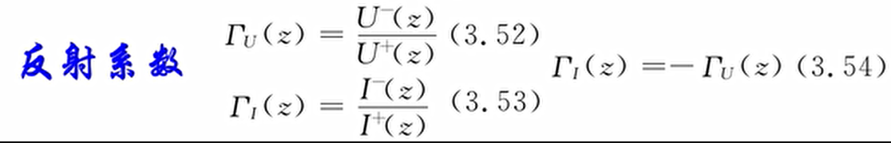

**Monday, April 10, 2023 @ 05:04:36 PM**

band和inner outer可以设置transpant方便查看之后的结果

band的设置，右键assign即可，注意选择旋转还是translation，就是暂态

###vector potential就是向量势，或者矢量势，A（x,y,t）就是边界条件使用电流密度不好表示的时候使用这个来表示∇ × A = B

如果在仿真中未使用向量势边界条件，则可能需要更频繁地进行电机中的电磁场采样

矢量磁势边界条件，定义边界上的矢量磁位A的常数值。边界处的磁场与边界正切，不会漏到边界外面去。

modelica实例实战http://modelicabyexample.globalcrown.com.cn/Release: v0.3.6-307-g33331e7-Early Access作者： Michael M. Tiller, Ph.D.

使用了timestamp，使用ctrl+shift+T可以创建时间戳

**Monday, April 10, 2023 @ 05:09:48 PM**

查看maxwell场图不显示的一个可能原因，没有隐藏掉band之类没有用的区域，把field遮住了

添加了markdown快捷键（使用markdown all in one），使用ctrlB和ctrlI可以实现快速斜体粗体

**Monday, April 10, 2023 @ 05:20:07**

使用快捷键：按下Ctrl + L，即可选中光标所在行。

*？加上的负载都是电流（和永磁体），那么为何load不需要与轴相关呢？是只有失去同步之后才会影响？*

玩poly brige有感，使用三角形的稳定性真的能做很多事情

mb3_excitation_assign eddy effect_可以分配涡流损耗，
*一般给永磁体？*

2d仿真别忘了设置轴向长度，mb3>model>assign depth即可

**Monday, April 10, 2023 @ 06:03:17 PM**
##轴向设计方法

插入一个rmxprt design

machine这一栏1.电流类型选择DC2.选择气隙长度，其他不用设置

stator这一栏全部要设置

core这一栏要注意外径给外壳留余量（也全部要设置，材料用steel就行）

slot这一栏根据槽型来看，最好都写，Rs可以不写不报错

winding这一栏注意conductor per slot是匝数乘以绕组层数（双层绕组是2）coil pitch指的是节距，设置1就行，漆包线厚度比较麻烦，需要查表，都是一一对应的，wire wrap指的是绝缘厚度，导线材料选铜

circuit也都填一下

stator依然注意是选择级数（x2）

core按照定子抄过来就行

pole分配的材料可以选NdFe35铝铁鹏，mag len不要选太大容易重合

之后再anali里面add solu，选一下电压转速，保存

右键setup，最下面的create 模型，这个circuit可以去掉如果不需要外电路

**Monday, April 10, 2023 @ 06:08:07 PM**

##双层轴向

click machine and then set fraction to one to get the whole machine.

删除掉多余的模型，选择select all。

右键材料查看property可以得到充磁方向。

这里一个比较方便的设置就是把上下都设为沿着z轴，所以经常会把电机这样摆放。

band设置要比运动部分稍大inner和outer正好包住就行摁住alt和方向可以快速转向Tuesday, April 11, 2023 @ 05:52:22 PM修改：他的意思仅仅是alt和mb1可以替代使用mb2进行旋转的作用，非常无语，定位到平面还是需要在view里面点击coordinate比较快

电流面coilterm可以用来加载电流方向和匝数等dependentsheet用来赋予边界条件

用draw里面这个按钮可以隐藏掉暂时不需要的区域（快捷键是f8还是f9，忘记了）

从右下角往左上角选择可以选择所有触碰到的obj，从左上角往右下角选择只能选择完全框住的

使用镜像命令镜像所有上半部分得到一个双定子结构之后使用参数化建模来约束下半个定子使得可以同步修改

在coil当中的createu user define part需要修改参数化外径内径等，之后就不用管了，都是根据coil_0复制过来的

之后在ndfe35（磁钢）里面改一下，diaouter设置为statorouter-2mm即可，单位不可缺失，不然默认是m

铁心也是一样操作，这个值要继承之前的修改

这几个域需要重新定义，需要完全重新设置band和outerregion才能

进行运动仿真

创建一个cylinder，改名为band，之后使用右键-measure-position可以

测量一下数值方便之后设置参数（三维之后感觉比较有用）

复制这个band，改变参数包住所有模型，height使用之前定义的参数加起来

选中这个域，进行split，先使用xz切一边再用yz切一边，可以保留四分之一模型

之后还要修改电流面coilterm和边界条件denpedent都需要在这里选择使用xz平面进行画图可以修改作图面

我怎么感觉这种简单的可以每次都重新画一下更快转到这个平面之后就很简
单了，仅仅画图的话使用around axis命令可以创建出从边界

右键band，assign band进行motion setupinitial角度选择7.5？关注吮指原味的后续视频
再选一个转速

边界选择assign bounders，因为模型不是对称的，（是否只有180deg才能叫做对称？）所以需要选择Hdep=-Hind

##参数化

之后开始设置激励，相对于前两个相对复杂

首先在exitation里面右键已经存在的phase选择add terminal，把属于a的两个激励选择加
进去以此类推
进
rmxprt里面，wind里面右键connect all coil可以得到线圈的连接情况方便理解电流的方
向，结合右手定则可以确定磁钢的NS极

设置一下winding，点击phaseA，改变激励type从external到 Current.

再点击单个线圈的，激励可以看到设置导体数目，其实设置的就是匝数。

点击set up。选择step time。计算一下电周期使用60秒除以转速，再除以极对数。记得是
除，因为之前算电角度的时候，是用机械角度乘以极对数。

**Monday, April 10, 2023 @ 06:13:08 PM**

##参数扫描

optimetric可以add一个参数，设置步长之后就可以进行扫描

HPC和analis这里可以设置多核计算

在中间的add中添加一个新的规则

add machine to list，设置core为4

之后右键parasetup进行仿真

*？？需要总结一下设计流程*

Ctrl/Cmd + Shift + V 快捷键在编辑器中打开 Clipboad Preview，然后直接粘贴图像即可，

Clipboad Preview 会自动将其转换为 Markdown 代码。


**Monday, April 10, 2023 @ 06:30:47 PM**
##峰值转速仿真
一般先仿真峰值转速之后仿真峰值转矩，再仿真一个额定工作点就行了。

**电机能达到某个转速的条件：电机的线反电动势峰值小于母线电压并且要给电阻和电感留出余量**

线反电动势峰值和转速正比，和直径成正比，和线圈匝数成正比

无刷直流电机的线反电动势峰值小于母线电压(24V)，并且要给电阻和电感留出余量

永磁同步!电机的线反电动势峰值大于母线电压加ld，削弱磁密，实现弱磁升速。

如此看来必须要联合变频器进行仿真才能得到高频下的这个，本来maxwell就可以加外电路，但是感觉还是不如抽出参数

**omega(rad/s)=2xpixf(Hz)
电频率(Hz)=机械频率(HZ)x极对数
机械速度(rpm)=机械频率(HZ)/60**

A:lqrms*sqrt(2)*sin(2*pi*rotor_speed_con/60*10*time)
B相:lqrms*sqrt(2)*sin(2*pi*rotor_speed_con/60*10*time-2*pi/3)
C相: lqrms*sqrt(2)*sin(2*pi*rotor_speed_con/60*10*time+2*pi/3)
Thursday, April 13, 2023 @ 03:22:55 PM补充
没有按照它那个设置参数化，直接输进去参数化吧
这个time参数是可以内置的吗

**Monday, April 10, 2023 @ 07:05:26 PM**

了解一下磁场调制理论，下载知乎文章

**Monday, April 10, 2023 @ 09:18:29 PM**

使用report>winding>任意一相电压，即可查看反电动势

如果需要查看电感矩阵，需要在model>model depth>matrix compu里面勾选并运算之后到报告中查看，不然默认是空白

**Monday, April 10, 2023 @ 09:52:15 PM**

试试吧SD卡作为miui的主要存储空间，这个红米10也能玩转了

**Tuesday, April 11, 2023 @ 12:09:16 AM**

继续尝试hory的acmop
一直在报错conda install pygmo，怀疑还是chen老师自己设置有问题
Thursday, April 13, 2023 @ 03:31:25 PM补充：没问题哈，自己没配置好虚拟环境
最后使用pip直接装了，conda还是玩不明白
给我报错的大意是pygmo无法通过pip直接安装，好烦，是不是还是要conda，用conda也可以防止一部分污染
chen老师这里关键是需要太多支持了，能不能把pyfemm里面的东西单独搞出来自己写一个，还有作图的那些

**Tuesday, April 11, 2023 @ 02:29:51 AM**

acmop学习阻力太大了，现阶段是不是先放一下？
感觉尽快搞完轴向+maxwell小技巧和comsol电磁比较重要
except:sys.path.insert(0, 'D:/DrH/Codes/acmop/codes3/')
用的是绝对路径，搞毛啊
pygmo安装失败大概率和mworks里面用到的一些东西有关

**Tuesday, April 11, 2023 @ 02:59:13 AM**

真的好烦啊这个东西，多目标优化，最好是能攥在自己手里就好
chen老师的东西很难模块化来用，暂时先放一放
抓紧先把maxwell所有的能回的会了然后学会分数槽

**Tuesday, April 11, 2023 @ 11:38:30 AM**

轴向的绕组理论？先放一下
之前听到idiq辨识还是有问题，要上功率容易掉电压，感觉轴向的控制确实比较麻烦，使用常规的FOC可能会出比较大的问题，参数辨识真的很重要

**Tuesday, April 11, 2023 @ 02:23:04 PM**

办完港澳通行证回来，记得20号去取一下
开始准备做振动测试这个事情
快速过一遍DTC之后就先把袁雷放一边，不能匀出更多时间给控制了
感觉把轴向那个分析外特性的过程学会比较重要

**Tuesday, April 11, 2023 @ 03:12:59 PM**

D’Amato2022综述阅读，感觉和王鹏的写的差不多，现在才看一半，希望能多讲建模的事情

**Tuesday, April 11, 2023 @ 03:55:35 PM**

找了一圈，资产，实验室，采购，没有找到底座的主人，等张松老师进一步安排

1.在VS Code中打开命令面板，可以使用快捷键Ctrl+Shift+P或者F1键来打开。
2.在命令面板中输入Preferences: Open Keyboard Shortcuts，然后选择这个选项来打开Keyboard Shortcuts配置页面。
3.在搜索栏中输入Timestamp，然后定位到Timestamp插件的命令。
修改为了alt+t

**Tuesday, April 11, 2023 @ 04:37:18 PM**

继续看了点rundong的overview of axial flux，师兄做的应该是double side

**Tuesday, April 11, 2023 @ 05:04:04 PM**

轴向仿真的问题，三维N极定义的是R，phi，Z，那所谓的halbach充磁会不会比较麻烦

**Tuesday, April 11, 2023 @ 05:26:29 PM**


在machine里面可以直接选择double sided，是否能达到一样的效果？试试
报错RatedOutputPower must be greater than 0. ，应该是因为删除了电路cirt导致的

明明选了double stator，为何生成了double rotor，好奇怪

siglesided会浪费很多磁通，如果使用double可以都兜住
使用bldc控制的话，一般就是每3coil对应4poles，这是那个拖动方式决定的

还是继续搞一下conda吧，顺便开个新坑，看一下pyaedt的东西
记一下要用jpg存本地图床才能显示markdown

**Wednesday, April 12, 2023 @ 08:58:21 AM**

别用win+shift+s截图了，出来的是png

```
Relative Permeability（相对磁导率）：相对磁导率是材料在存在磁场时的磁导率与真空中磁场的比值，是描述材料磁性的重要参数。N36Z_23的相对磁导率可能比较高，表示它在磁场中容易被磁化。
Bulk Conductivity（体导率）：体导率是指材料对电流的导电性能。N36Z_23的体导率可能较低，因为铁氧体材料通常为绝缘材料，不会很好地传导电流。
Magnetic Coercivity（磁饱和磁场强度）：磁饱和磁场强度是材料在磁化过程中需要的最大磁场强度，通常用于描述材料的磁性，但与相对磁导率不同，它与材料的饱和磁化强度有关。N36Z_23的磁饱和磁场强度可能比较高，表示它可以容纳更多的磁通量，但这并不一定意味着它具有较强的磁性能力。
```

**Wednesday, April 12, 2023 @ 09:28:08 AM**

Navigator Error
An unexpected error occurred on Navigator start-up
原来是整个anaconda出问题了
Navigator Error
An unexpected error occurred on Navigator start-up

Report
Please report this issue in the anaconda issue tracker

Main Error
check_hostname requires server_hostname
Traceback
Traceback (most recent call last):
  File "C:\ProgramData\Anaconda3\lib\site-packages\anaconda_navigator\exceptions.py", line 72, in exception_handler
 ### 需要处理以下这个hostname的问题


学术chat这个问题应该还是没有配置proxy导致的

不是代理导致的，还是容器的问题，这个包那个包已经全部乱了，啊啊啊啊
网速不好别玩需要pip和conda的东西。。。很容易梯子崩掉之后啥也玩不了还要花很多时间debug

**Wednesday, April 12, 2023 @ 10:35:53 AM**

学习nx制图2d流程，prt部件和菜单里面开始建模和制图并不冲突
放到整个视图的左上角可以移动视图，多等一会等他提示就行
尽量不要点到线。。不然拖不动的
明确目标，大致复现一下基座磁钢压块.prt
*如何实现在siemens nx制图中编辑公差？*
直接双击就能得到，不要再annotation里面搞,出现0的就是单向公差
*在Siemens nx制图中快速调整字体大小？*
Thursday, April 13, 2023 @ 09:59:06 AM跟进

在最顶端那个改不了的，只能改公差位置，要到这里改

**Wednesday, April 12, 2023 @ 11:32:41 AM**

尝试使用anaconda navigator创建环境
 environment location: C:\Users\siqip\.conda\envs\your-env-name
 成了，要激活就是conda activate your-env-name即可，好强啊，太棒了，记得断掉代理

**Wednesday, April 12, 2023 @ 02:42:45 PM**

*如何使用Siemens Nx选择更大的箭头？*

尽量多的使用菜单，一般preference都在这里面，不要习惯性选择文件去找东西

还是没成啊，好烦，这个偏好感觉还是重启才能有效

```
Traceback (most recent call last):
  File "C:\Users\siqip\ACMOP\codes3\acmop.py", line 4, in <module>
    import os, json, acm_designer, bearingless_spmsm_design, vernier_motor_design, bearingless_induction_design
  File "C:\Users\siqip\ACMOP\codes3\acm_designer.py", line 5, in <module>
    import population, FEMM_Solver, pyrhonen_procedure_as_function
  File "C:\Users\siqip\ACMOP\codes3\population.py", line 16, in <module>
    import FEMM_Solver
  File "C:\Users\siqip\ACMOP\codes3\FEMM_Solver.py", line 23, in <module>
    import winding_layout
  File "C:\Users\siqip\ACMOP\codes3\winding_layout.py", line 571, in <module>
    import scipy.integrate as integrate
ModuleNotFoundError: No module named 'scipy'
```

感觉需要用虚拟环境打开code进行调试
activate之后直接用code命令即可
cd..可以返回文件上一层cmd

```
在Python中，init.py文件主要用于标识一个包（package），它通常是一个空文件，用于告诉Python解释器这个目录是一个Python包，该目录中的模块可以被导入到其他模块中。当用户使用import语句导入整个包时，该文件将首先被执行。
一些常见的任务，可以在__init__.py文件中执行，例如：
初始化包级别的变量：例如在包中定义一些常量，也可以在该文件中初始化它们。
定义__all__变量：在__init__.py文件中，您可以定义__all__变量，用于指定其他模块可导入的公共接口。
支持动态导入：在某些情况下，您可能需要动态导入模块，例如，基于某些条件或用户输入导入不同的模块。在__init__.py文件中，您可以编写代码来动态导入模块。
```
```  
File "C:\Users\siqip\ACMOP\codes3\FEMM_SlidingMesh.py", line 1222, in parallel_solve_transient_FEA
    raise Exception('Subprocess failed to execute.')
```
在命令行直接跑更快，用code打开很慢。但是报了同样的错误

```
2023-04-12 15:46:35,644 - bearingless_spmsm_design - WARNING - [Warning from bearingless_spmsm_design.py]: Inter-pole notch depth mm_d_rp cannot be larger than mm_d_pm or else the sleeve cannot really hold or even touch the PM. So mm_d_rp is set to mm_d_pm.
2023-04-12 15:46:35,644 - bearingless_spmsm_design - WARNING - [Warning from bearingless_spmsm_design.py]: deg_alpha_rs cannot be larger than deg_alpha_rm/s. Note deg_alpha_rs is set to deg_alpha_rm/s.

```

这段日志包含了两条WARNING级别的警告消息。开发者想要告诉你的是在电机设计程序中存在两个参数，如果设置不正确，可能会导致电机无法正常工作，因此需要注意检查这些参数的设置。
第一条警告消息涉及到Inter-pole notch depth mm_d_rp参数，程序检查该参数是否大于mm_d_pm参数。如果mm_d_rp大于mm_d_pm，将会导致套管不能很好地承载或接触永磁体。因此，程序将mm_d_rp参数设为mm_d_pm，以确保电机能够正常工作。
第二条警告消息涉及到deg_alpha_rs参数，该参数不能大于deg_alpha_rm/s参数。如果deg_alpha_rs大于deg_alpha_rm/s，将会导致电机无法正常工作(不推荐设置这些参数不一致)。因此，程序将deg_alpha_rs参数设为deg_alpha_rm/s，以确保电机能够正常工作。


**Wednesday, April 12, 2023 @ 05:04:26 PM**

制图>绘制中心线>选中视图，在菜单栏中选择“Insert” > “Centerline”里面寻找命令
plot mesh这个问题还是没解决，唉，看了还是得自己啃这个文档

**Thursday, April 13, 2023 @ 09:43:05 AM**

*学一下maxwell里面外电路的问题？如何设置一个正确的激励？*
暂时放一下

**Thursday, April 13, 2023 @ 10:42:33 AM**
重新设置了motion的转速，出现了整个模型，之后就能看到plot mesh了，但是band只设置了1/8个模型

**Thursday, April 13, 2023 @ 03:16:39 PM**

axial flux结果还是乱七八糟，应该还是激励设置的有问题，需要重新去看视频了
三相激励设置的都是1A，测出的转矩就是脉动？还是要看看怎么设置的三相电流，是直接用的I生成的sin函数吗

**Thursday, April 13, 2023 @ 05:30:31 PM**

新的工具！scispace，太猛了，可以抓紧把开题肝出来

新的一周！

Thursday, May 4, 2023 @ 11:15:35 AM

算一个静态场，ansoft12保佑


看不到mesh看这里哦meshplot visibility


磁力线flux line在这里哦

赶紧学会处理简单报告

Thursday, May 4, 2023 @ 03:16:52 PM

学一下场计算器

使用wavecoil可以创建线圈模型

控制网格细度的办法：inner和outer都选在气隙的正中心，通过on selection对于气隙进行特别细分

在建模窗口的左下角可以选择瞬态仿真的当前时间用于查看sliding mesh和当前场


搞好这个瞬态仿真，setup的时候就要首先选好stop time，周期比较直观，再确定每一步的时间长度

师兄要求A相调整到起始角，不然会影响backemf的相对相位，这样功率∠计算就会出问题

Friday, May 5, 2023 @ 01:14:51 AM

把原来的项目abort了，目前在用副本算，尽量不要用任务管理器结束程序，会有很多错误数据，尽快学会清除冗余数据应该也可以

Friday, May 5, 2023 @ 05:38:56 PM

检查空载反电势一般从e=blv这个最基本的公式开始考虑，如果induce voltage没有，先看看B，l不设置也会有默认值，v只要设置了motion一般都能旋转

有可能是单位的问题，这个空载反电势的单位给的是gv，可能太大了，重新生成一下报告

目前还是没法解决这个，去mxwldby看看？这个先缓缓，为了避免被师兄讨厌，首先要解决A起始点的问题

打开ansoft12书

Saturday, May 6, 2023 @ 08:21:13 AM


看不到反电势的原因，这个参数没有选择moving1？
并不是，选择了也没有显示


也许不是没显示？而是分相分错了


A相，也有可能是前两个点的错误没有排除

他的电机的A相换向点是15deg，看看他的电机本身的参数，4极24槽，用rmxprt看看


我的电机，检查发现没有设置重复周期，会不会是这个原因？


一定找时间学一下清除场数据，目前的小技巧是把报告全部删掉然后重启软件，一般都能转起来
应该主要还是网格那个图一定删掉


和师兄交流结束，现在开始负载仿真

Saturday, May 6, 2023 @ 10:41:42 AM

《ansoft12》用的是外电路的方法加负载，显然不是132kw使用的方法，尽快跳过往后面看，找到sin有关的

但是132kw的winding这里写的是external，又没有circuit，难道是我拿过来之后删掉了？

目前需要从老师那里取得的参数：电机的轴向长度或depth，目前depth用的默认的1meter，还有端部漏感和相电阻，只有一个L是从有限元这里给的
Tuesday, August 22, 2023 @ 02:59:42 PM
这里得到的相电阻还有用，之后还可以作为损耗计算的根据

还有预估的相电压（不能功率除额定电流，还有功率因数和效率之类的需要考虑）

当前版本160kwloaded-副本

Saturday, May 6, 2023 @Saturday, May 6, 2023 @ 04:44:07 PM 04:28:05 PM

取更多点，优化齿槽转矩的平滑度，齿槽转矩可以在noload的torque，moving1.torque里面得到，就是由于开槽导致的转矩，可以试试通过斜一个槽来进行改善


确实平滑了

版本管理通过复制一个没有aedtresult的文件来进行，文件名精确到分钟

和A相对齐的意思是使极的中心线和两个A的中心线对齐

在model-model setting-use skew model里面可以设置斜槽/斜极？？，但是不是直接使用360/slots，而是(q-1)/q个

他的例子是8极48槽（360/48=7.5）,这里输入了5deg，他的优化效果不错，我的q=1，可以用斜槽吗？

按照360/slots进行设置skew angle，波形已经乱了起来。。。要进一步看一下视频之类的，不是(q-1)/q？这里是因为他用的number of slices

切片数量设置的是5

这是设置为10/3
看看设置10/3*0.8会有多少吧

幅值小了很多，之前是800N.m，现在不到200N.m

右键某个setup来进行仿真，尽量少使用analyze all，不然容易报错

利用参数扫描对6，10，19，5进行参数扫描
**Monday, April 17, 2023 @ 10:18:12 AM**

nx图画完了但是没法测量上表面，磁耦合器等三件的联系方式等老师
赶紧准备开题！程哥都动手了

**Monday, April 17, 2023 @ 10:44:20 AM**

看完了hangzhao的轴向综述，关键还是磁路法，


场重建（感觉比较麻烦，基于角度分解Bs(r,θ,z, t) = ∑ i bs,i (r,θ,z, t )Ii (t)），子域法（运用不同磁位方程∇2 A =−μ0∇×Mr）,都可以结合quasi3d

最好还是早点把坚果云里的东西tera同步一下，会员过期之后又是麻烦事情

**Monday, April 17, 2023 @ 11:52:03 AM**

在看DAmato的pwm电机综述，目前还都是材料的东西，感觉也必须讲一下电晕放电之类的东西，现在还没法把计算出来的电场返回到fea中，为了计算电场，必须要把整条电压的曲线全部加载进FEM模型当中？人家算的电压应力，所以那些什么端部评估之类的东西还是需要用啊，电晕，尖角这些都是解释性质的，这样电场应该只需要对单根导线建模吧？感觉还是不精确啊。

抽空学一下autoGPT，但是感觉我的token有些不够，唉

想办法把motorcad汉化一下？
已经完成

想办法把巫师3装到老电脑上面去吧，win11看起来是不支持了

**Monday, April 17, 2023 @ 02:46:26 PM**

```
FDTD方法对于处理各向同性材料和结构的电磁场问题更加简单。相比之下，FEM方法需要通过更复杂的网络模型来处理这些情况。
FDTD方法可以有效处理时域电磁场问题，特别是脉冲电磁场的传播和散射问题。FEM方法相对于FDTD方法在时域计算的计算效率较低，且不便于直接处理脉冲问题。
FDTD方法采用的是不规则网格的形式，能够更好地处理不规则结构的电磁场问题。而FEM方法需要进行离散化和网格划分，使得在处理不规则结构时需要更多的计算资源和时间。
```
fdtd很多都是光学的东西，感觉路子还是走的有点歪啊，先把电压计算这部分写了再说


curl equation，指的是倒三角


变化为此图


以下是一个链接fdtd for matlab
```
https://www.mathworks.com/matlabcentral/fileexchange/93045-fdtd-1d-2d-3d-simple-free-space-examples
```

**Monday, April 17, 2023 @ 04:10:29 PM**

fdtd的mtl建模和基于fem的mtl建模有什么不同？
先看liuping还是先看fdtd？
是不是应该先看能写开题的东西？

scispace也需要较稳定vpn才能玩，回家用

Monday, April 17, 2023 @ 04:31:13 PM

先试试nx装配吧

**Tuesday, April 18, 2023 @ 09:23:45 AM**

安装meep中，比较麻烦，在用conda装一下pymeep
conda config了一个国内镜像，这个也需要断掉代理，断开，不是推出
一样报错
```
https://blog.csdn.net/ZNJIAYOUYA/article/details/121721805
在**用户根目录（C:\Users\用户名）**下找到.condarc文件，打开将原有内容替换成如下代码：
```


搞了半天这玩意根本没有windows？


有时候csdn比知乎靠谱。。

**Tuesday, April 18, 2023 @ 10:05:35 AM**

ubuntu4个多G，回去搞吧，烦烦烦！真的先不动这个了，人已经麻了。
```
https://blog.csdn.net/weixin_43002202/article/details/120951578
```
好像我也不需要把链接包起来，就自己看，装什么犊子，ctrl+K被占用了，后续有一堆快捷键，不能拿这个出来就为了爽一下

**Tuesday, April 18, 2023 @ 10:25:44 AM**

最好是用typeset来玩scispace，插件的功能比较弱经常断开链接

还在看DAmato这个综述。有几个重要结论，
1.电机尺寸up>匝数down>更大反射
2.用Trise的计算公式可以反推临界的电缆长度
3.对于type1来说主要还是jump和rise影响匝间，对地和相间是收到峰峰影响（基频，冲击频）
4.双极性脉冲影响大
maxwell的强势在于（相比于hfss）有rmxprt还有maxwell 外电路，利用起来，但是只能用vb编程还是有点傻逼

**Tuesday, April 18, 2023 @ 11:57:02 AM**

老师最后估计还是会让我采用comsol的技术路径，毕竟哈理工已经做了一部分了，那就用comsol吧，反正它也能work with dxf（AutoCAD）

看到了谢菲一个新的研究，这个高频还和轴电流有关，唉，感觉真的可以采用以下jiahao的bearingless了，这个轴的东西确实影响挺大的

Tuesday, April 18, 2023 @ 03:34:43 PM

搞了一下午openEMS，然后需要visual C++ 14以上环境，就是要装vs没有code，6g以上，，又是需要回家搞，感觉这个支持还不如meep


**Friday, April 21, 2023 @ 02:15:04 PM**

开始做一下硕论的工作吧，又想接上上次的工作先搞一下

**Friday, April 21, 2023 @ 04:30:51 PM**

openems还是装不了，依然是报ms那个啥无法solve某个io.h文件

王鹏还是会水，照着他的东西抄一下，尽量再把他外行的话去掉


Thursday, May 4, 2023 @ 11:15:35 AM

算一个静态场，ansoft12保佑


看不到mesh看这里哦meshplot visibility


磁力线flux line在这里哦

赶紧学会处理简单报告

Thursday, May 4, 2023 @ 03:16:52 PM

学一下场计算器

使用wavecoil可以创建线圈模型

控制网格细度的办法：inner和outer都选在气隙的正中心，通过on selection对于气隙进行特别细分

在建模窗口的左下角可以选择瞬态仿真的当前时间用于查看sliding mesh和当前场


搞好这个瞬态仿真，setup的时候就要首先选好stop time，周期比较直观，再确定每一步的时间长度

师兄要求A相调整到起始角，不然会影响backemf的相对相位，这样功率∠计算就会出问题

Friday, May 5, 2023 @ 01:14:51 AM

把原来的项目abort了，目前在用副本算，尽量不要用任务管理器结束程序，会有很多错误数据，尽快学会清除冗余数据应该也可以

Friday, May 5, 2023 @ 05:38:56 PM

检查空载反电势一般从e=blv这个最基本的公式开始考虑，如果induce voltage没有，先看看B，l不设置也会有默认值，v只要设置了motion一般都能旋转

有可能是单位的问题，这个空载反电势的单位给的是gv，可能太大了，重新生成一下报告

目前还是没法解决这个，去mxwldby看看？这个先缓缓，为了避免被师兄讨厌，首先要解决A起始点的问题

打开ansoft12书

Saturday, May 6, 2023 @ 08:21:13 AM


看不到反电势的原因，这个参数没有选择moving1？
并不是，选择了也没有显示


也许不是没显示？而是分相分错了


A相，也有可能是前两个点的错误没有排除

他的电机的A相换向点是15deg，看看他的电机本身的参数，4极24槽，用rmxprt看看


我的电机，检查发现没有设置重复周期，会不会是这个原因？


一定找时间学一下清除场数据，目前的小技巧是把报告全部删掉然后重启软件，一般都能转起来
应该主要还是网格那个图一定删掉


和师兄交流结束，现在开始负载仿真

Saturday, May 6, 2023 @ 10:41:42 AM

《ansoft12》用的是外电路的方法加负载，显然不是132kw使用的方法，尽快跳过往后面看，找到sin有关的

但是132kw的winding这里写的是external，又没有circuit，难道是我拿过来之后删掉了？

目前需要从老师那里取得的参数：电机的轴向长度或depth，目前depth用的默认的1meter，还有端部漏感和相电阻，只有一个L是从有限元这里给的

还有预估的相电压（不能功率除额定电流，还有功率因数和效率之类的需要考虑）

当前版本160kwloaded-副本

Saturday, May 6, 2023 @Saturday, May 6, 2023 @ 04:44:07 PM 04:28:05 PM

取更多点，优化齿槽转矩的平滑度，齿槽转矩可以在noload的torque，moving1.torque里面得到，就是由于开槽导致的转矩，可以试试通过斜一个槽来进行改善


确实平滑了

版本管理通过复制一个没有aedtresult的文件来进行，文件名精确到分钟

和A相对齐的意思是使极的中心线和两个A的中心线对齐

在model-model setting-use skew model里面可以设置斜槽，但是不是直接使用360/slots，而是(q-1)/q个

他的例子是8极48槽（360/48=7.5）,这里输入了5deg，他的优化效果不错，我的q=1，可以用斜槽吗？

按照360/slots进行设置skew angle，波形已经乱了起来。。。要进一步看一下视频之类的，不是(q-1)/q？这里是因为他用的number of slices

切片数量设置的是5

这是设置为10/3
看看设置10/3*0.8会有多少吧

幅值小了很多，之前是800N.m，现在不到200N.m

右键某个setup来进行仿真，尽量少使用analyze all，不然容易报错

利用参数扫描对6，10，19，5进行参数扫描

Monday, May 8, 2023 @ 08:51:42 AM
新的一周！
当前目标，完成loaded
首先把师兄的6phase模型删掉一半

这个咋来的，频率大约100?
##因为电路设置的90hz，我的转速是27hz，电机旋转的必要条件是同步，电频率和电频率同步，设置27hz
torque积分为0说明没有转起来
动笔才会有思维。。

目前电频率确实是54/2=27hz，但是转矩还是乱的
Monday, May 8, 2023 @ 02:57:31 PM

9550公式复习一下T=9550P/n,这次有限元算出的转矩48KN*m左右，脉动pk/avg在0.06，但是9550公式出来136左右，应该是轴向长度和张老师预设轴向长度有所出入，要问下预设轴向长度和相电阻、端部漏感,之后开始进行优化仿真
参数化分析

同步的意思是两个参数一起变化

参数扫描的
目前设置的是max（Torque），下一次对min（pkavg（torque））进行参数分析

切角为10deg的时候转矩最小，接下来看看对于pkavg的影响吧

不能对其进行参数化分析，但是可以算完之后来这边用marker里面的功能看然后自己用excel看一下

Monday, May 8, 2023 @ 04:42:23 PM
学会HPC option了，主要还是跑参数化的时候能用，只跑一个没必要而且容易报错
优化分析和参数分析有什么区别？


Tuesday, May 9, 2023 @ 10:13:35 AM
首先是傅里叶分解

在这里他证明了任何d阶多项式可以用d+1个点来表示

通过取值法来计算多项式的乘积，可以减少复杂度


如果直接取值的话复杂度不变，要利用奇偶性，多项式也同样可以拆开成奇偶多项式


使用复数的表示可以有效避免每次都要取负数利用奇偶的尴尬

复数在平面上的分布，这样也就能看懂傅里叶变换的那一堆e^pi之类的

每次都会变成n/2个点可以方便实现递归

实在看不懂了，记一下吧，就是实际谐波极对数除以画的polyline的弧长

Tuesday, May 9, 2023 @ 10:56:41 AM

还是很奇怪啊


计算结果怎么都对不上。R为17.9？问题先留这里吧，真的做上了分数槽再去担心这个

Tuesday, May 9, 2023 @ 11:32:45 AM
正在计算，想想之前什么操作导致的crush比较多，应该是生成场却没有选择full model还有带着fields就进行计算了，还要保留关掉小窗的好习惯

师兄重新教了一下fft横坐标，之前那个教程有点问题，没说考虑极对数，或者他说的是电跨距


先看一下9550公式的推导和量纲就是一个2pi/60的倒数，要换算成线速度罢了
有两种推导办法，一种是宏观上直接用量纲来表示（辜）还有一种就是用微观上的线负荷和气隙磁密积分出来（汤）

改成shift之后粘贴图片要先切换英文了

Tuesday, May 9, 2023 @ 03:33:01 PM

来看一下端部漏抗的计算吧

最后还是经验占比比较大，和绕组形式之类的都强相关
但是有一个归一化的项，就是4piμ0N^2/pq，之后的才是经验项


主要是三次谐波？为何，q=1啊

重新问了一下师兄，domain这里选择spectral，这里面有branchcurrent和nodevoltage，其实和打开winding调出来的没有什么区别，选中一个之后在最右边的function里面选择ang_deg，其实做的就是傅里叶分析，能直接告诉你频率，之后改table显示（或者一开始就创建一个table效果是一样的）这里注意找一下电频率，90/60*18，就是rpm/60*p，他的单位默认是khz，不要去找幅值，这里右边的量是角度！，真的是有点蠢，唉。

一般电机设计中所提到的Btheta都是值得我算出来的Br的基波幅值，不是整个波形的最大值，不然由于磁钢形状不同，这个是无法比较的，不能把所有工作都交给计算极弧系数

Thursday, May 11, 2023 @ 03:58:14 PM
现在学一下使用motorcad来设置一下绕组，方便和老师讨论，快速浏览这大本营10个教程


老师让从转子一路拉到定子外圈的一条线，在定子颚部mag_B只有0.5左右的幅值，需要缩减一部分的体积？为什么？浪费材料了吗


Friday, May 12, 2023 @ 04:21:14 PM
终于画完了，新的110kw的方案
A的形状不太对，应该是充磁设置有问题，唉，赶紧自学一下，都教了一遍没做笔记。。
右键形状在property-orenta里面
错误的结果没必要截图了，明显的就是永磁体内都不是直线的fluxline


Tuesday, May 16, 2023 @ 04:31:34 PM

新的一周！虽然已经周二了，新的任务，对梨形槽电机进行建模，由于使用了平行齿结构，只能使用圆线了
首先对槽重新建模

slottype2,之后对照编辑参数。

**老师之前提到了使用的碳钢，和硅钢有什么区别，会影响到我的建模吗？**
不会一定要问问师兄！

Tuesday, May 16, 2023 @ 04:52:19 PM
目前用draw可以解决大部分需要测量的问题但是还是有必要到晴儿那里看看measure的进阶用法

help里面找slot type可以带空格，更快找到参数对应图形

Wednesday, May 17, 2023 @ 03:32:42 PM
暂时看来网格没有什么问题，noload的套路也要快速掌握一下


之前就碰过的老问题，想想当时怎么解决的？反电势前几步莫名值很大。。


之前遇到过同样的问题，反电势首先看B的波形，当然别忘记设置模型


空载反电势，是不是太大了？看看电流和额定比较一下吧

openEMS还没装呢。记得试试，用vc装的，感觉femm比较大的优势就是不像meep之类的那么麻烦，或许科研都默认有linux吧


netlist可以导出.sph文件，之后可以搞进maxwell


负载的torque为何减少？
失步了。。电路那里有个mistype，写成93rpm了，靠，一定要保证电频率和机械频率*p对上啊

丢掉了前面的这一部分波形，还是因为前两步失真的问题，可能要多跑几个周期才能减少这个影响
而且在FFT中反映出来了，出现了比较大的0次波和二次波
emmm没找到描述这个问题的词，就是直流量。师兄的建议是首先检查一下外电路的设置。
这个结果也显然有问题，和9.55公式计算器结果对不上
赶紧检查一下外电路吧，争取明天出结果

目前版本用05170944的就行了，我已经知道怎样生成results不会报错了

Thursday, May 18, 2023 @ 09:33:28 AM


直流分量是从孔子啊就出现的，外电路应该暂时可以先不动，先检查一下setup和motion，大概率是启动角不对，或者甚至边界也有可能有问题？不对，边界有问题半个周期都出不来

inducedVA不是0开始的导致的？先试试把motion里面的initial deg去掉，和ansoft12里面的对照一下


过零点3.5244，大概3.33？360/108=10/3=3.33，为何换向点不是PM——between对准A的时候吗？

寄，零序分量的问题更加严重了，还多了一个，先算一下fft哪个是基波吧

之前没有问题，还是setup这里有个mistype，我靠我靠！！怎么又开始搞这种，脑子有毛病啊！
之前师兄都看出来不是一个周期了，早就应该看看周期这方面的问题，一个波形出了问题先看周期再看相位最后看幅值比较好
之后就直接复制过去仿真负载就行
出现改setup之后结果一样的情况还是复制重开一下吧
现在周期的问题解决了，来看看相位吧


有空就来研究一下这张图，把磁极的中心移动到两个A的中间，而不是吧磁极的between移动到A的正下方，但是我这个既是也是啊，那到底那里出了问题
9.55×P(功率，单位为W)=T(转矩，单位为N.m)×n（每分钟转速）
正弦电流的有效值，最大值的0.707倍
一般是定子斜槽或者转子分段斜极


以上为修改极弧系数之前的结果
以下为修改极弧系数之后的结果


#以下是否斜极的对比图


Friday, May 19, 2023 @ 10:18:04 AM
对于磁极偏心的扫描，偏心越猛转矩越小但是转矩脉动越小，取转矩脉动最小的情况，接下来对磁极跨距进行扫描

在对齿槽转矩进行优化的时候要使用空载，首先一个是计算速度快，其次，使用负载优化的其实是转矩脉动

Friday, May 19, 2023 @ 11:51:45 AM

you
又一个低级错误，如果算两步就直接停下来可能是吧周期设置成步长了

如果结果不好，在band的圆弧设置里设置segment，数量等同于步长（扩展到整个圆）原理是把圆弧设置成segments个锯齿形状，方便和步长一一对应，提高仿真精度

仿真cogging对网格密度和步长的要求相对较高，一定要想办法搞细了，band设置不了多层就要把outer region一起搞细，shaft可以搞真空节约计算资源


接下来对slices=9和slices=5分别进行计算

负载就不能只看一个齿周期了。。


Tuesday, July 11, 2023 @ 10:39:19 PM
开始检查开题缺了些什么，对，连有限元都没有说。。
孟大伟文章能否找到？
坚果云zotero还没恢复，比较麻烦

Wednesday, July 12, 2023 @ 01:17:13 AM
西南和西安都没抄完，主要需要恢复一下自己的模型，明天抓紧

Wednesday, July 12, 2023 @ 03:49:31 AM
搞一下zotero插件，更改了一下首选项-高级-文件夹里面的路径，暂时还没有配置pdf，能用就行

Wednesday, July 12, 2023 @ 03:54:03 AM
想想办法恢复一下电场的图片，首先装一下comsol，忘记下载了，先下载一下，ansys和ug反而不急装，暂时用不到，仅仅毕设来说

Wednesday, July 12, 2023 @ 02:35:46 PM
comsol下载完毕，开始安装

Wednesday, July 12, 2023 @ 03:33:28 PM
安装完成，但是破解的bat文件没运行成功，虽然能用但还是有隐患

Wednesday, July 12, 2023 @ 04:17:51 PM
修改2.1公式的标号，采用的是整行复制的办法，他之前应该是用表格做的，但是行末还是有一些突出，希望不要多出那个框架。暂时通过修改标尺把它控制在行内了，希望不要出问题

Saturday, July 15, 2023 @ 01:40:21 PM
把209账号静置了，等回归

Wednesday, July 19, 2023 @ 09:51:36 AM
删除了传统高频部分重复的内容，字数回落到了7100

Wednesday, July 19, 2023 @ 11:47:48 PM
把论文放进框框里面了，但是没法自动生成目录，手动打一个吧

Wednesday, July 19, 2023 @ 11:48:26 PM
现在开始整理一下公式编号和章节编号，在-副本里修改？还是直接到-带格式里面修改？

Thursday, July 20, 2023 @ 01:48:44 AM
表格搞了一下公式，图号也一起动一下吧

Thursday, July 20, 2023 @ 07:12:04 PM
图号公式号

Thursday, July 20, 2023 @ 07:14:15 PM
接下来首要应该是需要照着刘仕裕的把结构补充完整，之后补参考文献，在这之前可以把研究报告1206的2.2节抄进来，分布参数计算的这一部分

Sunday, July 23, 2023 @ 01:31:49 AM
补充完了研究报告1206里面的参数计算部分，需要重新调整一下公式编号和图号切同时更改一下符号使得二者

Sunday, July 23, 2023 @ 01:40:10 AM
以上部分补充完毕

Monday, July 24, 2023 @ 03:41:01 PM
论文打印提交了

Monday, July 24, 2023 @ 03:43:56 PM
准备安装一下ansys，要看视频，会寝室看吧

Monday, July 31, 2023 @ 02:47:27 PM
躺平太久了。。。出了比较大问题
开始软件安装

Monday, July 31, 2023 @ 03:23:56 PM
ansysem结束安装，整理桌面，准备开始安装UG

Monday, July 31, 2023 @ 03:48:35 PM
ug安装结束，不要吝啬重启，会少很多问题

Monday, July 31, 2023 @ 03:49:04 PM
抓紧补充一下电场方面的文献，重读一下哈理工胡博士论文，然后学习一个comsol案例

Monday, July 31, 2023 @ 03:56:32 PM
电压计算那边的论文结论总结暂时搁置一下，如果不以这个作为研究重点的话？

在zotero中使用纯文本的笔记就行，之后粘贴到markdown中

Monday, July 31, 2023 @ 04:25:09 PM
autoCAD没装，暂时打不开dwg文件，PSCAd也需要安装的，今晚抓紧一下

Monday, July 31, 2023 @ 04:54:16 PM
首先看看算端部需要添加什么场，之前在maxwell里面建的二位模型好像并没有丢进comsol，一直想着用他的app，这样可不行。改了他的参数可以用了，6slot-副本，但是好像有部分几何是重合度，有机会最好自己画一下

Monday, July 31, 2023 @ 04:59:14 PM
他使用的场就是静电es和磁场mf，不算很精细
具体参数回去之后看表，先画个大概。。

Monday, July 31, 2023 @ 05:37:24 PM
可以先把试验的数据用excel复原一下放到论文里面

Tuesday, August 1, 2023 @ 08:21:33 AM
继续复原试验数据表格，完善一些能放到论文里的东西
这个表格可以塞进附表中，如果结果不是很好的话

Tuesday, August 1, 2023 @ 09:21:17 AM
表格复原完毕，开始准备重新学习一下comsol基本操作，为去哈理工学习做准备

Tuesday, August 1, 2023 @ 11:45:28 AM
几乎没有什么推进，文献看不进，这个仿真也没有进展，就是画完了这个槽点模型、、

报错相对残差大于相对容差，是因为静电场不能求解瞬态还是因为材料的相对介电常数等乱设置了？

Tuesday, August 1, 2023 @ 02:16:01 PM
更改相对介电常数等之后看看是否报错？

边界条件选择终端会比电势能做的东西更多，特别后处理可以输出终端，尽量使用终端作为静电的条件

在定义中可以通过选择显式-输出实体-相邻边界来一次选中所有相邻的边界，之后再在边界中分配，可以在选择下拉菜单中找到

边界元（bpm）用于求解不太适合划分网格的情况

不设置接地的话电势的答案可能是有问题的，因为是对电场求解，电势不是唯一的

Tuesday, August 1, 2023 @ 03:57:51 PM
还在看comsol视频，电流用频域，频域可以连续设置，要用外电路要添加物理场（电路cir），一般子母简单的比较泛用这样看起来。


使用编辑变元把按钮和操作进行绑定，在下方按钮可以找到各表单的编码

Wednesday, August 9, 2023 @ 02:21:37 PM
感觉都是目前用不到的知识，有点无所适从

为何要用这样的方法搞出波形。。是否导入进来的结果不够好？

电场最大值集中在低阻带和高阻带的交界处，是因为边界过于尖锐了？是否需要优化一下。

这样一个平的模型如何仿真端部的结构？

Wednesday, August 9, 2023 @ 04:47:33 PM
在绝缘-绕组-comsol里面有一个胡海涛的模型，但是需要装ptc cero，使用稍微麻烦，能否使用全集成的？会不会反而显得工作量小？还是先看看胡海涛模型吧

Thursday, August 10, 2023 @ 03:21:23 PM
装完creo了，但是还是用不了，需要他的一个特定模型才行。
先试试槽的？他只给了dwg文件，应该只能看槽的电场
早点把comsol的基本和app帮助文档看了再说

Thursday, August 10, 2023 @ 04:39:26 PM
今天目标是把comsol app的文档看完

Friday, August 11, 2023 @ 09:40:19 AM
AutoCAD安装完毕，看看他的dwg模型，之后想办法装一下creo的cad模块
是否版本不够？

Friday, August 11, 2023 @ 02:59:32 PM
还在跟comsol文档，这个fin到底有什么用？

Sunday, August 13, 2023 @ 02:32:51 PM
继续comsol文档的busbar例子

Monday, August 14, 2023 @ 08:28:58 AM
昨天没什么进展，继续这个busbar例子，争取迅速解决

https://cn.comsol.com/support/knowledgebase/1216
形成联合体相当于对几何序列中的所有实体进行布尔并集操作，但保持内部的几何边界
与形成装配的区别在于画出的网格是否共形（边界是否相连）

Monday, August 14, 2023 @ 10:41:02 AM
看完了comsol两个例子，等会开始看app，先直接看看胡的结构

Monday, August 14, 2023 @ 03:48:53 PM
胡的结构比较乱，PTC creo link还是用不了，还都是拼音的变量名，太逆天
边看app文档边想想波绕组在电场分布上有什么优势，安装motorCAD看看结构吧，自己想坡头
太逆天了我靠，写死还都是中文路径，拿出来骗横向

Monday, August 14, 2023 @ 04:30:53 PM
motorCAD装不上，晚点回家装一下v13，v15的ssq有点问题
最后放弃了安装，可以不借助motorcad也能熟悉结构

波相当于打开的叠绕组，一个大电感打成一圈串联，一般匝数为1的时候使用波绕组

Tuesday, August 15, 2023 @ 10:27:48 AM
复原一下110kw的磁场图


Tuesday, August 15, 2023 @ 10:48:30 AM

回顾一下充磁方向的设置，是在这个orientation里面

回顾一下外电路设置的位置

Tuesday, August 15, 2023 @ 05:46:40 PM
还是不知道110kw出了什么问题，为了wedge处的磁场到了2.1t，从磁路法来看是不是between——PM还是太小了
减少PM——height之后最大Br显著减少了，高度减少到10的时候最大B只有1.8T了，这是自然气隙宽了之后磁场都散掉了

Tuesday, August 15, 2023 @ 10:55:23 PM

场计算器从这里打开

Wednesday, August 16, 2023 @ 09:49:17 AM
学习一下师兄排查错误-仿真错误的方法：从静态static重新建模到transient再到loaded，或者把loaded重新剥离到static
可以的话，尽量参数化，任何一个没参数化成功的参数都有可能因为某处漏掉没有修改而成为错误的罪魁
一定要提前拿到尽可能多的参数，尤其是最重要的电压电流还有功率因数，其他都是表象，这个才是结果
尽量清楚掉冗余的模型，在进行时间版本更替的时候，粘贴更名完之后就立刻删除冗余模型并重命名
现在是老版本了，要注意对上傅里叶频率，在选择spectral之后FFT options里面要选择采样点数，特别是选择多算两个点的这种，时间ms往前选两个
选在老版本直接对图像进行FFT分析会出现很多错误，典型就是横坐标都还是时间。。
现在还是想想为何转矩对不上，看看几个经典的涉及转矩的方程能否找找原因。
离独立完成工作还任重道远，唉。
同时还要想想这个cos（phi）如何用ang_deg搞出来
ang_deg出来的纵坐标就是角度，把branchcurrent的angdeg和nodevoltage进行相减即可得到phi
如果感觉结果不对可以看看三相电，或者线电压

Wednesday, August 16, 2023 @ 10:35:15 AM
仿真软件里面跑出来的转矩和功率都是电磁功率，也就是电机学里面提到的Pem，而一般电动机标定的额定功率都是输出功率！需要再考虑杂散和机械，而低速的情况下杂散并不大，所以可以参照陈世坤《电机设计》来看看一些经验公式

考虑电机最大的工作效率的内功率因数角（即电机向量图中E和I的夹角psai（三叉戟）），一般标贴式的电机使用Id=0控制，I在E方向上的投影就是直轴电流，所以psai应该为90，但是实际上无法做到，师兄建议想想如何对psai进行扫描，找到最大的功率点

平行齿的结构首先关注一下齿宽，如果齿宽一致性对上了，说明槽的尺寸大致不差

斜槽系数直接在轴线长度里面乘算掉了，叠压系数和端部损耗暂时不考虑，μ和Hc的值需要用来反推一下温度

Thursday, August 17, 2023 @ 09:07:21 AM
磁钢牌号更改了，重新复习一下永磁体赋值


很明显能动的只有Hc和Br，回顾一下αr是怎么参与计算的就行


可见工作温度设定的是80℃，切Hc选取的是满足指标的最小值

可见上面选取的是Br范围内中低的一个数值1.34T，注意以上两个α都是负值，所以计算的时候其实是加法

Br选取1.30，按照80度工作温度算得到使用Br为0.934。。。逆天计算器，1-0.066就是0.934，他没给我算。。。
Hc选取923000A/m^2,按照80度工作温度算得到使用Hc为862082
转矩大小降低到了10.6KN*m，询问师兄，42指的应该不是N42而是42SH

Hc要显著得大一些，Br选取值1.29，Hc选取值995000
得到使用值Br1.20486，Hc929330
注意这里使用的是42SH
Tuesday, August 22, 2023 @ 11:29:12 AM
重新需要重新计算一组数值，设定温度序列使用20-80吧

Thursday, August 17, 2023 @ 04:18:02 PM
parametric里面的就add好用，建议都直接删除之后重新add，更新或者修改都很容易出错

Friday, August 18, 2023 @ 02:38:58 PM
定子齿部磁密


Friday, August 18, 2023 @ 05:27:18 PM
取出ang_deg，内功率因数角是induced和branch，功率因数角是node和branch

indudced角度-67.1179

branch角度-88.4958,之前好像也是这个？会不会可能有问题？不管了，标红之后问问师兄吧
Tuesday, August 22, 2023 @ 11:40:49 AM
这个角度出来的问题就是FFT options设置的问题，看左上角的频率，不是24.9kHz，要舍去前两个点就是正常的ang图

node角度-67.5770
内功率因数角21.3779，功率因数角20.9188

Monday, August 21, 2023 @ 08:51:18 AM
E会比U夹角更大吗？要复习一下相量图
王秀和书这里提到了三中运行状态：过激励磁、欠激助磁、增去磁临界三种运行状态，复习一下，顺便复习一下双反应理论
所以psai＜or＞phi都是正常情况，都是过激去磁
这三种情况都是针对V形曲线来说的
具体相量图为

其实一般只有内置式和表插式的PM需要使用双反应理论，因为等效为凸极电机，标贴式等效为隐极没有必要，但是为了统一分析，都使用双反应理论，只是标贴式设置为交直轴电感想等的形式
继续回顾一下V型曲线的推导过程，是和永磁体工作点有关吗？永磁体工作点由温度和电枢电流决定，所以温度一定的时候Ia和If会有一个曲线

Monday, August 21, 2023 @ 11:05:01 AM
这边的定子齿部磁密是不是之前也取错了？没有取到PM——center
出的图好难看，感觉是因为solution里面取得点数太多了，所以横坐标变窄了

Monday, August 21, 2023 @ 03:26:48 PM
做到斜极的部分了，我需不需要斜呢？先要复习一下概念。

以上为示意图，这也解释了什么叫slices即轴向分段

Monday, August 21, 2023 @ 04:46:12 PM
凸极同步电机一般是什么，是电励磁同步？就是表面磁路不均匀吧？
还是算一下斜极吧，首先看看如何搞出THD

Tuesday, August 22, 2023 @ 08:53:06 AM
branchcurrent那个ang_deg的图看起来很有问题，所以这两个数据存疑
以上已经解决，是之前FFT options 里面设置的有问题，频率没有设置到24.9KHz
线反电势THD（是否需要放到matlab里面去？手算即可，可以少取一点）


以上使用了公式1

Tuesday, August 22, 2023 @ 11:05:56 AM

6slot使用的模型应该是slottype6，直接导入会出现问题，导入的是一个整体mphbin，对参数不敏感，只能从头建模
Wednesday, August 23, 2023 @ 02:57:38 PM

对应他这里的bs0是上图bs2，而且hs1中间两段可以分别设置
hs0是一样的，hs2用的hs

虽然在理论上电和磁可以统一（maxwell eqution）但是实际上由于材料电导率可以差10^5
磁导率只能差10^3，所以分析起来还是有较大差别


在我这里只能修改磁钢的BrHc


Wednesday, August 23, 2023 @ 08:24:22 AM
开始做slot6的3d
fin比较烦人？在fin前一个对象上点构建就行

在几何学中，"strip"（带状物）通常指的是一个长而狭窄的形状，类似于带子或条带。它可以是平面上的一个矩形或长方形，也可以是三维空间中的一个长方体或柱体。在数学和计算机图形学中，"strip"还可以指代一种特定的几何图形，即带状多边形。

Wednesday, August 23, 2023 @ 11:48:21 AM
槽绝缘隐藏了，如何恢复？

Thursday, August 24, 2023 @ 09:36:21 AM
comsol外电路还是没搞定，现在正在计算齿部铁损耗，需要计算一下齿部的重量，应该看看陈世坤，之前pfe找不到，比较基础的硅钢比如DW系列都可以在唐任远书查到

计算铁心面积，首先用经验公式算槽面积
其中没截图到的R1=5.1mm
As=...好复杂而且h找不到，试试用maxwell直接量出来

1.field cal方法   2.measure方法
field cal有一个问题就是齿部和锷部没法分开，方程如下


试试用measure

感觉这个好用

Thursday, August 24, 2023 @ 02:54:46 PM

齿部面积2891.61mm^2
总面积2391.61*18=52,048.98mm^2

锷部面积3264.49mm^2
总面积3264.49*18=58,760.82mm^2
贴一下常用的DW465的Pfe数值

换算成kg/mm^3是一样的单位


1.7* 1.25* 5.25* ((24.9/50)^1.3)* 7.7* 2891.6* 460=46163970.657325
之前师兄填的是0.44，难道哪里需要* 一个10^ -8？
上一面p（fe直流）是有单位的，A/cm,那就是都用cm换算？


1.3* 1.97* (24.9/50)^ 1.3* 7.8* 3264.9* 460=12120765.312668

8* 634* 460* (3.1415* 83/60* 634)=64,2821,2729.509335
算一下师兄的用来验证一下


47转
8* 1020* 495* (3.1415* 47/60* 1020)=101,3862,8293.200003

10.332+0.46+0.12+0.006+2.2=13.118
110/(110+13.118)=0.893452

Thursday, August 24, 2023 @ 04:38:05 PM

之前那个结果有问题可能跟没有设置一个这样的无限元域有关，直接把铁心设置为零电位可能会产生问题，还有圆角也需要优化一下，不然网格被迫剖分过细

Friday, August 25, 2023 @ 10:07:04 AM
开始对《电磁方案》进行纠错
首先需要解决的是Tem和U过大的问题
需要解决这个首先要确定损耗部分算对，用P对应的T来验证T的大小，之后需要调整轴向长度，然后重新算
版本管理要好好做，不要崩溃一次就存一次，崩溃的直接丢掉，存下有意义的存档，mindful贯彻工作的过程
理解外电路设置的是

注意这里已经根据斜极×了一个系数，之后进行skew运算的时候要记得把这个系数去掉之后再算。
了解一下psai究竟影响的是什么，除了幅值，主要看看对于各个夹角的影响以及相量图的对应关系，主要要在空载里面做
刚计算玩loaded一版，下午来第一时间开始出图

希腊字母表，存一下省得每次搜索

用110kw带一下计算程序
1.额定数据
额定功率Pn=110kw
相数m=3
额定线电压Un1=380V
极对数p=18
转速nN=83r/min
额定频率f=nN* p/60=83* 18/60=24.9Hz
额定效率 epsilon=？0.89
额定功率因数cosphi=？0.95
额定相电压Un=380/ sqrt(3)=219.3931V
额定相电流In=Pn/m/Un/epsilon/cosphi=110* 1000/3/220/0.89/0.95=197.122019A
就是功率因数还不到0.95？
额定转矩T=9.55 * 110/83=12.66KN.m

2.主要尺寸
注意我都使用mm而这里都是cm
气隙长度delta=3mm
定子铁心外径D1=834mm
定子铁心内径Di1=670mm
转子外径Dm=670-2* 3=634mm
永磁体高度hm=15mm
转子铁心外径D2=634-15* 2=604mm
转子铁心内径Di2
定转子铁心长度L1/L2=430mm/430mm
电枢计算长度Lef=L1+2delta=436mm
定子槽数Q1=108
定子每极每相槽数q=Q1/2/p/m=3
定子极距tau1=3.14 *670/36=58.438889mm
转子极距tau2=3.14 *634/36=55.298889mm
硅钢片用量GFe=roufe *L1 *KFe *(D1+deltaFe)^2

3.永磁体计算
选取永磁体牌号42SH
计算剩磁密度Br=1.29 *(1-(80-20) *0.0011)=1.20486T
计算矫顽力Hc=995000 *(1-(80-20) *0.0011)=929330A/m
相对回复磁导率miur，这个可以calculate for
极弧对应的圆心角alpham=(3.1415* 604-10* 36)/(3.1415* 604)*360/36=8.102733deg
应该是单个极对应的圆心角
极弧宽度bm=alpham/(360/2p)*tau2=8.10/(360/36)* 55.3=44.793mm
轴向长度Lm=430mm
提供每极磁通的截面积Am=bmLm=44.793*430=19260.99mm^2
永磁体总重量Gm
4.定转子冲片
定子槽型尺寸h01,b01,b1,r1,h12,hs2,alpha1
定子齿距t1=3.14 *670/108=19.47963mm
定子斜槽距离tsk=t1
定子齿宽hs1,bt11,bt12,bt1
定子轭部计算高度hj1
定子齿磁路计算长度ht1
定子轭磁路计算长度Lj1
定子齿体积Vt1
定子轭体积Vj1
转子轭计算高度hj2
转子轭磁路计算长度Lj2

5.绕组计算
每槽导体数Ns=12
并联支路数a=2
并绕根数Nt1
线径/导线裸线直径d11
每相绕组串联匝数N=Ns* Q1/2/m/a=12 *108/2/3/2=108 （***）
槽满率Sf
槽有效面积Aef
槽面积As
槽绝缘面积At
节距y=3
绕组短距系数kp1
绕组分布系数Kd1
斜槽系数Ksk
绕组系数Kdp为上三个相乘
线圈平均半匝长Lav
线圈端部斜边长LE'
线圈端部投影长fd
线圈端部平均长LE
定子导线重量GCu

6.磁路计算
极弧系数alhap
计算极弧系数alphai
气隙磁密波形系数Kr
气隙磁通波形系数KPhi
气隙系数kdelta，kdeltam，sigmasm
空载漏磁系数sigma0
bm0'是永磁体空载工作点，求取方法相当复杂，虽然都是在BH曲线上反复画
这里有一个假定值0.745
气隙主磁通Phidelta0=bm0'* Br* Am* 0.0001/sigma0=0.745* 1.20486* 19260.99* 0.000001/1.01=0.017118Wb
以上的Am是提供每极磁通的截面积Am=bmLm
气隙磁密Bdelta=Phidelta0* 10^4/alphai/tau1/Lef
气隙磁位差Fdelta
定子齿磁密Bt1
定子齿磁位差Ft1
定子轭磁密Bj1
定子齿磁位差Fj1，Bj1，Hj1
j代表jaw？不应该是yoke吗，轭，用来拴住两头牛一起犁地的木制品
转子轭磁密Bj2
转子轭磁位差Fj2，Bj2，Hj2
总磁位差SigmaF
齿磁路饱和系数Kst
主磁导Lamdadelta
主磁导标幺值lamdadelta
外磁路总磁导标幺值lamdan
漏磁导标幺值lamdasigma
重新计算空载工作点bm0
气隙磁密基波幅值Bdelta1
空载反电动势E0=4.44f* N* Kdp* Phidelta0* KPhi=0.44* 24.9* 108* 0.955* 0.017* 0.93=17.865329V
这是肯定有问题的，都差了一个数量级。。。
两个K都是系数，沿用他的应该不打紧买就是要算一下Phidelta0

7.参数计算
定子直流电阻R1
漏抗系数Cx
定子漏比漏磁导lamdas1
定子槽漏抗Xs1
定子谐波漏抗Xd1
定子端部漏抗XE1
定子斜槽漏抗Xsk
定子漏抗X1
直轴电枢磁动势折算系数Kad
交轴电枢磁动势折算系数Kaq
直轴电枢反应电抗Xad，Fad，bmN，PhideltaN，Ed
直轴同步电抗Xd

8.工作特性计算（***）
机械损耗pfw
定子电流I=197.5A
他这里的值等于开始的额定相电流，那我也先用这个
电磁功率，电机采用Id=0控制时Pem=mE0I=3* E0?(***)
他这里电压值E0是空载反电势，就是用4.44公式算出来的，和f和Phi有关，那么就是不仅仅是和电压在比大小，他的额定电压和我一样也是380，220，但是E0的大小和端电压似乎关系不大

Monday, August 28, 2023 @ 09:46:48 AM
轴向长度改为430之后Tem变成了12.09，之前460的时候是12.9
12.9* 430/460=12.058696 其实是差不多的

9.55*110/83=12.656627 N.m 理论的额定转矩，是输出转矩
Pin-Pcu-Pfe=Pem
Pem-Padd-Pmec=Pout
理论的电磁转矩
(110+2.2)/110*12.656627=12.90976 N.m
则轴向长度就应该是460
是的，所以需要考虑弱磁，重新开始计算
附加损耗更改为千分之三，重新计算一下Tem
Padd=0.33kw Pmec=0.017kw
(110+0.33+0.017)/110*12.656627=12.696553 N.m
轴向长度为12.6966/12.9098*460=452.403291mm


Monday, August 28, 2023 @ 03:51:19 PM
求取内功率因数角，使用空载的E0
只要copy data，之后paste过去就行
cos(18.32/180*3.1415)=0.949319
cos(45/180*3.1415)=0.707123

表贴式一般不能弱磁太多，不然永磁转矩掉的太快，但是IPm内置式的会稍微好一些，有一个磁阻转矩掉的稍微慢一点

或者换一种理解，就是T的组成导致的电压极限椭圆不同，SRM的T=Psaif*Iq，所以极限椭圆变成了圆

Tuesday, August 29, 2023 @ 08:57:39 AM
附加损耗按千分之三来考虑的话，重新计算轭部齿部铁损
1.7*1.25*5.25*((24.9/50)^1.3)*7.7*(10^(-6))*2891.6* 460=46.163971
1.3*5.25*((24.9/50)^1.3)*7.7*(10^(-6))*3264.49*460=31.883405
8*0.634*0.460*(3.1415*0.634*83/60)^2=17.711013
380*sqrt(2)=537.401154

Br的波形太差，需要再加一层innner，然后把转轴剖分粗一点

509.35/sqrt(2)=360.164839

Monday, September 4, 2023 @ 09:00:23 AM
需要添加一个电绝缘的外框?反正不能让电无缘无故的全部耗散掉
他的电压都添加在体上面，可能三维仿真只能对三维的信号敏感

注意一下铁芯的定义，不能直接用steel，会影响电磁场分布，这里有一个例子

Monday, September 4, 2023 @ 11:27:10 AM
取一个静态的Br替换掉目前这张图，不能用瞬态取一个点，波形会太差了
Pfe需要修改
空载的斜极需要修改，不能比它大，师兄认为skew的4/5如果是continius就不要乘，跑跑仿真试试
把没有必要的pk2pk都去掉，只要能取出基波或者需要基波来判定的都不要露出pk2pk

Monday, September 4, 2023 @ 02:56:43 PM
在上一次的崩溃中此文件遗失了电路的netlist，需要重新添加一下

Monday, September 4, 2023 @ 03:36:15 PM
斜极的折算系数重新计算一下
斜极之后的电压不可能比斜极之前高，各种，因为是乘了一个＜1的系数，那之后都要重新规划一下
在陈世坤电机设计的P83


(19.49/9.5)*(18*3.1415/108)=1.074173
sin(1.074)/1.074=0.818542
转子齿距？是不是要在唐任远上面找一下？
sin(18*3.14/108)/(18*3.14/108)=0.954975
所以0.9549对应的就是斜的距离为一个定子齿距


重温一下斜极的设置，但是计算Ksk的时候要注意这个skew_ang不能直接拿来tan之后乘
一般就是0.9459就行，就是令bsk=t2的时候得到的值
NX爆炸了，要重新安装

Tuesday, September 5, 2023 @ 10:28:40 AM
装了motorcad没报错，开心诶
comsol当中的磁场也是可以少选择一部分的，特别是作为源的部分，可以免去一部分麻烦


Tuesday, September 5, 2023 @ 02:53:32 PM

他使用外部IvsU的原因是这里的线圈激励设置了电路电流

使用输出实体中的相邻边界可以快速选中很多表面

阻抗边界条件，主要用于电磁波侵入深度比较浅的部分

Wednesday, September 6, 2023 @ 03:54:30 PM
现在ansys licene sever出来之后每次都要先去网页端点一下start，不然三个软件都打不开
想想怎么给王秀和新版做笔记？用唐任远的pdf来做怎么样
zotfile太难搞了，文件都先存在zotero备份里面，然后手动加进坚果云吧，笔记尽量都用平板做

Thursday, September 7, 2023 @ 11:00:04 AM
端部在comsol里面建立太复杂了，parasolid胡老师觉得一般，可能用AutoCAD的3d会更好
中午记得下载AutoCAD2024
目前先试试能不能给端部.prt降版本，然后导入PTC cero，这样能成的话就livelink

Thursday, September 7, 2023 @ 11:38:07 AM
成大先机械手册电机部分从第四卷518开始

可以找时间复习一下这些曲线，但是当前还是试试导出NX配置文件到cero，可以减去相当多的工作量

Thursday, September 7, 2023 @ 04:05:42 PM
导出到cero还是找不到在哪里可以搞到配置文件，cero的官方文档比较粗略
导出到AutoCAD时遇到问题，C++ exception，根据论坛上的说明，大概率是显卡规格不符合NX当前版本的规定导致打开不了
先看看成大先吧
节约一些坚果云流量，没必要的时候看书一定要保持断网，这个增量同步不能完全关掉

Friday, September 8, 2023 @ 09:01:21 AM
cero和NX文件都尽量不要双击打开，在软件内打开，不然桌面会有很多错误文件（而且也打不开，它唤起的是layout）

水管的豁口已经去掉了，目前需要把磁钢的平行条件更改一下

不能直接过圆心split，在圆上和距离中心线5这两个条件不好直接画，张文敏老师建议使用一个矩形去subtract

between从8-12优化
refine按原样优化

between在refine=71的条件下是10为最优
在修改refine=69之后还是10为最优

对于E=dPsai/dt的认识还是不深刻，总是blv是搞不明白E的各种变化的
从磁场的角度去认识到为何要对齐需要initial position设置半个槽距角

电磁转矩/齿槽转矩的周期为何是6倍的24.9？因为电周期是走过一对极，这里走过一个齿就有一个cogging
一般分析电磁振动的时候有一个二倍频，这个可以后续去也就一下

Friday, September 8, 2023 @ 02:21:46 PM
坏了，才发现innerregion1没有设置一起motion

电机几何中即使微小的改动也会带来巨量的误差，就是改了那个磁钢的形状，朝向变了一下还有水管没有sub了，定子轭部的磁密极速减小了，一定要注意细节。

Friday, September 8, 2023 @ 06:09:16 PM
目前只要能把线圈相减就可以做到做出一层绝缘

Monday, September 11, 2023 @ 09:14:09 AM
奇怪的情况，不启动ansys lisence manager连NX都打不开了。。。这东西绑定了太多东西

程师兄给的叠绕组模型使用时出错，更改会出现部分问题
目前需要知道最简单的更改参数后模型如何变化


Wednesday, September 13, 2023 @ 09:07:41 AM
进入实验室开始学习
首先从师兄模型中取得参数修改槽部模型
今天的目标是把几何全部解决

Wednesday, September 13, 2023 @ 09:37:32 AM
尝试对槽部3d加电绝缘的面边界条件，简易看看稳态电场，暂时还有点问题，还是先画几何吧。

槽型尺寸和slot_es.mph相符合，不一个个测量了，直接把slot_es的参数移植过来。

Thursday, September 14, 2023 @ 09:41:28 AM
找出电压参数


还是以此图为例，1号槽上层边来自A1相，方向向上
1号槽下层边也来自A1相，方向向上，且马上要接地，也就是X1，假设导线电压均布，数一下总共需要走过多少个导体
然后乘以1/n即可

以上为从A1到X1的一次循环
A1-1上层向上--13下层向下--25下层向上--13上层向下--25上层向上--37下层向下--49下层向上--37上层向下--X1，共走过了8个
192槽共12相，平均每相只有16个槽，由于并联支路数为4，所以每相只有4个槽串联共8个导体
所以电压分布应该为1500V*1／n(n=1.2.3.4.5.6.7.8)这样的序列
对于今天要做的双槽模型，假设其为第13槽和第25槽，需要加载的电压分别为13下层n=7，25下层n=6，13上层n=5，25上层n=4

1.对于单槽的三维模型，加边界条件，正面加面（边界）的电势，反面加减去了半根导体的电势（面边界），然后唯一一个域的边界条件是铁心，其余半导体材料都是加电绝缘的面的边界条件
2.2slot的模型是都算，全部建出来13根和等效成一根看看有什么区别，而不是就只做等效一根的情况
3.一个极下的模型之后再说
对于上图中A1相，13，25，37都是上下同相位的，需要考虑的是1号槽和49这两个开始和结束的，由于上下层不是同意相位，所以可能产生恶劣条件，需要单独考虑，目前首先计算一下1号下层边所在的相位，和A1可能会差多少，是否要考虑使用相量来加边界条件待定。
Thursday, September 14, 2023 @ 03:00:36 PM
计算一下1号槽对应的电位和角度
已经确定1的下层边是和49的下层边是同相位，而且暂时也不考虑可能会出现的非整距带来的影响，老师要求电压建成参数化，方便之后修改
共有8*13个导体，1上层对应要

simplorer可以看看那个Vue图标的教程，总得学会的，早一点晚一点没有差别

Saturday, September 16, 2023 @ 05:21:57 PM
考虑建立一个极下的模型，192slot

Tuesday, September 19, 2023 @ 03:07:56 PM
静电和电流场的区别

就是是否产生电流
有没有可能制作不均匀绝缘的集中绕组电机，充分利用空间，甚至可以想办法给磁路一些空间
几何的导入选择插入序列可以插入带建模过程的文件，但应该只支持mph

做开关的时候需要使用电接触这类条件

如果希望稍微好一点的结果，有时可以考虑切换迭代求解器为直接求解器，但是会产生更大的内存，视模型而定

在电流场中一般只能使用I vs U

需要问一下胡老师如何处理这些数据，我需要知道什么，电应力也就是电场强度模沿轴向的分布？整体最大电应力的位置？局部匝间和对地最大电应力的位置？靠近两端分别取切片，中间分别取切片等等。

考虑应该使用的绘图组，应该不需要使用剪头图，使用多切片应该就能完成任务了
使用三维绘图组的切片命令应该可以完成

Wednesday, September 20, 2023 @ 02:25:17 PM
胡老师认为多切面是可以做的，等值面/线是没必要的
二维不方便看清可以使用高度表达式
全局最大值的位置值得商榷，胡也不知道怎么得到
平行截面上的最大值也应该有用，使用方法如下

存一下槽内的几何参数

bs0	11.57[mm]	槽宽
hs0	1[mm]	槽口高1
hs1	3[mm]	槽口高2
hs	(101.54-8)[mm]	定子内外径差
bs1	14.8[mm]	槽楔宽
hs01	2.4[mm]	槽高
hsj	68[mm]	定子轭部高度
coil_w	9[mm]	导线宽度
coil_h	2.8[mm]	导线高度
slotopen_strip_h	0.3[mm]	槽口垫条高度
slotopen_strip_w	11[mm]	槽口垫条宽度
out_ins_h	0.1[mm]	保护带厚度
main_ins_h	0.88[mm]	对地绝缘度厚
inturn_ins_h	0.15[mm]	匝间绝缘厚度
turn_num	13	匝数
gap1	0[mm]	间隙
gap2	0.5[mm]	间隙
inlay_strip_h	0.5[mm]	层间垫条
slot_ins_h	0.1[mm]	槽绝缘
rounded	0.5[mm]	圆角半径
axial_L	400[mm]	轴向长度
r_rotate	2*bs0	旋转半径（画的铁心宽度的一半），目的是避开圆圈重合
R_move	-1/2*((coil_h+2*inturn_ins_h)*turn_num+2*main_ins_h+2*out_ins_h+inlay_strip_h)	半槽长（用于导入导出）

NX问题挺大了，出问题还是run一下lmtools吧，以不变应万变

Thursday, September 21, 2023 @ 02:23:58 PM

1.在本单槽模型中，介电常数的设置会影响什么？除了导体内直流电流的数值，介电常数是否对于电场模的分布之类的都没有影响？是否相当于电机短路运行状态在计算？

答：对于稳态时的电场分布没有什么影响，如果考虑变频，或仅仅考虑输入带有上升沿的波形时会有影响，同时，如果设置多层绝缘也会有影响，对于单层绝缘的电场分布没有影响（我目前没有材料参数，绝缘材料统一用的一种）。

2.为什么要选用ec（电流场）来进行计算，它只是种计算手段，还是相比es能影响这个模型求解的结果？

答：仿真的对象处于恒定电场之中，有电荷的移动，就是电流密度J的散度不为0，同时由于半导体材料的存在，所以端部的电场分布与电流有关系，必须要使用电流场来反映端部半导体涂层的电导率。

3.电压如何加成瞬态量，至少是时变量？以此来反应电机内部的变化

答：已解决，使用定义函数的方法，求解器改成瞬态，唯一需要注意的就是，函数的起止时间要和瞬态求解器的起止时间对应上，如果赋值一个无限时间的波形，是无法识别的。可以自定义序列，使用插值就可以。

4.如何反映由于电场分布变化带来的损耗，尤其在半导体涂层中？实际测量我们也会测量到端部半导体涂层的发热，尤其是搭接部分，这部分的半导体涂层结果非常需要优化。

答：温度场的耦合相对麻烦计算量较大，目前的办法还是使用电流场中的体积损耗密度/电流密度来反应，胡老师他们在之前的仿真尝试中得到的结果，仅仅计算电流场得到的温度分布位置，与热场耦合反应出来的位置大致相同。中阻带分压的效果主要来自于电阻效应，所以发热是必然的，但是随着频率的升高，电容效应会比较显著，之前按电阻分压，逐渐转变为按电容分压，中阻带的分压的效果要大打折扣，为何依然发热，应该还是来自于之前提到的位移电流的效应，目前还没有可以变容的材料，胡老师也在想办法处理这个问题。

5.三维的网格剖分不了太细，在二维中把网格加密进行计算，二维的模型会不会影响电场分布？

答：不会，轴向上的电场分布其实都是一样的，是等同压降，产生的轴向电场强度有细微的不同都来自于网格的剖分。


Tuesday, September 26, 2023 @ 10:45:32 AM
模型需要修改，体现出低中高阻带
低阻对应的还是直线部分，拐角处使用中阻带，变频的故障多发生于端部出口处，所以都需要建立
在斜线段的后半部分需要建成绝缘材料，用来验证高阻带这个削弱的能力是否有效，不然（在端部斜线段拉一条直线看电场）会有一个比较陡峭的跌落
这边能关注的量目前只有电势电场和损耗，测量方面电势测量使用静电电压表，电场这边无法测量，损耗测量只能用温枪测温度分布，因为温度分布和损耗分布应该大致一样
电压可能需要添加复数来表示相位
还需要考虑无限元域，他内有设置无限元域，是直接做了一个长方体然后给的面的电绝缘，这样是不是影响也不大？

Saturday, October 7, 2023 @ 08:56:39 AM
好久不见
今日任务，报销、建无匝间模型、所服
使用endwinding导出之后进行切割出现问题，改动了pitchnum和coil_w但是导线的结构完全变了

诊断了一下，3d那个应该还是网格的问题，张文敏老师建议是把所有转角处的绝缘部分单独剖分细一点避免报错
学习如何细分网格


Saturday, October 7, 2023 @ 02:32:29 PM
设置狭窄区域分辨率不能一劳永逸地解决问题，很多次都是跑不了，还是要分段设计
张文敏老师提议说试试看去掉鼻子能不能先用
需要重新从1slot——3d中回收一些电压的参数，暂时不算端部压降，直接按照降低一半来算
空气域建得太粗了，所以在槽口处一直报错无法剖分，现有两种解决办法，一是尝试使用网格处理中的剪裁功能，一种是建一个槽的模型把这个窟窿填上，感觉填上会简单一些

都给我画上小人了，乐
无法符合几何面上的边界单元报错原因，还是要想办法使用移除细节和虚拟操作


和旋转部分链接的部分剖分出现问题，要不铁心外的不做扫掠吧，先减少铁心内的剖分量
现在空气域都剖不出来，应该还是和空气接壤的部分有太细的网格，无论设置极粗或者其他依然不能避免它继承这边的几何属性，要想办法把这个空气单独隔开？还是想办法使用自适应网格，通过设置最大单元增长率来达到效果？又或者只能放弃绝缘部分的细剖分？
张文敏老师建议是使用一个体单独把导线的面隔离出来，人为避免一部分接壤，可以使得大部分的空气可以画得更粗

Monday, October 8, 2023 @ 03:09:40 PM
还是没有实现空气域网格的剖分
向论坛和胡老师提问如何解决
同时试试张文敏老师的提议，使用一个非模型的体专门用来绘制网格
comsol中如何创建non——model的模型？

Monday, October 9, 2023 @ 03:03:22 PM
无限元是不是需要剖分网格？
看看视频https://cn.comsol.com/video/automated-meshing-infinite-element-domains
他的版本和我的不一样，当时可以勾选物理场控制网格，但是他使用的是电感的模型，这个模型是还在更新的，可以看看

应该目标是在无限元上面画一个面，之后使用扫掠创造棱柱网格，如果我也可以这样是否可以有效的控制空气网格的密度呢？
*启用‘物理场控制网格’特征后，点击‘网格’按钮，COMSOL Multiphysics 将使用‘扫掠’网格完成无限元域的剖分，同时也会剖分其他域。*
看起来是的


新版本的无限元域不是一整个圆了，是多个单个象限的方块构成
然后是在空气的外围开始画
有没有一种可能我也能先一把梭了，用他的自适应画一个粗糙点的，多余的部分使用绕坐标裁剪工具？

尝试使用一下物理场控制的网格，这里无法禁用全部网格，只能新开文件了，命名为wulichangkongzhi，师兄说过合适的拼音反而维护性高
尝试解决*域必须只能被一个连接的面组件界定。*
胡海涛老师认为如果不涉及多个线圈完全可以不建空气

Monday, October 9, 2023 @ 10:24:36 PM

论坛回复可以试试装配体的薄层近似来解决这个问题，但是我现在粗画网格已经可以跑了

Monday, October 9, 2023 @ 10:34:20 PM
观看了视频https://cn.comsol.com/blogs/automatic-meshing-for-electromagnetic-simulations/
主要还是讲他这个物理场自适应网格，特别对于电磁波，频域的分析,可以直接设置用波长来控制网格


现在来试试把激励在这个无空气的模型中加完整吧，要带瞬态的，当然我们想直接把完整电压波形直接丢进去，但是肯定最后还是要按上升沿简化来进行，都是cpu算力的问题，本身这个非线性材料就很容易不收敛，希望不要出问题

Tuesday, October 10, 2023 @ 03:07:25 PM
但是空气域应该还是没法避免的，同时完成一下用一个块隔开的网格划分吧

Thursday, October 12, 2023 @ 08:09:51 AM
天哪，昨天完全没有干活
半导体的不收敛问题是不是主要出现在瞬态？稳态是不是无法反应这个问题

现在来解决一下带空气域物理场控制的问题，首先最外围的域1（无限元）报错“域必须只能被一个连接的面组件界定。”这个问题
论坛讨论写的是

应该是你的完美匹配层里的那个球设置的不对，必须是一个完整的球体，不能被切割
完美匹配层(PML) 域功能用于本质上为波形的定常控制方程，其中的场描述能量的辐射，电磁波，频域接口就属于这种情况。PML 充当一个近乎理想的吸收体或辐射体域。这里我感觉理解成无限元就行
检查一下我的球是否被切割吧，是否和我表面对象的属性设置有关？需要设置成表面而不是实体？看看电感的例子

人家根本就不是用的两个球，而是使用一个球，然后使用层命令生成的部分用来指派无限元
目前可以使用物理场分配了，但是要精度高还是要域遮罩，待会试试
文章https://cn.comsol.com/blogs/your-guide-to-meshing-techniques-for-efficient-cfd-modeling/
及其父类都相对深奥，暂时用不到
别忘记使用缩放到选择
“通过绘制质量最差的网格单元(在本篇文章后面有进一步的详细解释)，可以得到质量最差的单元的位置信息。
如果网格质量为负值或者非常接近于零的正值，说明报告的网格单元出现反转或者几乎反转。低质量的单元会导致求解器难以收敛，或者使解对网格的微小变化很敏感。”关注网格质量

使用物理场控制出来的网格质量很差，最差都是0，已经会出现很容易不收敛的情况

给铁心划分的时候就是槽楔这里报错，看来简单的设置bs1=0并不能避免这里影响网格划分，要在几何里就把它修正掉

Thursday, October 12, 2023 @ 10:19:14 AM
遮罩都建完了，但是还是无法画出遮罩区域的网格，这个单元增长率真的屁用没有
还是先把无空气的瞬态激励加一下吧，但是还是有低质量单元的问题，带着低质量单元跑带半导体的瞬态是不行的
没戏啊，这个瞬态的跑三个点都跑不动，还是没带空气

Thursday, October 12, 2023 @ 03:35:07 PM

按照师兄的建议增大了绝缘，还是没有什么用，这个半导体材料确实太难收敛了，可能还是网格剖分太细了，计算量太大，重新全部改回物理场网格

继续加粗了网格，还是卡在了28%，out of my reach

Thursday, October 12, 2023 @ 04:53:51 PM
今晚装好matlab，争取先把吴广宁的mworks模型移植回去，再想想到底该如何准确地仿真传输线，吴广宁的集中参数等效还是太简单了，是否有更直给的方法可以对传输线进行仿真？
同时开始总结一下二维的仿真结果，然后开始总结一些文献，争取先搞出一些文字的东西

Friday, October 13, 2023 @ 09:39:05 AM
看了视频https://www.youtube.com/watch?v=Knpt6zcK_CU
是一个短传输线的作业，还是用RLC branch来代表的传输线，只是短传输线可以忽略C，RL就行
三相不好测量的都在线路中间加一个3phase V-I measurement
官方有例子，但是也是用的time delay和R,L混合，虽然是2011年的例子，没有用上最新的feature，但是应该能用了

simulink数据类型还是玩不转，太久没用了

Friday, October 13, 2023 @ 11:32:54 AM
积累一些文献吧，找到一篇中车分公司的人

Tuesday, October 17, 2023 @ 09:36:00 AM
安装pscad，然后把单线棒的模型建一下，首先看到半导体的热反应。
Tuesday, October 17, 2023 @ 02:47:37 PM
装完了pscad，开始学一个例子，这软件中文文本较少，准备intense的英文阅读

新建路之后在左下角找component wizard用来建传输线，除了传输线之外的元件大部分都可以从main中复制
例子建立完了，主要是示波器稍微有点麻烦，要重新记录一下步骤
现在看看谢菲那个印度人怎么处理的，刘平的也试试能不能复现
首先在meters里面选一个voltmeter to ground接在导线上
之后在IO devices里面选一个output channel
再选一个data 里面的data label，用data label设置和 IO相连
之后找一个 graph里面的graph pane出来，add overlay graph（analog）
右键IO，add as curve，在pane左边右键paste curve即可
可run

Tuesday, October 17, 2023 @ 03:35:07 PM

能处理的最大单元应该就是这个了，要么使用comsol里面自带的线圈来赋电压或者借助spice创建的电路，用电压的连接来简化模型，不然跑起来的概率实在是比较低，动脑简化计算量。
线圈文档一般比较难懂，估计还是要用电感器那个例子里面，但是他是整块线圈，我需要仿真的是部分线圈

一些建模的小技巧，在几何中添加union联合体或者删除实体可以使得一个部件中域的个数减少，以免几何变动之后重新选择多个域，同样，也可以保留交叉的边界，但是我感觉要去掉，之前出的几个问题都在边界上
试验一下去除掉我的模型中的边界，看看是否会减少网格点报错
使用线圈是不是都需要使用“磁场”中的线圈几何分析，那还是转而使用电路会比较好
在有限元里面尽一切可能减少运算，最好直接是一个域的电压进去，其他都在pscad里面处理了，刘平最后是不是只做了二维的？

**老师指示**
*倒角，气泡做二维*

Wednesday, October 18, 2023 @ 03:01:22 PM
目前需要做的就是把这个等效电路参数的求取方法学会，
所在的文献是“何明鹏-永磁直驱”其实是刘平写的
涉及长电缆的文献是4-5，涉及MTL多导体传输线的是6-8
4-15都要看看标题，看看有没有能用的
阶梯型RL是在16里面，宇宙万法的那个源头
Calculation of stator winding parameters to predict the voltage distributions in inverter fed AC machines
开始阅读本文Magdun，妈个蛋老师，靠你了
和以前的模型不同，本文考虑了铁心效应以及它带来的涡流损耗
应用了一个metal-oxide金属氧化物varistor压敏电阻模型
“The occurring step voltage variations with the inverter switching frequency and high dv/dt due to the reflections at the motor terminals, almost twice the inverter DC link voltage in the worst case, are directly responsible for the winding insulation failures [2], [3].”
这里就提到了两倍的结论，估计吴广宁也是引用了同一个结论
改善的方法除了使用更牛逼的滤波器和新颖的拓扑结构就是使用我们的金属压敏电阻来改善端部电场分布，当然，这不能完全替代变频器端的改进，至少轴承电流是没法通过这种方法消除的。
他的模型也是来自7-9，只是根据铁心结构进行了优化
Thursday, October 19, 2023 @ 10:26:03 AM
继续magdun-calculation
截止频率cut off frequency
fco=1/pi/tr(tr=trise反射波的上升时间)
fmax=3fco≈1/tr
namdaMin=vc/fmax≈vc*tr
这里的vc指的是波速，在cable里面这个速度大概是150m/μs，但是在machine winding里面这个速度只有75m/μs，这是由于叠片铁心导致的，[10]这个结论也需要引用，当然7-9如果有更好的模型就好了，虽然我感觉刘平应该用的是sundeep的，但是时间有点对不上
λmin = vc*tr = 75m/μs · 200ns = 15m
Thursday, October 19, 2023 @ 10:52:33 AM
这个模型用的还是用的散下线绕组，先放放，看看7-9

刘平的模型还不跟他完全一样，多并联了一个电容，好像何明鹏的文章中有说明这个电容是干嘛的，也算是他们的创新点吧，毕竟等效替代都是从实际模型出发的
[7]就是suresh，已经回到1997的文献了，suresh是学生，注意看看toliyat的，有时间的话

suresh这里说了用maxwell 2d算的原理
*The individual elements in the impedance matrix are computed as follows: The frequency for which the eddy current analysis has to be computed can be defined in the package. The simulator generates an eddy-current field solution for each conductor in the model. The first turn is set to 1 A current in the first solution with all the other turns set to zero current. In the second solution, only the second turn is set to 1 A current with all the other turns set to zero current. After each field solution, the inductance and resistance are computed using the following relations:*
就是一个个设置成1A其他设置成0然后算相对电感电阻，当然现在的软件提供更丰富的算法，刘平那个就是直接生成的矩阵
Thursday, October 19, 2023 @ 03:12:58 PM

感觉他的精度也不会高，最好还是在magdun或者sundeep那里找到公式，其他技术问题自己在comsol里面去试
单根导体的自感用Lj,j表示
第j和第k之间的互感使用Lj,k表示
如果铁心视作理想导体的话，这些电感就提供了所有槽内的磁场
那么每匝的电感Lslot，就是Ljk的求和，求和到nt
他这里Nt=17

注意是散下线的不能照搬，需要考虑每匝的四根导体
端部的电感认为是固定值Lov，在高频时其在每匝的分布是一个等效电感L<sub>T,slot,j</sub>
对每一匝j，有LTj=LToj+Sigma（k从1到nT）Ljk，端部是固定，槽部是求和。
接下来就是电容，在槽部，匝对铁心的认为匝对地的，端部不考虑对地

明早9.30在艇员大楼218有讲座，裴瑞琳教授，内容是关于新材料
苏州英磁，2017成立，发展很快似乎项目很多，挂在沈阳工业大学但是是很多其他学校博导

Thursday, October 19, 2023 @ 09:08:33 AM
补充一些传输线基础知识

也称之为电报公式，移项把右边deltaz到左边就得到下方公式

两倍的结论就是传输线这里简单出来的吧


只要不匹配就有反射,匹配就是零反射


Thursday, October 19, 2023 @ 03:17:25 PM
在刘平2023里面有提到
*对于 SiC 防晕材料来说, 电导率与电场强度之间 呈非线性关系, 近似服从式(2)所示的函数:*
σv=σ0*exp(βx|E|)也就是胡老师设置的只和电场模相关的半导体材料参数
他这里把变频器端的实测波形直接输入进去然后跑二维也是可以的，但是他完全变成空间分布了，公式也都是comsol里面抄出来的控制公式，本文比他其他文章更水

Monday, October 23, 2023 @ 09:20:05 AM
抓紧先把二维的落实了，很简单，就是加密网格，之后变化圆角尺寸，验证一下绝缘结构的圆角是否没什么影响，之后讨论一下气泡（空洞）大小和所在位置的影响。

电势大一般在四个角，所以最大电压的朝向还是有影响的，也可以做一下，有总比没有好
复习一下，使用标记可以或者体最大值的三维坐标
未倒圆角时的最大电场模位置及其大小


倒圆角时的最大电场模位置及其大小

以上为使用图像快照生成的图片，是没有比例尺的，还是使用截图吧


右键研究即可添加参数扫描
使用全部组合可以快速生成矩阵的参数
参数扫描后处理，比如说选择一个体最大值，选择参数化解之后就会自动计算这些，之后在右下角的table处电机表格面图即可

出现问题，这是因为目前用的是二维的模型，只用了一个个参数，点击表图即可，三维二参数使用表格面图

电场模最大值和圆角半径的关系，可见随着圆角半径的增大，电场的分布会趋向更均匀，电场强度模的最大值会显著减小，但是考虑到增大圆角半径同样会减少导线的实际体积，从而减小槽满率影响电机性能，所以需要综合权衡。
在变频电机实际运行中，由于很难避免的局部放电的影响，会同时引起电化学和热反应，从而在绝缘结构中难免出现气泡

气泡设置得太随便了，可能是导致了和边界重合没法赋予air材料了，只能一个个试试bubble的位置了

Monday, October 23, 2023 @ 03:06:14 PM
圆角和气泡不要放在一个文件里面，之前沿用的参数模型和电压标签V1V2还有坐标啥的都会冲突

仅仅是二维无法直接使用表格面图来展示气泡的电场模，要画出点之后进行标注？不对，感觉也是可以使用的，待会试试。要创建一个二维绘图组之后才可以画这个表格面图，之后可以在范围里选择data range


只有这两个位置的气泡会影响最大电场强度分布，但是周围的场强分布如何？如果也是增大只是没有达到最大值依然对绝缘有不良影响

重新画了一下这两个点的位置

本身也是电场模相对较大的部位
为了避免特殊性，之前圆角半径的是否要对其他线规进行讨论，有没有可能不是一个单调的情况？
今天依然先做一下好做的工作，继续讨论一下气泡大小带来的影响
感觉这个气泡的位置也有点没选好，应该都全部选在红色区域，现在重新做一个参数扫描吧，注意看看ins_inturn的大小，r_bubble别搞太大了
认识一下G fortran，“GNU Fortran is an implementation of the Fortran programming language in the GNU Compiler Collection, an open-source and free software project maintained in the open-source programmer community under the umbrella of the GNU Project. It is the successor to previous compiler versions in the suite, such as g77. ”就是一个GNU协议开源的fortran应用项目，fortran主要用于数值计算，pscad使用的G fortran95应该是面向过程的，fortran 98才支持面向对象，届时可以试试用gpt解释一部分pscad 中的fortran代码帮助理解分布参数电路建模

气泡大小和电场模的关系，随着气泡的增大，电场在绝缘结构中的分布就更加不均匀，所以最大的电场模会随之增大。

Tuesday, October 24, 2023 @ 09:06:28 AM
容易工作都做了，现在只能继续看看分布参数电路了
之前帮师兄找了WEMPEC的DOE Vehicle Technologies Office Annual Merit Review，今天找了MIT的megawatt，这玩意的特点是集成式转子，可能与我们目前项目有点关系

Tuesday, October 24, 2023 @ 02:58:30 PM
开始提取参数，之前还用不熟comsol的表格操作，这次就算啃文档也要搞出来
又回来了，面外厚度和广义平面建模https://cn.comsol.com/blogs/how-to-model-generalized-plane-strain-with-comsol-multiphysics/
这篇文章里为了仿真应力用了非常麻烦的方法，在方程视图里面做了一堆东西，自己找到了

直接右键静电就可以设置面外厚度
B-H暂时先用材料预设，如果结果出入很大再考虑使用刘枰的B-H曲线
数值的问题暂时不像电机那样可以非常完美的对应上，目的是尽量减少误差至少可以优化绝缘结构
网格剖分报错“实体必须只能被一个连接的边组件界定。”，看看之前的无限元网格如何剖分的，应该是可以解决的
*请问您知道在构建网格时，完美匹配层域的映射网格失败，*错误显示实体只能被一个连接的边组建界定是什么意思吗*
*遇到过这个问题*，应该是你的完美匹配层里的那个球设置的不对，必须是一个完整的球体，不能被切割*
不是第一次了，当时似乎是使用球的分层做的，就是不能直接一个完整的相接，应该是几何上的问题，懒得探索了，直接用圆的分层试试
成了，应该就是不能用一个连续封闭的表面当做无限元
报错“
编译方程时出错
找不到任何笛卡尔坐标区域。
 - 特征: 无限元域 1 (ie1)”
字面意思是我不能用圆作为外边界？这是什么道理
是无限元域这里的定义类型需要定义笛卡尔型或者圆柱型，选用圆柱形之后解决了部分问题
报错“找不到初始参数的解。相对误差 (0.07) 大于相对容差。线性求解器有 1 条警告消息。已触发迭代求精，返回的解不收敛。没有返回所有参数步长。”
阅读博客“https://cn.comsol.com/blogs/how-to-calculate-a-capacitance-matrix-in-comsol-multiphysics/”如何在 COMSOL Multiphysics® 中计算电容矩阵
之前也看过，现在应该会看懂更多一些

Wednesday, October 25, 2023 @ 08:01:35 PM
用正方形边界画了，最外围网格用了自由三角形网格，不知道会不会出问题，一般都用映射来做这个无限元的网格
报错了“找不到初始参数的解。相对误差(0.0024)大于相对容差。线性求解器有1条警告消息。已触发迭代求精返回的解不收敛。没有返回所有参数步长”

删掉了最后一块映射，相对误差增加到了0.0056，所以应该是尽可能多的使用映射网格以降低相对误差以此避免报错。
多切了几块，终于都划分成映射网格了

不用切很多块，直接正方形四遍加层即可完成方形无限元。
发生意外错误“2023-10-25T19:52:36.878+0800 ERRORcom.comsol.bridgelException:com.comsol.util.exceptions.FlException: You need to provide input objectsMessapes :Error while building X in Y# 2#银执 1You need to provide input objects灞快E: input”
好不容易画好的网格，要不尝试还是把无限元全部去掉吧，有空气我就搞不定，唉
是不是应该想办法绕过稳态源扫描，做26个稳态也行啊，如果可以有效求出电感参数的话

Friday, October 27, 2023 @ 09:05:02 AM
继续看看稳态源扫描的知识
在稳态求解器里面设置相对容差为0.1了，为了先算出一个结果，但是这样的误差肯定是无法接受的，只能先应付，之后再考虑改善
想去掉空气域，结果相对误差还变大了，不能理解。。。
目前只能先让这个相对容差比较大来了，继续走流程

有27列的麦克斯韦电容矩阵，不像之前那样丢列了！
将定子接地条件变成了铁心内侧边界接地，麦克斯韦矩阵变成了26列，好耶。
之前静电的面外厚度都是设置的1m，希望别出问题，就在磁场-设置-厚度里面
稳态源扫描Stationary Source Sweep，窗口设置类似stationary稳态，主要为了提取lumped matrics，不清楚原理
Friday, October 27, 2023 @ 10:55:30 AM
电感提取这边运算相当慢，是不是因为有效B-H曲线的normbeff和normheff乱设置了？找不到含有这两个参数的材料
报错“参数列表给出空扫描。”难道线圈几何分析自带参数扫描？
电感计算报错“未定义变量变量: comp1.mf.omega- 全局范围无法计算变量-变量: comp1.mf.LCoil 1定义为: imag(comp1.mf.ZCoil 1)/comp1.mf.omega
看起来是没定义电阻？如何解决？试试看看omega有没有说明？

Tuesday, October 31, 2023 @ 06:12:45 PM
没有理解线圈几何分析，这个研究步骤一定要在频域之前就计算
刘枰他们之前用过电致发光的原理测过沿面电位梯度（电位的梯度就是电场？）
电场测量方法，还是基于电光效应，利用电场强度会改变折射率的特性进行研究，但是提到了传统的电场测量方法是使用场磨式的电场测量仪，可以看看这个场磨式是干什么的
仅仅电容提取这个应该是已经可以用了除了对角线三列是-9和-10，其他都是至少-14，所以可以忽略，导致刘枰这样处理掉了，有没有可能用公式算一个电阻，然后用矩阵把电感倒出来，避免进行频域计算和线圈分析？当然如果能提取出来肯定更好。

Wednesday, November 1, 2023 @ 09:50:21 AM
线圈几何分析的作用：1.将导体模型参数设置为单导体，对大块实心导体建模，或者 2.将导体模型设置为均质多匝，将线圈类型设置为数字numeric。 它给出的电流密度相当于一束串联导线产生的电流密度。

会议预拟问题
1.我们的这种直接在端部接出引出线的测量方式行不行，这样测量会产生怎样的误差？
2.您的试验是针对整个定子通电，在带载的时候是否也能和实际拟和的比较好，在变频绝缘这方面，对完整电机的仿真和仅对定子的仿真会有比较大出入吗，比如转子产生的反电势这些能否考虑进来，或者您考虑的就是通电这一瞬间（转子尚未开始旋转）？
3.我们试验时变频器发连续电压，看您这边使用的是脉冲波，做您这边试验对脉冲电源有什么要求。还有您最新这篇hairpin绕组电机电压里面高压探头是接在哪个部位，是如何测得匝间电压的，这个图有一些模糊看不太清，抱歉
4.您这边是直接用ansys maxwell计算的吗？maxwell作为一款低频电磁场仿真软件，在进行高频仿真时会不会遇到什么限制，比如几何尺寸＜求解波长的十分之一。就比如您在涡流场提取这个端部交流电感的时候，也是直接使用maxwell进行的参数提取吗？
5.您这边能对电场进行测量吗，我看之前西安交大发过一篇利用SiC的电致发光特性进行电场测量的。

Thursday, November 2, 2023 @ 08:49:40 AM
舍友通宵，早上几乎报销，继续小论文
感觉刘枰这个教程跟完就可以做出来，之前遇到的很多问题都是没有正确设置有效B-H曲线的那两个曲线，偷懒跳过当然容易出现意想不到的问题

Friday, November 3, 2023 @ 09:00:38 AM
小论文，虽然内容很幼稚但是也要美化一点。

网格细化之前得到的错误结论中间大两头小

此时网格图像

网格细化之后的结论，几乎只根据电压差进行分布，看看有没有人做出过类似结论可以反驳一下

此时网格密度


这样加电压无法反映出匝间所面临的应力，强制第二匝为0之后进行仿真

金属杂质（尖角），气泡的大小和位置，放在槽口能不能有效抑制

*对高压电机来说能做温升仿真吗？如何定量地研究散热？
*
Tuesday, November 7, 2023 @ 09:23:39 AM
川大实验室会议纪要
电源规格+-10kv,20pf

pwm可给50khz，峰峰值25kv，双极性
重复脉冲电压100khz，半桥10kv，全桥25kv，单双极性
预测寿命，调整基频（也就是电机调整转速）之类的
低压电机主要考虑热老化为主，高压电机主要考虑电老化，有一条曲线，以logt...为接线
对汤逊理论和流柱理论产生的电子崩进行积分，气泡大小要适中，气泡很小不会产生流柱，气泡大电场小，只有气泡大小50-100um左右容易放电
能否开发一直相对介电常数非常小的材料帮助减小电场强度？
电缆的屏蔽层是否需要接地？我们测试使用的黑线是否具备屏蔽层？
能够容忍的最大的气泡的大小，指引生产
无法加强相间绝缘的情况，如hairpin
巴申曲线，x压强y电压先减少后增加，一般绝缘系统的巴申曲线在右侧
对电机进行切片得到的结果，存在较多的气泡
温度气压上升时间波形频率对于轴电流的影响

B-H曲线可能不准在高频上
整个变频器前行波和后行波是否会互相影响

1.以脉冲电源输出作为初始载荷（频率幅值可调），暂定测量单脉冲的，仿真做单脉冲，测试做一下整个变频器并尽量在测试中提升频率
2.考虑输入的单双极性的问题
3.计算的频率需要提高，时间要拉长，如5khz和20khz算两个点，具体电压值需要根据具体情况确定
4.对匝间电容使用解析解
5.能否将电机作为黑箱测出RLC然后通过这个决定电缆参数（电机端口的等效阻抗的测试已经模型以及电缆的模型参数的测试）
6.线缆长度以及线缆参数的计算
7.建立二维的场路耦合的仿真模型
8.都对地进行测量，使用高压探头（不使用差分探头，感性阻抗大）
9.电机定子和线缆由我们提供
10.工艺上的创新-更严密的灌风

2023年11月7日在四川大学新能源与电气绝缘实验室，就712所委托四川大学先期启动一台套某型电机定子绝缘研究的相关事宜，纪要如下
1.电机定子、各规格线缆由712所提供，试验使用的脉冲电源、高压探头等由四川大学新能源与电气绝缘实验室提供。 
2.四川大学新能源与电气绝缘实验室指导712所人员对此电机建立二维的场路耦合仿真模型，并细化此模型的电缆部分。
3.四川大学新能源与电气绝缘实验室提供频率、幅值可调的脉冲电源作为初始载荷，拟输出单脉冲、双脉冲方波信号对电机进行试验以验证仿真结果，并尝试输出变频器完整信号，同时尽量提升输出频率，延长仿真时间，暂定测试频率为5KHz和20KHz，测试电压值根据具体情况确定。
4.四川大学新能源与电气绝缘实验室设计实验测出电机端口的多组等效阻抗，建立简化的将电机视作黑箱的RLC模型，探索能否在不建立场路耦合模型的基础上预测电缆参数对于电机输入输出端的影响。

武汉712所：
四川大学新能源与电气绝缘实验室：


Friday, November 10, 2023 @ 04:58:44 PM
扁线国家标准：https://openstd.samr.gov.cn/bzgk/gb/newGbInfo?hcno=AE1E74DA106598F34EA2084C03DB790D


气泡发生在左侧时电场模大于1590000时的数据备份

从上到下的四个频率依次为m=1，2，3，4
Friday, November 17, 2023 @ 04:09:01 PM
阅读文章：在comsol中使用局部电感
https://cn.comsol.com/blogs/computing-and-using-partial-inductance-with-comsol/


按照comsol这个博客的说法，交流电阻随着频率增大是可以预见的，交流电感也会随着频率减小
抽空做一下ppt看为可能的答辩做准备

黄文东的仿真结果与这个近似但是还是有出入，现在最优先的事情应该是做ppt并且把它搞到公众平台上面
熟悉一下什么是波形的单双极性，是有下降沿还是说会完全变成负的？？
上升时间的等效频率是这样计算的，就是用一个ln9约掉了原本2pi里面的一个2所以最后就是pi
https://zhuanlan.zhihu.com/p/269429390
我们一般定义稳态值的10%上升到90%时需要的时间为上升时间 tr
做计算一般excel就够了，这个计算器是真的难用


Friday, November 17, 2023 @ 02:34:31 PM
由于comsol没法世界输入B-H曲线，刘枰最后肯定是使用有效B-H操作的硅钢片属性，但是我们需要考虑吗？如果电流都设置为20A是不是可以减少这个B-H的误差？

看刘枰感觉进度很慢，要不先看看simpolorer的教程，跟黄文东先学会搭建电路

目前重新开始解决电感扫描只给第一匝线圈电感的问题，能否使用稳态源扫描？
报错：“有效 BH 曲线”本构关系只能用于频域研究步骤。
为“稳态”、“瞬态”或“频域，扰动”研究步骤使用“HB 曲线”本构关系。
 - 特征: 安培定律 2 (al2)
 - 物理场: 磁场 (mf)
找不到源。
 - 研究步骤: 稳态源扫描 {stssw}“
频域无法使用稳态源扫描，现在能想到的办法就是自己一个个设置全部算出来统计到表格里面，在这么做之前，首先看看数量级和刘枰的结果差多少

Tuesday, November 21, 2023 @ 03:42:03 PM
做simplorer仿真的时候首先需要把右边的component拉出来，没有则在view里面勾选一下显示，不然一切免谈
目前需要进行的工作：1.建立单槽的模型用来提取参数2.建立整个的模型用来做电感。首先找出来96slots的图纸来搭建模型

spl模型不要把那个TR之类的删掉了，这是用来设置spl仿真的，就是不知道会不会影响提取出netlist，在twin builder里面选择solution setup可以把这个瞬态设置的东西给找回来

Tuesday, November 21, 2023 @ 04:57:54 PM
完成：2.学会simplorer（不需要学太深，只要使用winding就可以实现连接）

不使用导入netlist使用联合仿真需要在maxwell3D中选择design setting之后在advance product coupling里面勾选使用twin builder，才能使用联合仿真

VHDLAMS代表VHDL (VHSIC Hardware Description Language) Analog and Mixed-Signal。它是一种语言，用于描述模拟和混合信号电路，并在仿真和验证过程中使用。这东西表示的是模拟信号

通过这种方式可以把maxwell模型加进来
加进来是一个块块，之前osu那边应该也是这样做的。

Wednesday, November 22, 2023 @ 10:01:09 AM
rmxprt中提供的都是core，需要找定子就用slotcore然后调转一下

在这里设置矩阵之后进入solution data里面找到

即可完成电容参数的提取

Sunday, November 26, 2023 @ 08:44:45 PM
aedt启动不了，报错是有ansysli.md之类的需要重置，重启然后搞ansys license server
Monday, November 27, 2023 @ 09:25:34 AM
阅读一下jinx关于pdiv的文章https://zhuanlan.zhihu.com/p/416086886
什么是电压的单双极性（只有正电压（或负）的就是单极性）±都有的就是双极性
MMC指的是modular multilevel converter，模块化多电平变换器
https://patentimages.storage.googleapis.com/e4/c8/64/ff021026490f35/US20140354394A1.pdf
通过降低介电常数来打到均衡电场的作用
“[0008]As another method to improve the partial dischargeinception voltage ofthe insulated wire, a resin low in dielectric constant is used in the insulating film. However, such ause of the resin low in the dielectric constant is difficult.because the resin is usually low in a surface free energy andpoor in the adhesion with the conductor."

通过分割绞合线的方式降低扁线内部的电阻，能够避免由于靠近气隙的B更大导致的涡流损耗分布不均匀的问题，缺点是端部扭转会散开，只能只用焊接的方法

日本的PEEK（聚醚醚酮）线性能更好但是贵很多
“三层结构属于漆包线的行业标准了，大家都在用这样一种制程或者这样的漆膜结构，有三层有四层的，基本上就是一层打底，中间用耐电晕PI，还有低介电PI降低它的介电常数，最后在面漆上一层改性耐油水的PI去过耐油实验。”
这里的PI指的是polimide就是聚酰亚胺
佳腾电业https://www.sohu.com/a/695730251_100072557
博格华纳开始使用了连续波绕组这一个绕组形式，之前都是使用的i-pin或者hair-pin，就是单根焊接两头和双根焊接一头，连续波绕组相对于这两兄弟来说可以减少焊点，但是会产生其他的问题;
（1） 绕组支路不对称，导致反电势、电阻、电感存在差异，降低电机性能，同时绕组环流将增加电机的附加损耗，导致电机局部过热。
（2） 电机绕组排布困难，容易发生交叠，难以放进定子槽。
（3） 当波绕组的跨距不同时，制作过程复杂，模具投入成本高，生产难度大。
https://patentscope.wipo.int/search/zh/detail.jsf?docId=WO2019233041
关于绕线的其他信息https://www.trueplusmedia.com/cms/800V/149.html
巴申曲线和流柱理论https://zhuanlan.zhihu.com/p/446325601
巴申曲线就是V-pd曲线，先下降后升高，（在电机中一般在曲线的右侧，也就是高海拔有更高的爬电距离，时间上比汤森早但是汤森可以解释它所以先学的汤森。
https://zhuanlan.zhihu.com/p/446937936
气泡电压线的缺点
“回到前文所描述，塑料击穿强度是空气的几倍，通过增加空气虽能提高PDIV，但本身的击穿强度是降低的，同时机械强度也是降低的，特别是在电磁线折弯处。
正常绝缘材料内部出现气泡本身就是一个缺陷，会引起巨大的绝缘失效风险。但气泡漆包线的设计就犹如火中取栗，单从这个角度来说，就可以知道气泡漆包线的难度之高。
因此，虽然逻辑上气泡漆包线听起来原理很简单，但是实际却要考虑气泡比例、气泡大小、气泡均匀度、增加气泡后整体的击穿强度等等众多因数，复杂而精细。”
开始绕线标号，用他的标记uwv，他的12是用来标记并联支路的，我们的标记用的是xyz代替的，双三相应该不会带来太多麻烦
Tuesday, November 28, 2023 @ 11:04:17 AM
在二维设计中尽量不要使用rmxprt模型给的corelenth，会变成三维solid处理起来会有麻烦，不如都做成片片
没有pymaxwell现在，只有pyaedt但是要求aedt在2022版本以上。

skewed实例还有切片数

model depth只是用来scale出转矩、磁链、backEMF之类，不是建立出整个模型，就是个乘法。

Thursday, November 30, 2023 @ 11:55:59 AM
交直轴电感的求取方法

idea：有没有可能通过电感矩阵反推dq再推回去看看控制对于绝缘的影响 ？
有没有可能可以不要铁心直接靠绝缘部分  提取分布参数，会产生很大误差吗？
为何不带转子是更严酷环境？找一下支持论据
为何可以不考虑emit？能否用定子磁屏蔽解释？仅仅用hfss没有circuit也太牵强了，肯定有其他解释

找一下为啥L(windingA,windingA)都输出不了的原因，看起来好像是运动设置有点问题，inner region一直没动直到最后突然移动到位置，是因为场的保存的问题吗？
看其他的magB之类的没有问题，是不是轴向长度没有设置？

Thursday, November 30, 2023 @ 04:16:18 PM
交直轴电感计算使用增量电感，设置为incremental，上列的apparent是视在电感，这两种计算方法的差异是

*我们还能碰到增量电感(intremental inductance)和视在电感(apparent inductance)的概念。
增量电感是：Lz=N dφ/di，增量电感的意思就是某个确定的电流附近做微小变化时，电感可以看做不变，就是一个固定的值，它可以推导如下：
Ndφ=d(L*i)=dL*i+di*L=L*di，L=N*dφ/di，Lz=N dφ/di
而视在电感就是在某个确定的电流下，磁通和这个电流的关系：Ls=N*φ/i
它的意义在于计算磁场储能：W=1/2* Ls*i^2*
https://zhuanlan.zhihu.com/p/666315554
公式法计算电感，感觉需要修改他的公式，目前误差比较大

使用maxwell自带的方法对DQ电感进行计算的方法/电感计算/dq轴电感
师兄认为冻结磁导率的方法相对过时，目前已经不再使用

Monday, December 11, 2023 @ 09:52:31 AM
Error when serializing reference to: ResultFeatureList (feature) [D] in /result/export/anim1/plot: PropValuePrim
之前怀疑是破解的有问题，其实是anime（导出中的动画）出现了问题导致保存不了

“无法计算表达式。
未定义变量。- 变量: V- 几何: geom1域: 63无法计算表达式。- 表达式: V- 绘图: 表面 1 fsurf1]”

Wednesday, December 13, 2023 @ 11:42:50 AM
coupling script目前是我的主力模型，不要搞丢了，场路耦合try副本缺少edb暂时无法运行

"使用快捷键 Ctrl + H 或点击菜单栏的 "编辑" -> "查找和替换" 打开查找替换面板。
在查找框中输入 #.*，这是一个正则表达式，表示匹配每行中 # 号后面的所有内容。
在替换框中留空，即不输入任何内容。
点击替换面板右侧的三个垂直点按钮 ...，然后选择 "正则表达式" 选项。"
批量删除注释的手段

Thursday, December 14, 2023 @ 03:16:08 PM

直接用create external生成的winding并不严格按照名称，目前两种解决方法：从头开始运行脚本warp使得名称统一，或者写一个脚本用来生成winding
倾向于使用后者，首先是前者结果无法预料，其次是生成出来也是纵向排布，连线时候模型的可读性非常差

试了一下，id可以从1开始，对编码来说比较有利

Friday, December 15, 2023 @ 02:42:55 PM
微波的频段是300M到300GHz，波长大概是1m到0.001m，和我们所接触的应该差不多
特性阻抗的意义
这个单位是有意义的，单位就是欧姆，如：50欧姆的传输线，指的是Zc=50
传播常数
这里beta指代的是相位变化的速度，alpha指代的是幅度变化的速度

阻抗不匹配的原理，在线上满足Zc，在负载需要满足Zl，所以Zl部分需要满足Zl=Ul/IL=(U++U-)/(I+-I-)

输入阻抗的定义
特性阻抗和位置z没有关系，但是输入阻抗和位置z相关


反射系数，一般默认为电压反射系数，也是位置相关的系数

反射系数和输入阻抗一一对应，关系是Zin=Zc(1+gama)/(1-gama),或者有负载处的反射系数gamal=(Zl-Zo)/(Zl+Z0)
用Z0,Zl加上位置可以唯一确定一个Zin，Zin和gama可以互相唯一确定


接不同负载时的几种不同工作状态
微波技术中很多都是处理的无损线，Z0Zc混用的现象比较多，之后学习要注意区分一下