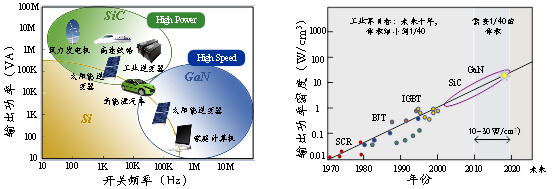

**Monday, April 17, 2023 @ 10:18:12 AM**

nx图画完了但是没法测量上表面，磁耦合器等三件的联系方式等老师
赶紧准备开题！程哥都动手了

**Monday, April 17, 2023 @ 10:44:20 AM**

看完了hangzhao的轴向综述，关键还是磁路法，


场重建（感觉比较麻烦，基于角度分解Bs(r,θ,z, t) = ∑ i bs,i (r,θ,z, t )Ii (t)），子域法（运用不同磁位方程∇2 A =−μ0∇×Mr）,都可以结合quasi3d

最好还是早点把坚果云里的东西tera同步一下，会员过期之后又是麻烦事情

**Monday, April 17, 2023 @ 11:52:03 AM**

在看DAmato的pwm电机综述，目前还都是材料的东西，感觉也必须讲一下电晕放电之类的东西，现在还没法把计算出来的电场返回到fea中，为了计算电场，必须要把整条电压的曲线全部加载进FEM模型当中？人家算的电压应力，所以那些什么端部评估之类的东西还是需要用啊，电晕，尖角这些都是解释性质的，这样电场应该只需要对单根导线建模吧？感觉还是不精确啊。

抽空学一下autoGPT，但是感觉我的token有些不够，唉

想办法把motorcad汉化一下？
已经完成

想办法把巫师3装到老电脑上面去吧，win11看起来是不支持了

**Monday, April 17, 2023 @ 02:46:26 PM**

```
FDTD方法对于处理各向同性材料和结构的电磁场问题更加简单。相比之下，FEM方法需要通过更复杂的网络模型来处理这些情况。
FDTD方法可以有效处理时域电磁场问题，特别是脉冲电磁场的传播和散射问题。FEM方法相对于FDTD方法在时域计算的计算效率较低，且不便于直接处理脉冲问题。
FDTD方法采用的是不规则网格的形式，能够更好地处理不规则结构的电磁场问题。而FEM方法需要进行离散化和网格划分，使得在处理不规则结构时需要更多的计算资源和时间。
```
fdtd很多都是光学的东西，感觉路子还是走的有点歪啊，先把电压计算这部分写了再说


curl equation，指的是倒三角


变化为此图


以下是一个链接fdtd for matlab
```
https://www.mathworks.com/matlabcentral/fileexchange/93045-fdtd-1d-2d-3d-simple-free-space-examples
```

**Monday, April 17, 2023 @ 04:10:29 PM**

fdtd的mtl建模和基于fem的mtl建模有什么不同？
先看liuping还是先看fdtd？
是不是应该先看能写开题的东西？

scispace也需要较稳定vpn才能玩，回家用

Monday, April 17, 2023 @ 04:31:13 PM

先试试nx装配吧

**Tuesday, April 18, 2023 @ 09:23:45 AM**

安装meep中，比较麻烦，在用conda装一下pymeep
conda config了一个国内镜像，这个也需要断掉代理，断开，不是推出
一样报错
```
https://blog.csdn.net/ZNJIAYOUYA/article/details/121721805
在**用户根目录（C:\Users\用户名）**下找到.condarc文件，打开将原有内容替换成如下代码：
```


搞了半天这玩意根本没有windows？


有时候csdn比知乎靠谱。。

**Tuesday, April 18, 2023 @ 10:05:35 AM**

ubuntu4个多G，回去搞吧，烦烦烦！真的先不动这个了，人已经麻了。
```
https://blog.csdn.net/weixin_43002202/article/details/120951578
```
好像我也不需要把链接包起来，就自己看，装什么犊子，ctrl+K被占用了，后续有一堆快捷键，不能拿这个出来就为了爽一下

**Tuesday, April 18, 2023 @ 10:25:44 AM**

最好是用typeset来玩scispace，插件的功能比较弱经常断开链接

还在看DAmato这个综述。有几个重要结论，
1.电机尺寸up>匝数down>更大反射
2.用Trise的计算公式可以反推临界的电缆长度
3.对于type1来说主要还是jump和rise影响匝间，对地和相间是收到峰峰影响（基频，冲击频）
4.双极性脉冲影响大
maxwell的强势在于（相比于hfss）有rmxprt还有maxwell 外电路，利用起来，但是只能用vb编程还是有点傻逼

**Tuesday, April 18, 2023 @ 11:57:02 AM**

老师最后估计还是会让我采用comsol的技术路径，毕竟哈理工已经做了一部分了，那就用comsol吧，反正它也能work with dxf（AutoCAD）

看到了谢菲一个新的研究，这个高频还和轴电流有关，唉，感觉真的可以采用以下jiahao的bearingless了，这个轴的东西确实影响挺大的

Tuesday, April 18, 2023 @ 03:34:43 PM

搞了一下午openEMS，然后需要visual C++ 14以上环境，就是要装vs没有code，6g以上，，又是需要回家搞，感觉这个支持还不如meep


**Friday, April 21, 2023 @ 02:15:04 PM**

开始做一下硕论的工作吧，又想接上上次的工作先搞一下

**Friday, April 21, 2023 @ 04:30:51 PM**

openems还是装不了，依然是报ms那个啥无法solve某个io.h文件

王鹏还是会水，照着他的东西抄一下，尽量再把他外行的话去掉

