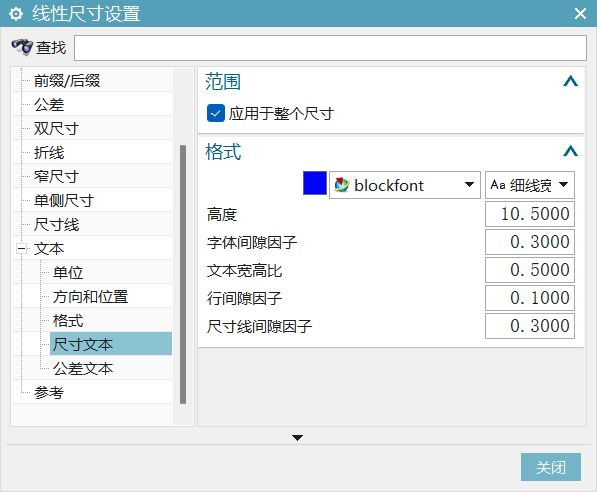
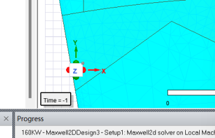
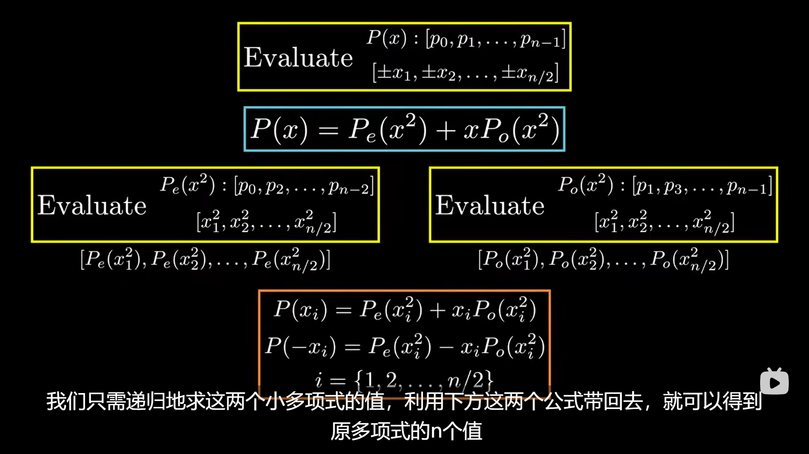
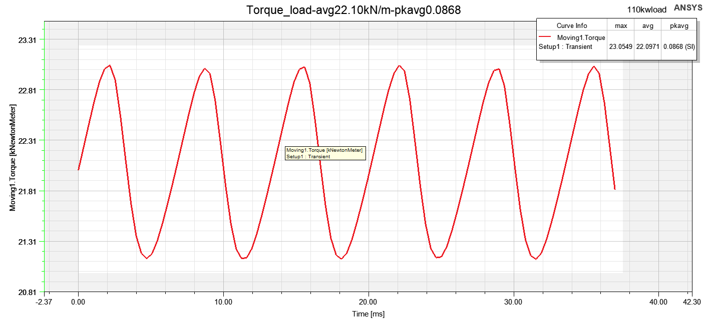
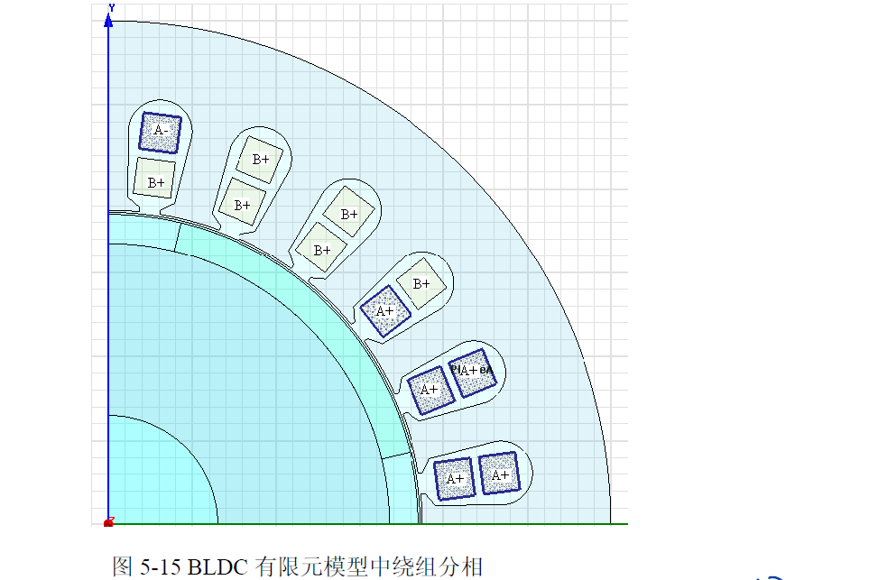
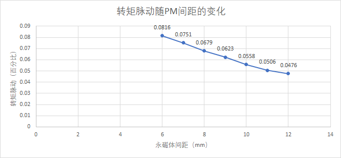

**Monday, April 10, 2023 @ 05:04:36 PM**

band和inner outer可以设置transpant方便查看之后的结果

band的设置，右键assign即可，注意选择旋转还是translation，就是暂态

###vector potential就是向量势，或者矢量势，A（x,y,t）就是边界条件使用电流密度不好表示的时候使用这个来表示∇ × A = B

如果在仿真中未使用向量势边界条件，则可能需要更频繁地进行电机中的电磁场采样

矢量磁势边界条件，定义边界上的矢量磁位A的常数值。边界处的磁场与边界正切，不会漏到边界外面去。

modelica实例实战http://modelicabyexample.globalcrown.com.cn/Release: v0.3.6-307-g33331e7-Early Access作者： Michael M. Tiller, Ph.D.

使用了timestamp，使用ctrl+shift+T可以创建时间戳

**Monday, April 10, 2023 @ 05:09:48 PM**

查看maxwell场图不显示的一个可能原因，没有隐藏掉band之类没有用的区域，把field遮住了

添加了markdown快捷键（使用markdown all in one），使用ctrlB和ctrlI可以实现快速斜体粗体

**Monday, April 10, 2023 @ 05:20:07**

使用快捷键：按下Ctrl + L，即可选中光标所在行。

*？加上的负载都是电流（和永磁体），那么为何load不需要与轴相关呢？是只有失去同步之后才会影响？*

玩poly brige有感，使用三角形的稳定性真的能做很多事情

mb3_excitation_assign eddy effect_可以分配涡流损耗，
*一般给永磁体？*

2d仿真别忘了设置轴向长度，mb3>model>assign depth即可

**Monday, April 10, 2023 @ 06:03:17 PM**
##轴向设计方法

插入一个rmxprt design

machine这一栏1.电流类型选择DC2.选择气隙长度，其他不用设置

stator这一栏全部要设置

core这一栏要注意外径给外壳留余量（也全部要设置，材料用steel就行）

slot这一栏根据槽型来看，最好都写，Rs可以不写不报错

winding这一栏注意conductor per slot是匝数乘以绕组层数（双层绕组是2）coil pitch指的是节距，设置1就行，漆包线厚度比较麻烦，需要查表，都是一一对应的，wire wrap指的是绝缘厚度，导线材料选铜

circuit也都填一下

stator依然注意是选择级数（x2）

core按照定子抄过来就行

pole分配的材料可以选NdFe35铝铁鹏，mag len不要选太大容易重合

之后再anali里面add solu，选一下电压转速，保存

右键setup，最下面的create 模型，这个circuit可以去掉如果不需要外电路

**Monday, April 10, 2023 @ 06:08:07 PM**

##双层轴向

click machine and then set fraction to one to get the whole machine.

删除掉多余的模型，选择select all。

右键材料查看property可以得到充磁方向。

这里一个比较方便的设置就是把上下都设为沿着z轴，所以经常会把电机这样摆放。

band设置要比运动部分稍大inner和outer正好包住就行摁住alt和方向可以快速转向Tuesday, April 11, 2023 @ 05:52:22 PM修改：他的意思仅仅是alt和mb1可以替代使用mb2进行旋转的作用，非常无语，定位到平面还是需要在view里面点击coordinate比较快

电流面coilterm可以用来加载电流方向和匝数等dependentsheet用来赋予边界条件

用draw里面这个按钮可以隐藏掉暂时不需要的区域（快捷键是f8还是f9，忘记了）

从右下角往左上角选择可以选择所有触碰到的obj，从左上角往右下角选择只能选择完全框住的

使用镜像命令镜像所有上半部分得到一个双定子结构之后使用参数化建模来约束下半个定子使得可以同步修改

在coil当中的createu user define part需要修改参数化外径内径等，之后就不用管了，都是根据coil_0复制过来的

之后在ndfe35（磁钢）里面改一下，diaouter设置为statorouter-2mm即可，单位不可缺失，不然默认是m

铁心也是一样操作，这个值要继承之前的修改

这几个域需要重新定义，需要完全重新设置band和outerregion才能

进行运动仿真

创建一个cylinder，改名为band，之后使用右键-measure-position可以

测量一下数值方便之后设置参数（三维之后感觉比较有用）

复制这个band，改变参数包住所有模型，height使用之前定义的参数加起来

选中这个域，进行split，先使用xz切一边再用yz切一边，可以保留四分之一模型

之后还要修改电流面coilterm和边界条件denpedent都需要在这里选择使用xz平面进行画图可以修改作图面

我怎么感觉这种简单的可以每次都重新画一下更快转到这个平面之后就很简
单了，仅仅画图的话使用around axis命令可以创建出从边界

右键band，assign band进行motion setupinitial角度选择7.5？关注吮指原味的后续视频
再选一个转速

边界选择assign bounders，因为模型不是对称的，（是否只有180deg才能叫做对称？）所以需要选择Hdep=-Hind

##参数化

之后开始设置激励，相对于前两个相对复杂

首先在exitation里面右键已经存在的phase选择add terminal，把属于a的两个激励选择加
进去以此类推
进
rmxprt里面，wind里面右键connect all coil可以得到线圈的连接情况方便理解电流的方
向，结合右手定则可以确定磁钢的NS极

设置一下winding，点击phaseA，改变激励type从external到 Current.

再点击单个线圈的，激励可以看到设置导体数目，其实设置的就是匝数。

点击set up。选择step time。计算一下电周期使用60秒除以转速，再除以极对数。记得是
除，因为之前算电角度的时候，是用机械角度乘以极对数。

**Monday, April 10, 2023 @ 06:13:08 PM**

##参数扫描

optimetric可以add一个参数，设置步长之后就可以进行扫描

HPC和analis这里可以设置多核计算

在中间的add中添加一个新的规则

add machine to list，设置core为4

之后右键parasetup进行仿真

*？？需要总结一下设计流程*

Ctrl/Cmd + Shift + V 快捷键在编辑器中打开 Clipboad Preview，然后直接粘贴图像即可，

Clipboad Preview 会自动将其转换为 Markdown 代码。


**Monday, April 10, 2023 @ 06:30:47 PM**
##峰值转速仿真
一般先仿真峰值转速之后仿真峰值转矩，再仿真一个额定工作点就行了。

**电机能达到某个转速的条件：电机的线反电动势峰值小于母线电压并且要给电阻和电感留出余量**

线反电动势峰值和转速正比，和直径成正比，和线圈匝数成正比

无刷直流电机的线反电动势峰值小于母线电压(24V)，并且要给电阻和电感留出余量

永磁同步!电机的线反电动势峰值大于母线电压加ld，削弱磁密，实现弱磁升速。

如此看来必须要联合变频器进行仿真才能得到高频下的这个，本来maxwell就可以加外电路，但是感觉还是不如抽出参数

**omega(rad/s)=2xpixf(Hz)
电频率(Hz)=机械频率(HZ)x极对数
机械速度(rpm)=机械频率(HZ)/60**

A:lqrms*sqrt(2)*sin(2*pi*rotor_speed_con/60*10*time)
B相:lqrms*sqrt(2)*sin(2*pi*rotor_speed_con/60*10*time-2*pi/3)
C相: lqrms*sqrt(2)*sin(2*pi*rotor_speed_con/60*10*time+2*pi/3)
Thursday, April 13, 2023 @ 03:22:55 PM补充
没有按照它那个设置参数化，直接输进去参数化吧
这个time参数是可以内置的吗

**Monday, April 10, 2023 @ 07:05:26 PM**

了解一下磁场调制理论，下载知乎文章

**Monday, April 10, 2023 @ 09:18:29 PM**

使用report>winding>任意一相电压，即可查看反电动势

如果需要查看电感矩阵，需要在model>model depth>matrix compu里面勾选并运算之后到报告中查看，不然默认是空白

**Monday, April 10, 2023 @ 09:52:15 PM**

试试吧SD卡作为miui的主要存储空间，这个红米10也能玩转了

**Tuesday, April 11, 2023 @ 12:09:16 AM**

继续尝试hory的acmop
一直在报错conda install pygmo，怀疑还是chen老师自己设置有问题
Thursday, April 13, 2023 @ 03:31:25 PM补充：没问题哈，自己没配置好虚拟环境
最后使用pip直接装了，conda还是玩不明白
给我报错的大意是pygmo无法通过pip直接安装，好烦，是不是还是要conda，用conda也可以防止一部分污染
chen老师这里关键是需要太多支持了，能不能把pyfemm里面的东西单独搞出来自己写一个，还有作图的那些

**Tuesday, April 11, 2023 @ 02:29:51 AM**

acmop学习阻力太大了，现阶段是不是先放一下？
感觉尽快搞完轴向+maxwell小技巧和comsol电磁比较重要
except:sys.path.insert(0, 'D:/DrH/Codes/acmop/codes3/')
用的是绝对路径，搞毛啊
pygmo安装失败大概率和mworks里面用到的一些东西有关

**Tuesday, April 11, 2023 @ 02:59:13 AM**

真的好烦啊这个东西，多目标优化，最好是能攥在自己手里就好
chen老师的东西很难模块化来用，暂时先放一放
抓紧先把maxwell所有的能回的会了然后学会分数槽

**Tuesday, April 11, 2023 @ 11:38:30 AM**

轴向的绕组理论？先放一下
之前听到idiq辨识还是有问题，要上功率容易掉电压，感觉轴向的控制确实比较麻烦，使用常规的FOC可能会出比较大的问题，参数辨识真的很重要

**Tuesday, April 11, 2023 @ 02:23:04 PM**

办完港澳通行证回来，记得20号去取一下
开始准备做振动测试这个事情
快速过一遍DTC之后就先把袁雷放一边，不能匀出更多时间给控制了
感觉把轴向那个分析外特性的过程学会比较重要

**Tuesday, April 11, 2023 @ 03:12:59 PM**

D’Amato2022综述阅读，感觉和王鹏的写的差不多，现在才看一半，希望能多讲建模的事情

**Tuesday, April 11, 2023 @ 03:55:35 PM**

找了一圈，资产，实验室，采购，没有找到底座的主人，等张松老师进一步安排

1.在VS Code中打开命令面板，可以使用快捷键Ctrl+Shift+P或者F1键来打开。
2.在命令面板中输入Preferences: Open Keyboard Shortcuts，然后选择这个选项来打开Keyboard Shortcuts配置页面。
3.在搜索栏中输入Timestamp，然后定位到Timestamp插件的命令。
修改为了alt+t

**Tuesday, April 11, 2023 @ 04:37:18 PM**

继续看了点rundong的overview of axial flux，师兄做的应该是double side

**Tuesday, April 11, 2023 @ 05:04:04 PM**

轴向仿真的问题，三维N极定义的是R，phi，Z，那所谓的halbach充磁会不会比较麻烦

**Tuesday, April 11, 2023 @ 05:26:29 PM**


在machine里面可以直接选择double sided，是否能达到一样的效果？试试
报错RatedOutputPower must be greater than 0. ，应该是因为删除了电路cirt导致的

明明选了double stator，为何生成了double rotor，好奇怪

siglesided会浪费很多磁通，如果使用double可以都兜住
使用bldc控制的话，一般就是每3coil对应4poles，这是那个拖动方式决定的

还是继续搞一下conda吧，顺便开个新坑，看一下pyaedt的东西
记一下要用jpg存本地图床才能显示markdown

**Wednesday, April 12, 2023 @ 08:58:21 AM**

别用win+shift+s截图了，出来的是png

```
Relative Permeability（相对磁导率）：相对磁导率是材料在存在磁场时的磁导率与真空中磁场的比值，是描述材料磁性的重要参数。N36Z_23的相对磁导率可能比较高，表示它在磁场中容易被磁化。
Bulk Conductivity（体导率）：体导率是指材料对电流的导电性能。N36Z_23的体导率可能较低，因为铁氧体材料通常为绝缘材料，不会很好地传导电流。
Magnetic Coercivity（磁饱和磁场强度）：磁饱和磁场强度是材料在磁化过程中需要的最大磁场强度，通常用于描述材料的磁性，但与相对磁导率不同，它与材料的饱和磁化强度有关。N36Z_23的磁饱和磁场强度可能比较高，表示它可以容纳更多的磁通量，但这并不一定意味着它具有较强的磁性能力。
```

**Wednesday, April 12, 2023 @ 09:28:08 AM**

Navigator Error
An unexpected error occurred on Navigator start-up
原来是整个anaconda出问题了
Navigator Error
An unexpected error occurred on Navigator start-up

Report
Please report this issue in the anaconda issue tracker

Main Error
check_hostname requires server_hostname
Traceback
Traceback (most recent call last):
  File "C:\ProgramData\Anaconda3\lib\site-packages\anaconda_navigator\exceptions.py", line 72, in exception_handler
 ### 需要处理以下这个hostname的问题


学术chat这个问题应该还是没有配置proxy导致的

不是代理导致的，还是容器的问题，这个包那个包已经全部乱了，啊啊啊啊
网速不好别玩需要pip和conda的东西。。。很容易梯子崩掉之后啥也玩不了还要花很多时间debug

**Wednesday, April 12, 2023 @ 10:35:53 AM**

学习nx制图2d流程，prt部件和菜单里面开始建模和制图并不冲突
放到整个视图的左上角可以移动视图，多等一会等他提示就行
尽量不要点到线。。不然拖不动的
明确目标，大致复现一下基座磁钢压块.prt
*如何实现在siemens nx制图中编辑公差？*
直接双击就能得到，不要再annotation里面搞,出现0的就是单向公差
*在Siemens nx制图中快速调整字体大小？*
Thursday, April 13, 2023 @ 09:59:06 AM跟进

在最顶端那个改不了的，只能改公差位置，要到这里改

**Wednesday, April 12, 2023 @ 11:32:41 AM**

尝试使用anaconda navigator创建环境
 environment location: C:\Users\siqip\.conda\envs\your-env-name
 成了，要激活就是conda activate your-env-name即可，好强啊，太棒了，记得断掉代理

**Wednesday, April 12, 2023 @ 02:42:45 PM**

*如何使用Siemens Nx选择更大的箭头？*

尽量多的使用菜单，一般preference都在这里面，不要习惯性选择文件去找东西

还是没成啊，好烦，这个偏好感觉还是重启才能有效

```
Traceback (most recent call last):
  File "C:\Users\siqip\ACMOP\codes3\acmop.py", line 4, in <module>
    import os, json, acm_designer, bearingless_spmsm_design, vernier_motor_design, bearingless_induction_design
  File "C:\Users\siqip\ACMOP\codes3\acm_designer.py", line 5, in <module>
    import population, FEMM_Solver, pyrhonen_procedure_as_function
  File "C:\Users\siqip\ACMOP\codes3\population.py", line 16, in <module>
    import FEMM_Solver
  File "C:\Users\siqip\ACMOP\codes3\FEMM_Solver.py", line 23, in <module>
    import winding_layout
  File "C:\Users\siqip\ACMOP\codes3\winding_layout.py", line 571, in <module>
    import scipy.integrate as integrate
ModuleNotFoundError: No module named 'scipy'
```

感觉需要用虚拟环境打开code进行调试
activate之后直接用code命令即可
cd..可以返回文件上一层cmd

```
在Python中，init.py文件主要用于标识一个包（package），它通常是一个空文件，用于告诉Python解释器这个目录是一个Python包，该目录中的模块可以被导入到其他模块中。当用户使用import语句导入整个包时，该文件将首先被执行。
一些常见的任务，可以在__init__.py文件中执行，例如：
初始化包级别的变量：例如在包中定义一些常量，也可以在该文件中初始化它们。
定义__all__变量：在__init__.py文件中，您可以定义__all__变量，用于指定其他模块可导入的公共接口。
支持动态导入：在某些情况下，您可能需要动态导入模块，例如，基于某些条件或用户输入导入不同的模块。在__init__.py文件中，您可以编写代码来动态导入模块。
```
```  
File "C:\Users\siqip\ACMOP\codes3\FEMM_SlidingMesh.py", line 1222, in parallel_solve_transient_FEA
    raise Exception('Subprocess failed to execute.')
```
在命令行直接跑更快，用code打开很慢。但是报了同样的错误

```
2023-04-12 15:46:35,644 - bearingless_spmsm_design - WARNING - [Warning from bearingless_spmsm_design.py]: Inter-pole notch depth mm_d_rp cannot be larger than mm_d_pm or else the sleeve cannot really hold or even touch the PM. So mm_d_rp is set to mm_d_pm.
2023-04-12 15:46:35,644 - bearingless_spmsm_design - WARNING - [Warning from bearingless_spmsm_design.py]: deg_alpha_rs cannot be larger than deg_alpha_rm/s. Note deg_alpha_rs is set to deg_alpha_rm/s.

```

这段日志包含了两条WARNING级别的警告消息。开发者想要告诉你的是在电机设计程序中存在两个参数，如果设置不正确，可能会导致电机无法正常工作，因此需要注意检查这些参数的设置。
第一条警告消息涉及到Inter-pole notch depth mm_d_rp参数，程序检查该参数是否大于mm_d_pm参数。如果mm_d_rp大于mm_d_pm，将会导致套管不能很好地承载或接触永磁体。因此，程序将mm_d_rp参数设为mm_d_pm，以确保电机能够正常工作。
第二条警告消息涉及到deg_alpha_rs参数，该参数不能大于deg_alpha_rm/s参数。如果deg_alpha_rs大于deg_alpha_rm/s，将会导致电机无法正常工作(不推荐设置这些参数不一致)。因此，程序将deg_alpha_rs参数设为deg_alpha_rm/s，以确保电机能够正常工作。


**Wednesday, April 12, 2023 @ 05:04:26 PM**

制图>绘制中心线>选中视图，在菜单栏中选择“Insert” > “Centerline”里面寻找命令
plot mesh这个问题还是没解决，唉，看了还是得自己啃这个文档

**Thursday, April 13, 2023 @ 09:43:05 AM**

*学一下maxwell里面外电路的问题？如何设置一个正确的激励？*
暂时放一下

**Thursday, April 13, 2023 @ 10:42:33 AM**
重新设置了motion的转速，出现了整个模型，之后就能看到plot mesh了，但是band只设置了1/8个模型

**Thursday, April 13, 2023 @ 03:16:39 PM**

axial flux结果还是乱七八糟，应该还是激励设置的有问题，需要重新去看视频了
三相激励设置的都是1A，测出的转矩就是脉动？还是要看看怎么设置的三相电流，是直接用的I生成的sin函数吗

**Thursday, April 13, 2023 @ 05:30:31 PM**

新的工具！scispace，太猛了，可以抓紧把开题肝出来

新的一周！

Thursday, May 4, 2023 @ 11:15:35 AM

算一个静态场，ansoft12保佑


看不到mesh看这里哦meshplot visibility


磁力线flux line在这里哦

赶紧学会处理简单报告

Thursday, May 4, 2023 @ 03:16:52 PM

学一下场计算器

使用wavecoil可以创建线圈模型

控制网格细度的办法：inner和outer都选在气隙的正中心，通过on selection对于气隙进行特别细分

在建模窗口的左下角可以选择瞬态仿真的当前时间用于查看sliding mesh和当前场



搞好这个瞬态仿真，setup的时候就要首先选好stop time，周期比较直观，再确定每一步的时间长度

师兄要求A相调整到起始角，不然会影响backemf的相对相位，这样功率∠计算就会出问题

Friday, May 5, 2023 @ 01:14:51 AM

把原来的项目abort了，目前在用副本算，尽量不要用任务管理器结束程序，会有很多错误数据，尽快学会清除冗余数据应该也可以

Friday, May 5, 2023 @ 05:38:56 PM

检查空载反电势一般从e=blv这个最基本的公式开始考虑，如果induce voltage没有，先看看B，l不设置也会有默认值，v只要设置了motion一般都能旋转

有可能是单位的问题，这个空载反电势的单位给的是gv，可能太大了，重新生成一下报告

目前还是没法解决这个，去mxwldby看看？这个先缓缓，为了避免被师兄讨厌，首先要解决A起始点的问题

打开ansoft12书

Saturday, May 6, 2023 @ 08:21:13 AM


看不到反电势的原因，这个参数没有选择moving1？
并不是，选择了也没有显示


也许不是没显示？而是分相分错了


A相，也有可能是前两个点的错误没有排除

他的电机的A相换向点是15deg，看看他的电机本身的参数，4极24槽，用rmxprt看看


我的电机，检查发现没有设置重复周期，会不会是这个原因？


一定找时间学一下清除场数据，目前的小技巧是把报告全部删掉然后重启软件，一般都能转起来
应该主要还是网格那个图一定删掉


和师兄交流结束，现在开始负载仿真

Saturday, May 6, 2023 @ 10:41:42 AM

《ansoft12》用的是外电路的方法加负载，显然不是132kw使用的方法，尽快跳过往后面看，找到sin有关的

但是132kw的winding这里写的是external，又没有circuit，难道是我拿过来之后删掉了？

目前需要从老师那里取得的参数：电机的轴向长度或depth，目前depth用的默认的1meter，还有端部漏感和相电阻，只有一个L是从有限元这里给的

还有预估的相电压（不能功率除额定电流，还有功率因数和效率之类的需要考虑）

当前版本160kwloaded-副本

Saturday, May 6, 2023 @Saturday, May 6, 2023 @ 04:44:07 PM 04:28:05 PM

取更多点，优化齿槽转矩的平滑度，齿槽转矩可以在noload的torque，moving1.torque里面得到，就是由于开槽导致的转矩，可以试试通过斜一个槽来进行改善


确实平滑了

版本管理通过复制一个没有aedtresult的文件来进行，文件名精确到分钟

和A相对齐的意思是使极的中心线和两个A的中心线对齐

在model-model setting-use skew model里面可以设置斜槽，但是不是直接使用360/slots，而是(q-1)/q个

他的例子是8极48槽（360/48=7.5）,这里输入了5deg，他的优化效果不错，我的q=1，可以用斜槽吗？

按照360/slots进行设置skew angle，波形已经乱了起来。。。要进一步看一下视频之类的，不是(q-1)/q？这里是因为他用的number of slices

切片数量设置的是5

这是设置为10/3
看看设置10/3*0.8会有多少吧

幅值小了很多，之前是800N.m，现在不到200N.m

右键某个setup来进行仿真，尽量少使用analyze all，不然容易报错

利用参数扫描对6，10，19，5进行参数扫描
**Monday, April 17, 2023 @ 10:18:12 AM**

nx图画完了但是没法测量上表面，磁耦合器等三件的联系方式等老师
赶紧准备开题！程哥都动手了

**Monday, April 17, 2023 @ 10:44:20 AM**

看完了hangzhao的轴向综述，关键还是磁路法，


场重建（感觉比较麻烦，基于角度分解Bs(r,θ,z, t) = ∑ i bs,i (r,θ,z, t )Ii (t)），子域法（运用不同磁位方程∇2 A =−μ0∇×Mr）,都可以结合quasi3d

最好还是早点把坚果云里的东西tera同步一下，会员过期之后又是麻烦事情

**Monday, April 17, 2023 @ 11:52:03 AM**

在看DAmato的pwm电机综述，目前还都是材料的东西，感觉也必须讲一下电晕放电之类的东西，现在还没法把计算出来的电场返回到fea中，为了计算电场，必须要把整条电压的曲线全部加载进FEM模型当中？人家算的电压应力，所以那些什么端部评估之类的东西还是需要用啊，电晕，尖角这些都是解释性质的，这样电场应该只需要对单根导线建模吧？感觉还是不精确啊。

抽空学一下autoGPT，但是感觉我的token有些不够，唉

想办法把motorcad汉化一下？
已经完成

想办法把巫师3装到老电脑上面去吧，win11看起来是不支持了

**Monday, April 17, 2023 @ 02:46:26 PM**

```
FDTD方法对于处理各向同性材料和结构的电磁场问题更加简单。相比之下，FEM方法需要通过更复杂的网络模型来处理这些情况。
FDTD方法可以有效处理时域电磁场问题，特别是脉冲电磁场的传播和散射问题。FEM方法相对于FDTD方法在时域计算的计算效率较低，且不便于直接处理脉冲问题。
FDTD方法采用的是不规则网格的形式，能够更好地处理不规则结构的电磁场问题。而FEM方法需要进行离散化和网格划分，使得在处理不规则结构时需要更多的计算资源和时间。
```
fdtd很多都是光学的东西，感觉路子还是走的有点歪啊，先把电压计算这部分写了再说


curl equation，指的是倒三角


变化为此图


以下是一个链接fdtd for matlab
```
https://www.mathworks.com/matlabcentral/fileexchange/93045-fdtd-1d-2d-3d-simple-free-space-examples
```

**Monday, April 17, 2023 @ 04:10:29 PM**

fdtd的mtl建模和基于fem的mtl建模有什么不同？
先看liuping还是先看fdtd？
是不是应该先看能写开题的东西？

scispace也需要较稳定vpn才能玩，回家用

Monday, April 17, 2023 @ 04:31:13 PM

先试试nx装配吧

**Tuesday, April 18, 2023 @ 09:23:45 AM**

安装meep中，比较麻烦，在用conda装一下pymeep
conda config了一个国内镜像，这个也需要断掉代理，断开，不是推出
一样报错
```
https://blog.csdn.net/ZNJIAYOUYA/article/details/121721805
在**用户根目录（C:\Users\用户名）**下找到.condarc文件，打开将原有内容替换成如下代码：
```


搞了半天这玩意根本没有windows？


有时候csdn比知乎靠谱。。

**Tuesday, April 18, 2023 @ 10:05:35 AM**

ubuntu4个多G，回去搞吧，烦烦烦！真的先不动这个了，人已经麻了。
```
https://blog.csdn.net/weixin_43002202/article/details/120951578
```
好像我也不需要把链接包起来，就自己看，装什么犊子，ctrl+K被占用了，后续有一堆快捷键，不能拿这个出来就为了爽一下

**Tuesday, April 18, 2023 @ 10:25:44 AM**

最好是用typeset来玩scispace，插件的功能比较弱经常断开链接

还在看DAmato这个综述。有几个重要结论，
1.电机尺寸up>匝数down>更大反射
2.用Trise的计算公式可以反推临界的电缆长度
3.对于type1来说主要还是jump和rise影响匝间，对地和相间是收到峰峰影响（基频，冲击频）
4.双极性脉冲影响大
maxwell的强势在于（相比于hfss）有rmxprt还有maxwell 外电路，利用起来，但是只能用vb编程还是有点傻逼

**Tuesday, April 18, 2023 @ 11:57:02 AM**

老师最后估计还是会让我采用comsol的技术路径，毕竟哈理工已经做了一部分了，那就用comsol吧，反正它也能work with dxf（AutoCAD）

看到了谢菲一个新的研究，这个高频还和轴电流有关，唉，感觉真的可以采用以下jiahao的bearingless了，这个轴的东西确实影响挺大的

Tuesday, April 18, 2023 @ 03:34:43 PM

搞了一下午openEMS，然后需要visual C++ 14以上环境，就是要装vs没有code，6g以上，，又是需要回家搞，感觉这个支持还不如meep


**Friday, April 21, 2023 @ 02:15:04 PM**

开始做一下硕论的工作吧，又想接上上次的工作先搞一下

**Friday, April 21, 2023 @ 04:30:51 PM**

openems还是装不了，依然是报ms那个啥无法solve某个io.h文件

王鹏还是会水，照着他的东西抄一下，尽量再把他外行的话去掉


Thursday, May 4, 2023 @ 11:15:35 AM

算一个静态场，ansoft12保佑


看不到mesh看这里哦meshplot visibility


磁力线flux line在这里哦

赶紧学会处理简单报告

Thursday, May 4, 2023 @ 03:16:52 PM

学一下场计算器

使用wavecoil可以创建线圈模型

控制网格细度的办法：inner和outer都选在气隙的正中心，通过on selection对于气隙进行特别细分

在建模窗口的左下角可以选择瞬态仿真的当前时间用于查看sliding mesh和当前场


搞好这个瞬态仿真，setup的时候就要首先选好stop time，周期比较直观，再确定每一步的时间长度

师兄要求A相调整到起始角，不然会影响backemf的相对相位，这样功率∠计算就会出问题

Friday, May 5, 2023 @ 01:14:51 AM

把原来的项目abort了，目前在用副本算，尽量不要用任务管理器结束程序，会有很多错误数据，尽快学会清除冗余数据应该也可以

Friday, May 5, 2023 @ 05:38:56 PM

检查空载反电势一般从e=blv这个最基本的公式开始考虑，如果induce voltage没有，先看看B，l不设置也会有默认值，v只要设置了motion一般都能旋转

有可能是单位的问题，这个空载反电势的单位给的是gv，可能太大了，重新生成一下报告

目前还是没法解决这个，去mxwldby看看？这个先缓缓，为了避免被师兄讨厌，首先要解决A起始点的问题

打开ansoft12书

Saturday, May 6, 2023 @ 08:21:13 AM


看不到反电势的原因，这个参数没有选择moving1？
并不是，选择了也没有显示


也许不是没显示？而是分相分错了


A相，也有可能是前两个点的错误没有排除

他的电机的A相换向点是15deg，看看他的电机本身的参数，4极24槽，用rmxprt看看


我的电机，检查发现没有设置重复周期，会不会是这个原因？


一定找时间学一下清除场数据，目前的小技巧是把报告全部删掉然后重启软件，一般都能转起来
应该主要还是网格那个图一定删掉


和师兄交流结束，现在开始负载仿真

Saturday, May 6, 2023 @ 10:41:42 AM

《ansoft12》用的是外电路的方法加负载，显然不是132kw使用的方法，尽快跳过往后面看，找到sin有关的

但是132kw的winding这里写的是external，又没有circuit，难道是我拿过来之后删掉了？

目前需要从老师那里取得的参数：电机的轴向长度或depth，目前depth用的默认的1meter，还有端部漏感和相电阻，只有一个L是从有限元这里给的

还有预估的相电压（不能功率除额定电流，还有功率因数和效率之类的需要考虑）

当前版本160kwloaded-副本

Saturday, May 6, 2023 @Saturday, May 6, 2023 @ 04:44:07 PM 04:28:05 PM

取更多点，优化齿槽转矩的平滑度，齿槽转矩可以在noload的torque，moving1.torque里面得到，就是由于开槽导致的转矩，可以试试通过斜一个槽来进行改善


确实平滑了

版本管理通过复制一个没有aedtresult的文件来进行，文件名精确到分钟

和A相对齐的意思是使极的中心线和两个A的中心线对齐

在model-model setting-use skew model里面可以设置斜槽，但是不是直接使用360/slots，而是(q-1)/q个

他的例子是8极48槽（360/48=7.5）,这里输入了5deg，他的优化效果不错，我的q=1，可以用斜槽吗？

按照360/slots进行设置skew angle，波形已经乱了起来。。。要进一步看一下视频之类的，不是(q-1)/q？这里是因为他用的number of slices

切片数量设置的是5

这是设置为10/3
看看设置10/3*0.8会有多少吧

幅值小了很多，之前是800N.m，现在不到200N.m

右键某个setup来进行仿真，尽量少使用analyze all，不然容易报错

利用参数扫描对6，10，19，5进行参数扫描

Monday, May 8, 2023 @ 08:51:42 AM
新的一周！
当前目标，完成loaded
首先把师兄的6phase模型删掉一半

这个咋来的，频率大约100?
##因为电路设置的90hz，我的转速是27hz，电机旋转的必要条件是同步，电频率和电频率同步，设置27hz
torque积分为0说明没有转起来
动笔才会有思维。。

目前电频率确实是54/2=27hz，但是转矩还是乱的
Monday, May 8, 2023 @ 02:57:31 PM

9550公式复习一下T=9550P/n,这次有限元算出的转矩48KN*m左右，脉动pk/avg在0.06，但是9550公式出来136左右，应该是轴向长度和张老师预设轴向长度有所出入，要问下预设轴向长度和相电阻、端部漏感,之后开始进行优化仿真
参数化分析

同步的意思是两个参数一起变化

参数扫描的
目前设置的是max（Torque），下一次对min（pkavg（torque））进行参数分析

切角为10deg的时候转矩最小，接下来看看对于pkavg的影响吧

不能对其进行参数化分析，但是可以算完之后来这边用marker里面的功能看然后自己用excel看一下

Monday, May 8, 2023 @ 04:42:23 PM
学会HPC option了，主要还是跑参数化的时候能用，只跑一个没必要而且容易报错
优化分析和参数分析有什么区别？


Tuesday, May 9, 2023 @ 10:13:35 AM
首先是傅里叶分解

在这里他证明了任何d阶多项式可以用d+1个点来表示

通过取值法来计算多项式的乘积，可以减少复杂度


如果直接取值的话复杂度不变，要利用奇偶性，多项式也同样可以拆开成奇偶多项式



使用复数的表示可以有效避免每次都要取负数利用奇偶的尴尬

复数在平面上的分布，这样也就能看懂傅里叶变换的那一堆e^pi之类的

每次都会变成n/2个点可以方便实现递归

实在看不懂了，记一下吧，就是实际谐波极对数除以画的polyline的弧长

Tuesday, May 9, 2023 @ 10:56:41 AM

还是很奇怪啊


计算结果怎么都对不上。R为17.9？问题先留这里吧，真的做上了分数槽再去担心这个

Tuesday, May 9, 2023 @ 11:32:45 AM
正在计算，想想之前什么操作导致的crush比较多，应该是生成场却没有选择full model还有带着fields就进行计算了，还要保留关掉小窗的好习惯

师兄重新教了一下fft横坐标，之前那个教程有点问题，没说考虑极对数，或者他说的是电跨距


先看一下9550公式的推导和量纲就是一个2pi/60的倒数，要换算成线速度罢了
有两种推导办法，一种是宏观上直接用量纲来表示（辜）还有一种就是用微观上的线负荷和气隙磁密积分出来（汤）

改成shift之后粘贴图片要先切换英文了

Tuesday, May 9, 2023 @ 03:33:01 PM

来看一下端部漏抗的计算吧

最后还是经验占比比较大，和绕组形式之类的都强相关
但是有一个归一化的项，就是4piμ0N^2/pq，之后的才是经验项


主要是三次谐波？为何，q=1啊

重新问了一下师兄，domain这里选择spectral，这里面有branchcurrent和nodevoltage，其实和打开winding调出来的没有什么区别，选中一个之后在最右边的function里面选择ang_deg，其实做的就是傅里叶分析，能直接告诉你频率，之后改table显示（或者一开始就创建一个table效果是一样的）这里注意找一下电频率，90/60*18，就是rpm/60*p，他的单位默认是khz，不要去找幅值，这里右边的量是角度！，真的是有点蠢，唉。

一般电机设计中所提到的Btheta都是值得我算出来的Br的基波幅值，不是整个波形的最大值，不然由于磁钢形状不同，这个是无法比较的，不能把所有工作都交给计算极弧系数

Thursday, May 11, 2023 @ 03:58:14 PM
现在学一下使用motorcad来设置一下绕组，方便和老师讨论，快速浏览这大本营10个教程


老师让从转子一路拉到定子外圈的一条线，在定子颚部mag_B只有0.5左右的幅值，需要缩减一部分的体积？为什么？浪费材料了吗


Friday, May 12, 2023 @ 04:21:14 PM
终于画完了，新的110kw的方案
A的形状不太对，应该是充磁设置有问题，唉，赶紧自学一下，都教了一遍没做笔记。。
右键形状在property-orenta里面
错误的结果没必要截图了，明显的就是永磁体内都不是直线的fluxline


Tuesday, May 16, 2023 @ 04:31:34 PM

新的一周！虽然已经周二了，新的任务，对梨形槽电机进行建模，由于使用了平行齿结构，只能使用圆线了
首先对槽重新建模

slottype2,之后对照编辑参数。

**老师之前提到了使用的碳钢，和硅钢有什么区别，会影响到我的建模吗？**
不会一定要问问师兄！

Tuesday, May 16, 2023 @ 04:52:19 PM
目前用draw可以解决大部分需要测量的问题但是还是有必要到晴儿那里看看measure的进阶用法

help里面找slot type可以带空格，更快找到参数对应图形

Wednesday, May 17, 2023 @ 03:32:42 PM
暂时看来网格没有什么问题，noload的套路也要快速掌握一下


之前就碰过的老问题，想想当时怎么解决的？反电势前几步莫名值很大。。


之前遇到过同样的问题，反电势首先看B的波形，当然别忘记设置模型


空载反电势，是不是太大了？看看电流和额定比较一下吧

openEMS还没装呢。记得试试，用vc装的，感觉femm比较大的优势就是不像meep之类的那么麻烦，或许科研都默认有linux吧


netlist可以导出.sph文件，之后可以搞进maxwell


负载的torque为何减少？
失步了。。电路那里有个mistype，写成93rpm了，靠，一定要保证电频率和机械频率*p对上啊

丢掉了前面的这一部分波形，还是因为前两步失真的问题，可能要多跑几个周期才能减少这个影响
而且在FFT中反映出来了，出现了比较大的0次波和二次波
emmm没找到描述这个问题的词，就是直流量。师兄的建议是首先检查一下外电路的设置。
这个结果也显然有问题，和9.55公式计算器结果对不上
赶紧检查一下外电路吧，争取明天出结果

目前版本用05170944的就行了，我已经知道怎样生成results不会报错了

Thursday, May 18, 2023 @ 09:33:28 AM


直流分量是从孔子啊就出现的，外电路应该暂时可以先不动，先检查一下setup和motion，大概率是启动角不对，或者甚至边界也有可能有问题？不对，边界有问题半个周期都出不来

inducedVA不是0开始的导致的？先试试把motion里面的initial deg去掉，和ansoft12里面的对照一下


过零点3.5244，大概3.33？360/108=10/3=3.33，为何换向点不是PM——between对准A的时候吗？

寄，零序分量的问题更加严重了，还多了一个，先算一下fft哪个是基波吧

之前没有问题，还是setup这里有个mistype，我靠我靠！！怎么又开始搞这种，脑子有毛病啊！
之前师兄都看出来不是一个周期了，早就应该看看周期这方面的问题，一个波形出了问题先看周期再看相位最后看幅值比较好
之后就直接复制过去仿真负载就行
出现改setup之后结果一样的情况还是复制重开一下吧
现在周期的问题解决了，来看看相位吧


有空就来研究一下这张图，把磁极的中心移动到两个A的中间，而不是吧磁极的between移动到A的正下方，但是我这个既是也是啊，那到底那里出了问题
9.55×P(功率，单位为W)=T(转矩，单位为N.m)×n（每分钟转速）
正弦电流的有效值，最大值的0.707倍
一般是定子斜槽或者转子分段斜极


以上为修改极弧系数之前的结果
以下为修改极弧系数之后的结果


#以下是否斜极的对比图


Friday, May 19, 2023 @ 10:18:04 AM
对于磁极偏心的扫描，偏心越猛转矩越小但是转矩脉动越小，取转矩脉动最小的情况，接下来对磁极跨距进行扫描

在对齿槽转矩进行优化的时候要使用空载，首先一个是计算速度快，其次，使用负载优化的其实是转矩脉动

Friday, May 19, 2023 @ 11:51:45 AM

you
又一个低级错误，如果算两步就直接停下来可能是吧周期设置成步长了

如果结果不好，在band的圆弧设置里设置segment，数量等同于步长（扩展到整个圆）原理是把圆弧设置成segments个锯齿形状，方便和步长一一对应，提高仿真精度

仿真cogging对网格密度和步长的要求相对较高，一定要想办法搞细了，band设置不了多层就要把outer region一起搞细，shaft可以搞真空节约计算资源


接下来对slices=9和slices=5分别进行计算

负载就不能只看一个齿周期了。。





