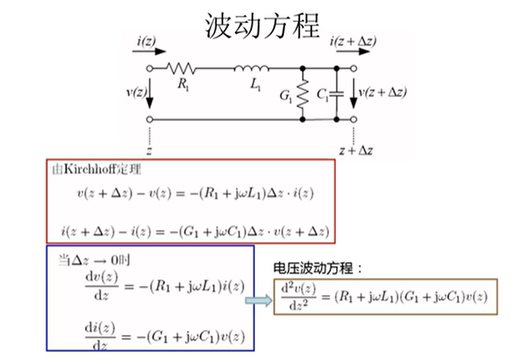

他这里Nt=17

注意是散下线的不能照搬，需要考虑每匝的四根导体
端部的电感认为是固定值Lov，在高频时其在每匝的分布是一个等效电感LT,slot,j

明早9.30在艇员大楼218有讲座，裴瑞琳教授，内容是关于新材料
苏州英磁，2017成立，发展很快似乎项目很多，沈阳工业大学但是是很多其他学校博导

Thursday, October 19, 2023 @ 09:08:33 AM
补充一些传输线基础知识

也称之为电报公式，移项把右边deltaz到左边就得到下方公式