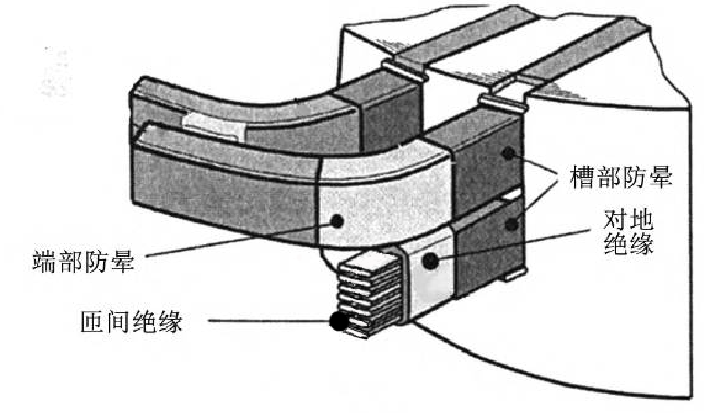
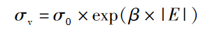
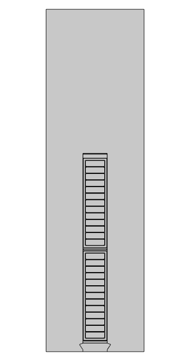
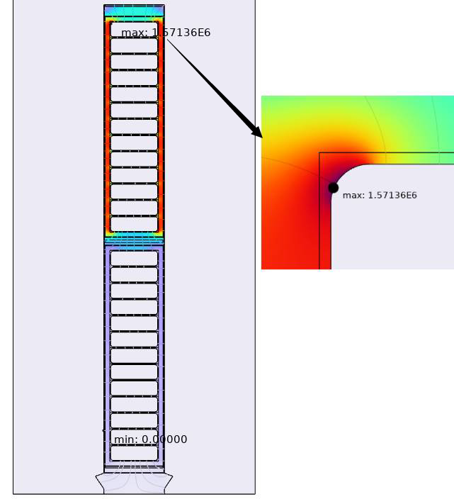
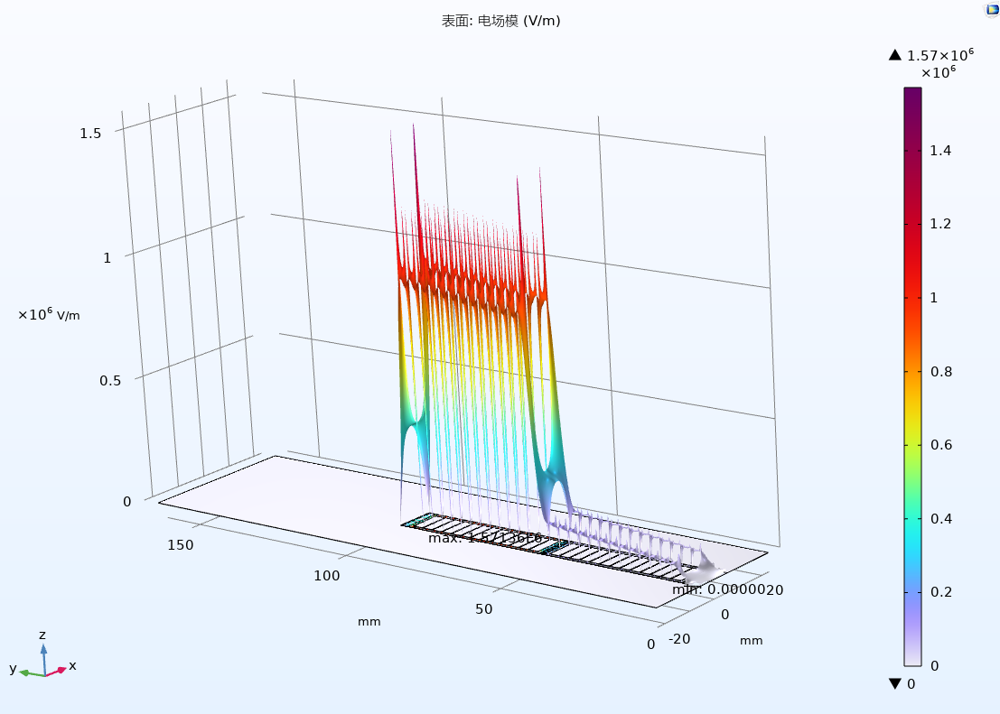
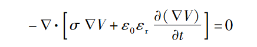
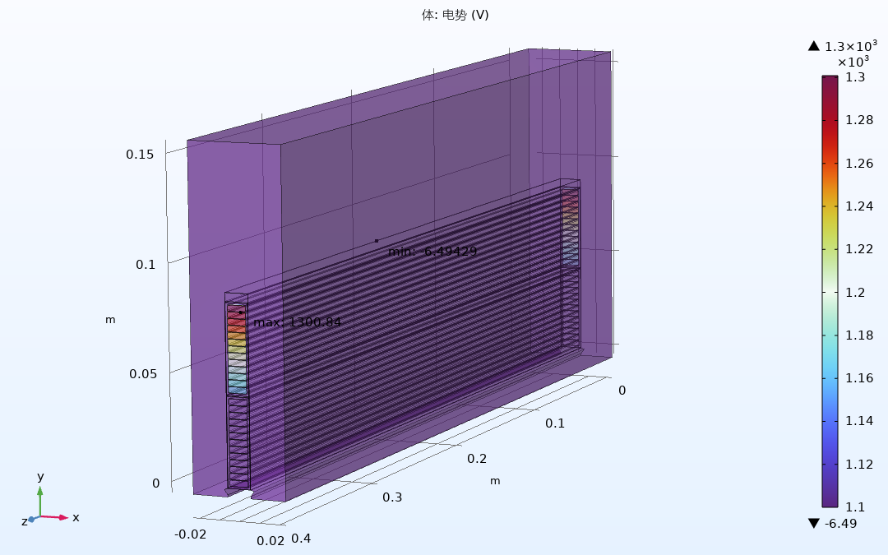

对集中绕组变频电机定子电场分布的初步研究
0引言
随着第三代半导体技术的逐渐成熟，其在变频器开关器件中的应用也随之增多，这有效提升了变频器的功率密度并降低了开关损耗，但是同时变频电机的绝缘系统需要承受频率更高的脉冲电压，这对变频电机绝缘系统提出了新的挑战。由于对高频下变频电机定子电场分布的研究不全面，一篇年代稍早的经典文献，使用阻抗匹配理论得到了“变频电机首匝电压约为额定电压两倍”这一深入人心的结论[高频PWM脉冲波传输引起电机端子过电压的研究_万健如]，故而目前电机厂普遍按照额定电压等级的两倍来整体绕包绝缘。虽然普遍绕包较厚的绝缘可以有效地防止绝缘被击穿，但是增厚的绝缘会减少电机的槽满率，在功率不变的情况下，电机被迫采用更大的轴向长度，增加硅钢片、稀土材料的使用，影响电机性能的同时增加成本。
因此，优化变频电机绝缘结构很有必要，为此，本文拟对一台16相电机的电场分布情况进行研究，并对其绝缘结构优化给出建议。本文在COMSOL Multiphysics商业仿真软件中建立此电机的局部模型并分析了其电场分布，相比其他同类软件，COMSOL Multiphysics对于多物理场耦合的支持较好，方便后续对端部温升等现象进行进一步仿真，同时其提供自适应的网格，在三维建模时可以帮助工程师更快地捕捉转角等特征的细节并使模型快速收敛。
1电场仿真模型
本文对一台槽部和端部分别建立了静电场和电流场模型，主要研究了各绝缘层采用不同材料、导线倒圆角尺寸、端部采用半导体材料以及局部放电可能导致绝缘结构中出现的空气泡的位置对于电场分布的影响。
相数m=12:极数2p=16;槽数Q=192;每极每相槽数q=1;并联支路数α=4;节距y1=12;绕组型式为叠绕组，星形连接（功率和转速是否需要补充？）
1.1槽部二维静电场仿真
本文所涉及的绝缘结构如图1所示，绕线形制为双层叠绕组，整距，不考虑相间绝缘，槽部(直线段)防晕采用低阻防晕带，端部绝缘采用中阻防晕带。
图1绝缘结构示意图【】
各绝缘结构的几何参数以及电导率和相对介电常数如表1所示
表1绝缘结构参数表【】
其中端部防晕采用高阻防晕带材料，其电导率与多种因素相关，在本文的工况下，可认为此材料电导率与电场强度之间呈以下非线性关系
式1【】
式中, σv 为电导率, S / m; σ sub[0] 为假设零电场下 的初始电导率, S / m; β 为非线性系数, mm / kV; E 为电场强度, kV / mm。
首先对槽部的二维静电场进行仿真，
槽部二维静电场模型如图2所示
图2槽部二维静电场仿真模型【】
额定电压为1300V从下层边靠近槽底的一匝输入，稳态时认为电压降沿导体均匀分布，计算得每匝压降为6.25V，按此电压降加载得到如图3所示的仿真结果
图3(a)【】静电场仿真结果及其局部放大图
图3(b)【】静电场仿真结果高度表达式

可见在稳态下，电场分布主要受到对地绝缘的影响，电场强度的分布与电压大小的分布相关性较强，且靠近槽口槽底以及层间垫条的部位电场强度会明显高出周围区域，最大电场强度出现在铜导体处。
1.2槽部三维电流场仿真
高压电机定子绕组端部暂态电场的场域控制方程如下
式2【】
式中, V 为电位; σ 为材料的电导率; ε0 为真空介电常数; εr 为材料的相对介电常数
建立如下仿真模型
图4槽部三维电流场仿真模型

