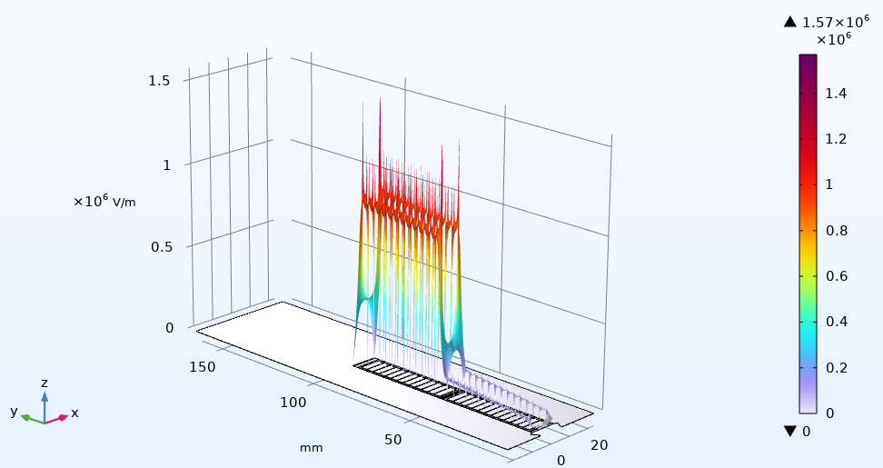
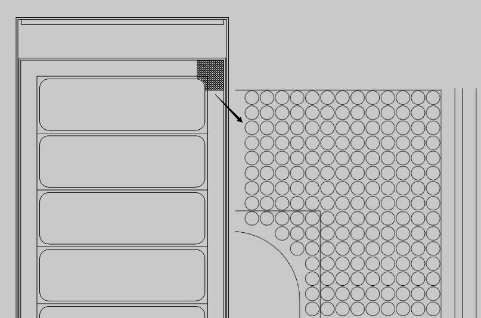
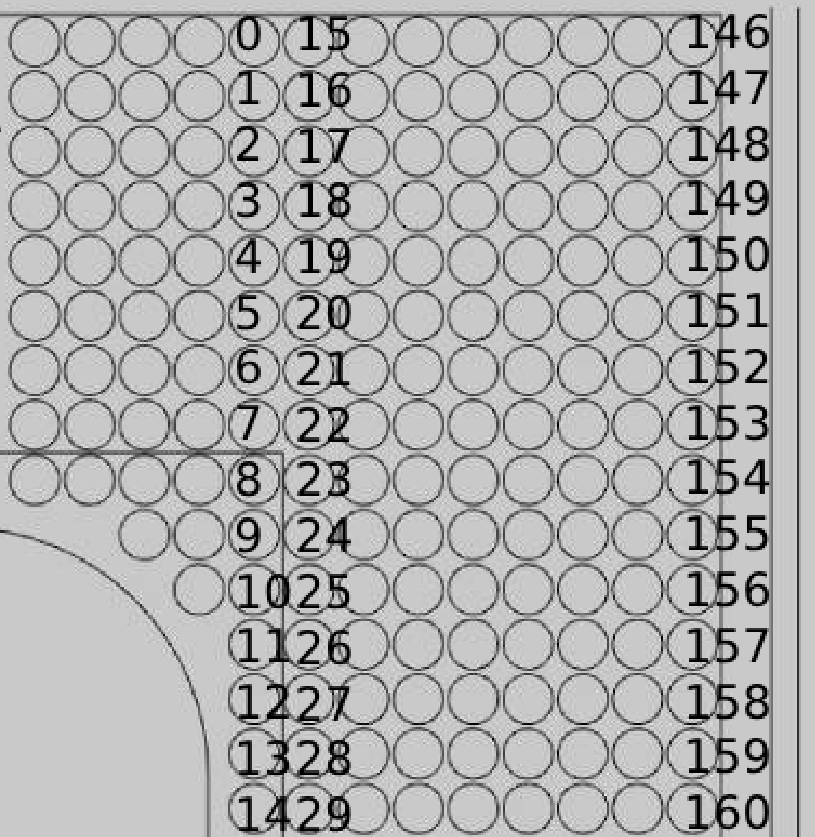
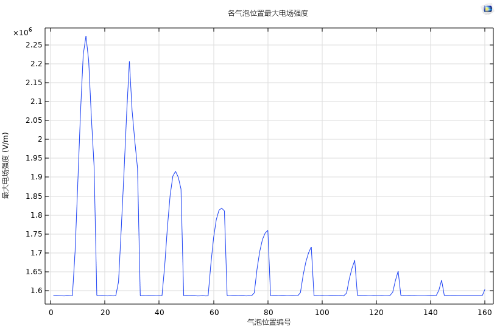
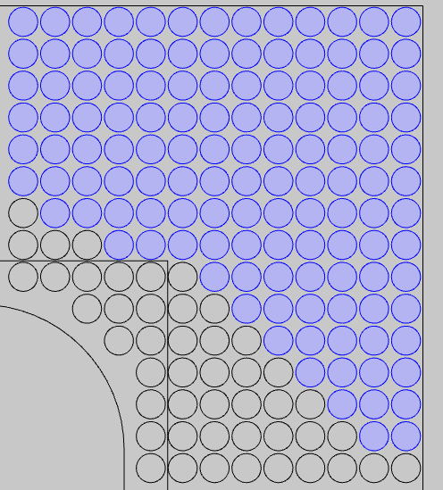

对一台集中绕组变频电机定子电场分布的仿真研究
0引言
随着第三代半导体技术的逐渐成熟，其在变频器开关器件中的应用也随之增多，这有效提升了变频器的功率密度并降低了开关损耗，但是同时变频电机的绝缘系统需要承受频率更高的脉冲电压，这对变频电机绝缘系统提出了新的挑战。由于对高频下变频电机定子电场分布的研究不全面，一些年代稍早的经典文献，使用阻抗匹配理论得到了“变频电机首匝电压约为额定电压两倍”这一深入人心的结论[高频PWM脉冲波传输引起电机端子过电压的研究_万健如]，故而目前电机厂普遍按照额定电压等级的两倍来整体绕包绝缘。虽然普遍绕包较厚的绝缘可以有效地防止绝缘被击穿，但是增厚的绝缘会减少电机的槽满率，在功率不变的情况下，电机被迫采用更大的轴向长度，增加硅钢片、稀土材料的使用，影响电机性能的同时增加成本。
因此，对变频电机电场优化变频电机绝缘结构很有必要，为此，本文拟对一台16相电机的电场分布情况进行研究，并对其绝缘结构优化给出建议。本文在COMSOL Multiphysics商业仿真软件中建立此电机的局部模型并分析了其电场分布，相比其他同类软件，COMSOL Multiphysics对于多物理场耦合的支持较好，方便后续对端部温升等现象进行进一步仿真，同时其提供自适应的网格，在三维建模时可以帮助工程师更快地捕捉转角等特征的细节并使模型快速收敛。
1电场仿真模型
本文对一台槽部和端部分别建立了静电场和电流场模型，主要研究了各绝缘层采用不同材料、导线倒圆角尺寸、端部采用半导体材料以及局部放电可能导致绝缘结构中出现的空气泡的位置、大小对于电场分布的影响。
相数m=12:极数2p=16;槽数Q=192;每极每相槽数q=1;并联支路数α=4;节距y1=12;绕组型式为叠绕组，星形连接（功率和转速是否需要补充？）
1.1槽部二维静电场仿真
本文所涉及的绝缘结构如图1所示，绕线形制为双层叠绕组，整距，不考虑相间绝缘，槽部(直线段)防晕采用低阻防晕带，端部绝缘采用中阻防晕带。
图1绝缘结构示意图【】
各绝缘结构的几何参数以及电导率和相对介电常数如表1所示
表1绝缘结构参数表【】
其中端部防晕采用高阻防晕带材料，其电导率与多种因素相关，在本文的工况下，可认为此材料电导率与电场强度之间呈以下非线性关系
式1【】
式中, σv 为电导率, S / m; σ sub[0] 为假设零电场下 的初始电导率, S / m; β 为非线性系数, mm / kV; E 为电场强度, kV / mm。
1.1.1对圆角尺寸的讨论
以下对槽部的二维静电场进行仿真以讨论圆角尺寸对于电场分布的影响，当圆角半径足够大的时候，可以近似用圆柱电极结构对其进行近似，则对应的电场强度计算公式为E=l/(r*ln((r+d)/r))，此式中r为内圆角曲率半径，所以预测在圆角附近出现最大电场强度且电场强度与圆角半径呈类似反比例函数关系。槽部二维静电场模型如图2所示
图2槽部二维静电场仿真模型【】
首先对变频电机面临的对地绝缘应力进行计算，设定额定电压为1300V从下层边靠近槽底的一匝输入，稳态时认为电压降沿导体均匀分布，此时每匝压降为6.25V，按此电压分布加载得到如图3所示的仿真结果
图3(a)【】圆角半径为0.8mm时对地电场仿真结果及其局部放大图
图3(b)【】对地电场仿真结果高度表达式
可见在仅考虑对地绝缘的情况下，变频电机电场强度的分布与电压大小的分布相关性较强，且靠近槽口槽底以及层间垫条的部位电场强度会明显高出周围区域，最大电场强度出现在铜导体圆角处。
对其圆角尺寸进行参数化扫描，探索其对最大电场强度的影响，得到如下结果
图4 圆角半径对对地绝缘电场强度最大值的影响
可见最大电场强度的大小和圆角半径成斜率下降速度非常快的近似反比例函数关系，符合预期，数值上比经验模型稍大，哈尔滨理工大学的学者[孙永鑫. 2020. 高压电机定子线棒绝缘结构优化与电寿命快速评估方法[D/OL]. 哈尔滨理工大学.]对利用定义的不均匀系数对解析的方法做了进一步改进使之与有限元结果更加接近，在此不过多赘述。
接下来对变频电机面临的匝间绝缘应力进行计算，将除了首匝之外的端口电压都设置为0，以模拟变频器输入的单个脉冲带来的瞬时绝缘应力。
图5 圆角半径为0.8mm时匝间电场仿真结果
图6 圆角半径对匝间绝缘电场强度最大值的影响
可见当圆角半径相对较小时，电场强度的最大值主要受到尖锐处带来的电场集中效应影响。当圆角半径足够大的时候电场强度高的区域比较均匀地分布在首匝和第二匝之间，模型可用平板电容器类比，使用平板电容的场强计算公式验算可以得到类似的结果，此结果说明变频电机在匝间面对更加严酷的绝缘条件，在设计时应该优先给匝间绝缘分配更多的槽内面积。
按照国家标准[GB/T 5584.1-2020, 电工用铜、铝及其合金扁线　第1部分：一般规定[S]].本电机使用铜线的窄边宽度为2.8mm，对应国标推荐设置的电机圆角半径为0.8mm，允许偏差为25%的窄边宽度，在本文中即为0.7mm，按照上图的仿真结果，即使圆角尺寸缩小到0.1mm，电场强度的最大值依然不到10MV/m，而目前大多数聚酰亚胺薄膜的工频电气强度都达到了50MV/m及以上，可见，按照理想情况来说，即使缩小圆角尺寸电机也没有击穿风险，但是在实际生产中会有其他导致场强升高的因素。
1.1.2对气泡位置、大小的讨论
在电机实际生产过程中，特别是部分变频电机并不采用真空压力浸渍工艺，在浸漆、烘干这两步工艺中难免存在材料无法填满、材料蒸发损失的情况，导致绝缘层中残留气泡，本文接下来对气泡位置对于电场强度最大值的影响进行讨论。
图7 预设的气泡位置
首先对扁线窄边右侧的气泡进行仿真，气泡位置编号如下
图8 气泡编号
得到各编号下最大电场强度的数值如下
图9 各气泡编号下最大电场强度
同理，对剩余的气泡位置进行仿真，整理得到气泡发生在如下蓝色位置时不会影响最大电场强度

1.2端部三维电流场仿真
高压电机定子绕组端部暂态电场的场域控制方程如下
式2【】
式中, V 为电位; σ 为材料的电导率; ε0 为真空介电常数; εr 为材料的相对介电常数
建立如下仿真模型
图4端部三维电流场仿真模型

