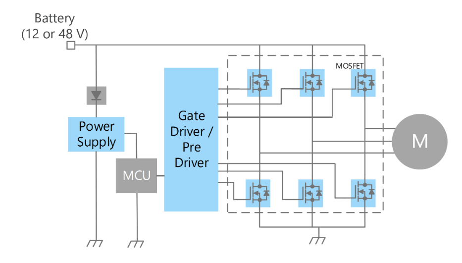

#背景

我的毕设题目是对变频电机定子绕组绝缘结构进行优化设计
当然在实际操作中，可以通过改变电源电压并采用不同的降速方法如串电阻调速、机械调速等来控制电机转速。但是在额定状态下进行的调速手段相当有限
我们来看三相电动机在额定状态下的转速控制公式：$n=60f/p(1-s)$
其中，n为电机输出转速，f为电源电压的频率，p为电机的极数，s为转差。
对于永磁同步电机来说，转差s恒为0，调速的选择就只剩下变频和变极，变极调速又有着较大的缺陷，调速范围窄而且精度非常低，所以现行的永磁电机大多使用变频调速。
以下是一个常见的采用BLDC三相变频电机的控制电路

使用了6个mosfet来控制电机，无论采用BLDC控制策略或者PMSM控制策略，区别只在转子形状和控制算法上，使用的电力电子器件是一样的
随着WBG宽禁带半导体的发展，变频电机绝缘系统面临着新的压力

